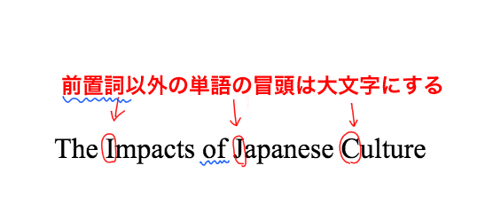

**APAスタイル（APAフォーマット）**という英語エッセイの型をご存知でしょうか？英語エッセイ、小論文には、コンテンツの構成としての型と、スタイルとしての型があり、それらを書く際は必ず規定のスタイルを指定されます。

この「スタイル」は論文を書く上では必須の知識、当然の知識として扱われており、記述方法やフォーマット設定が間違っていると当然のように減点されます。

しかし、英語小論文、エッセイのライティングが初めての方や、不慣れな方にとって一つ一つのルールを確認するのは大変だと思います。

今回は、英語エッセイで複数存在するスタイルのうち、**APAスタイル（APAフォーマット）と呼ばれる英語小論文の基本の書式設定について、具体例とともにご紹介**します。

- 英語の論文の書き方がわからない
- APAスタイルを指定されたが細かい書式フォーマットがわからない
- 書いてみたものの、ルールが間違っていないかもう一度確認したい

上記のように不安を抱えている方も、この記事を読めばAPAスタイルの書式設定について確認することができます。

[APAフォーマットの参考文献、リファレンスの書き方についてはこちら](https://28-nikki.com/how-to-write-apa-reference/)。

https://28-nikki.com/how-to-write-apa-reference/

なお、そもそもの[英語小論文のコンテンツ、内容の盛り込み方や構成の作り方](https://28-nikki.com/how_to_write_english_essay_content/)については、こちらの記事で紹介しています

https://28-nikki.com/how\_to\_write\_english\_essay\_content/

## 英語エッセイでのAPAスタイルとは？

**APA**とは、**The American Psychological Associationの略**です。社会学を中心に、学術論文のスタイルとして多く使用されるエッセイフォーマットであり、表紙付き、各ページの上に省略タイトルを入れるなどの特徴があります。

最新のマニュアルは、[随時公式サイトで更新](https://apastyle.apa.org/)されています。

このページでは、6th ed., 2n printing 2010版の情報をもとにAPAスタイルの基本的な書き方、注意したいポイントをご紹介します。

<iframe style="width: 125px; height: 245px;" src="//rcm-fe.amazon-adsystem.com/e/cm?lt1=_blank&amp;bc1=000000&amp;IS2=1&amp;bg1=FFFFFF&amp;fc1=000000&amp;lc1=0000FF&amp;t=28nikki-22&amp;o=9&amp;p=8&amp;l=as4&amp;m=amazon&amp;f=ifr&amp;ref=as_ss_li_til&amp;asins=4469246026&amp;linkId=6afe7ed92faaac1a613052460c28fcbd" frameborder="0" marginwidth="0" marginheight="0" scrolling="no"></iframe>

## 【APAスタイル】フォーマット　書式基本のルール

まず最初に、全体で守るべきAPAスタイルの基本のルールについてです。

- **フォント：Times New Roman**
- **フォントサイズ：12pt**
- **テキスト行間：2**
- **ページ番号：各ページ右上****に配置。　表記方法は「番号」のみ**
- **論文省略タイトル：各ページ左上に配置。　表紙のみ「****Running Head : 」を付記**
- **本文の各段落冒頭には「Tab」キーでスペースを入れる。**

具体的な表紙、２ページ目以降の書式設定など各ルールの詳細を確認していきます。

### APAスタイルの全体の書式設定（フォント、文字スタイル）

APAスタイルに限らず、どの英語小論文でもフォントの指定は基本同じです。

先述の通り、下記を基本としてご確認ください。

- **フォントサイズ：12pt**
- **フォントスタイル：Times New Roman（を推奨。読みやすいものであること）**
- **テキスト行間：２**

フォントスタイルは必ずしもTimes New Romanである必要はなく、**読みやすいものであることがルール**となりますが、Time New Romanであれば絶対に問題ありません。

英文が詰まっていると読みにくすぎるため、**テキスト行間は「２」（英語ではDouble spaceと言います）**が基本となっています。

## APAスタイルの表紙の書き方

APAスタイルは表紙が必要になります。表紙に必要な構成要素・書き方について詳しく説明していきます。

### APAスタイル　表紙の書式設定

APAスタイルは、エッセイ全体を通して文字部分の書式設定は変わりません。（フォントサイズ、テキスト行間など）

**ヘッダー部は左に省略タイトル、右にページ番号を記載します（詳細は後述）。**

また、**ページ余白は上下「1.25cm」**を指定します。

**ヘッダー以外の部分はセンター揃え**にしてください。

 

### APAスタイル　表紙の構成要素

APAスタイルの表紙に必要な構成要素です。

英小論文　APAスタイルの表紙の構成要素

1. **ヘッダー：「Running Head : 省略タイトル」（省略タイトルは全て大文字）**
2. **ヘッダー：ページ番号（１）**
3. **論文タイトル**
4. **自身の名前**
5. **クラス名称**
6. **先生の名前**
7. **日付**

#### **APAスタイルのヘッダー部（省略タイトル・ページ番号）**

APAスタイルでは、**ヘッダー部左上に省略タイトル（すべて大文字）を書きます**。

決め方は自由で、自身の決めた論文タイトルをさらに一言で言うなら、くらいの簡単なもので問題ありません。

表紙以降も全てのページに省略タイトルを追加しますが、**表紙のみ「Runnning Head : 」という言葉に続けて省略タイトルを記入します。**

また、**ページ番号も表紙にもつけ、１から始めます。**

### APAスタイル　小論文タイトルの書き方

エッセイのタイトルを記入するときに気をつけたいのが、大文字小文字の使い分けです。

下記の例を見ていただくとわかるとおり、文頭の「the」の「T」が大文字になっているだけでなく、その他の単語についても、**頭文字を大文字にするというルール**があります。

一方、すべての単語の頭文字が大文字になるわけではありません。**前置詞や、a,theといった冠詞については、タイトルで使用する際も頭文字を小文字のままにしておきます。**

**Food Impacts on Climate Change**

**The Nurture and Nature Influence the Individual Developmental Gaps**

なお、省略タイトルについては全て大文字で記載します。

## 【APAスタイル】２ページ以降の基本のフォーマット

### 2ページ目以降の書式設定（ページ余白、ヘッダー等）

続いてAPAスタイルのWordページ設定です。

まず、「省略タイトル」をヘッダー左上に記載します。また、**ページ番号は表紙を１とし、以降は自動的に連番**になるように設定します。

また、**ページ余白は上下「1.25cm」**、**左右「1.25cm」**に揃えましょう。

また、**段落が変わる際は、論文を読みやすくするためもう一行改行を入れましょう。**

### APAスタイル　２ページ目以降の構成要素

空白等の設定は変わりませんが、**２ページ目以降のヘッダー部は、「Running Head : 」を除いた省略タイトル（すべて大文字）を記載します。**

また、上記省略タイトルと別に、**論文の最初のみ、再度エッセイのタイトルを記載します。**以降は必要ありません。

上記例は

 **１ページ目：表紙**

 **２ページ目：論文本文（論文タイトル後に続ける）**

というパターンです。本格的な論文の場合は、

 **１ページ目：表紙**

 **２ページ目：Abstract(論文の要旨)**

 **３ページ目：論文本文（論文タイトル後に続ける）**

という構成になります。

 

## まとめ

以上、APAフォーマットの基本的な書式設定、および表紙などの注意点でした。

英論文（エッセイ）は色々なフォーマットがある複雑ですが、型ごとの基本を最初に設定してしまえば、あとはファイルのコピーペーストで活用していくことができます。

最初に設定だけしてしまって、あとはガツガツ書いていきましょう！

なお、APAフォーマットを書く際には引用方法、参考文献の書き方が他のスタイルと異なりますのでご注意ください。

<iframe style="width: 125px; height: 245px;" src="//rcm-fe.amazon-adsystem.com/e/cm?lt1=_blank&amp;bc1=000000&amp;IS2=1&amp;bg1=FFFFFF&amp;fc1=000000&amp;lc1=0000FF&amp;t=risso2408-22&amp;o=9&amp;p=8&amp;l=as4&amp;m=amazon&amp;f=ifr&amp;ref=as_ss_li_til&amp;asins=4799102877&amp;linkId=a3d97ccc164e7e7a0e5ae7852db0aab5" frameborder="0" marginwidth="0" marginheight="0" scrolling="no"></iframe>

<iframe style="width: 125px; height: 245px;" src="//rcm-fe.amazon-adsystem.com/e/cm?lt1=_blank&amp;bc1=000000&amp;IS2=1&amp;bg1=FFFFFF&amp;fc1=000000&amp;lc1=0000FF&amp;t=28nikki-22&amp;o=9&amp;p=8&amp;l=as4&amp;m=amazon&amp;f=ifr&amp;ref=as_ss_li_til&amp;asins=4766419219&amp;linkId=6900978a5ad2492f57bfb680d59363b7" frameborder="0" marginwidth="0" marginheight="0" scrolling="no"></iframe>

 また、そもそもの[英語小論文のコンテンツ、内容の盛り込み方や構成の作り方](https://28-nikki.com/how_to_write_english_essay_content/)については、こちらをご確認ください。

https://28-nikki.com/how\_to\_write\_english\_essay\_content/

また、[APAスタイルの参考文献の書き方についてはこの記事](https://28-nikki.com/how-to-write-apa-reference/)に詳しく書いています。

https://28-nikki.com/how-to-write-apa-reference/
