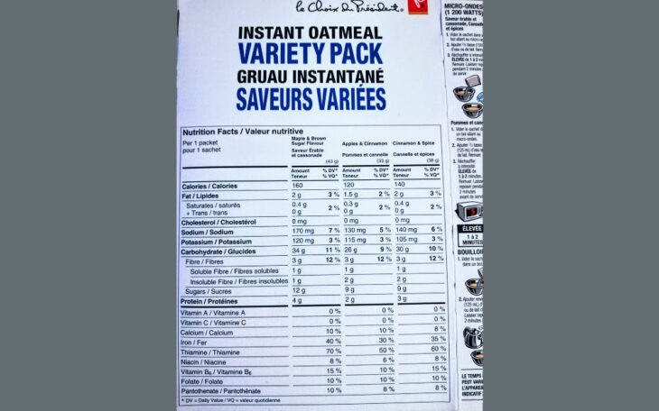

カナダに引っ越した！　ものの、**カナダの食品表示の方法が日本と異なっており、見方がいまいちわかりません。**そのため、今回は表示基準について調べてみました。

カナダの食品ラベル、表の見方をご紹介します。

※今回引用している情報は、2019年7月31日時点のカナダ政府公式Webサイトの情報を基に記載しています。

## カナダの食品ラベルに表示してある内容

カナダのラベルで表示されているものは以下の３つです。

1. **the nutrition facts table　（栄養成分表）**
2. **ingredient list　（原材料名表示）**
3. **nutrition and health claims 　（食品および健康作用への特記事項）**

[Government of Canada](https://www.canada.ca/en/health-canada/services/understanding-food-labels/about-food-labels.html)(About food labelsより）

今回は**1.the nutrition facts table　（栄養成分表）**について詳しく説明いたします。

## 栄養成分表　 the nutrition facts table

### 表示されているもの

栄養成分表の中に表示されているものは以下の３つ。

- **serving size（含有量）**
- **calories（カロリー）**
- **% DV （% daily values）**

最初の二つは日本でも同様ですが、最後の%DVはカナダ独特の表示となります。

### 表示が義務付けられている主な13種類の成分

- fat　（脂肪）
    - saturated fat　（飽和脂肪）
    - trans fat　（トランス脂肪）
- cholesterol　（コレステロール）
- sodium　（塩分）
- carbohydrate　（炭水化物）
    - fibre　（食物繊維）
    - sugars　（糖類）
- protein　（たんぱく質）
- vitamin A　（ビタミンA）
- vitamin C　（ビタミンC）
- calcium　（カルシウム）
- iron 　（鉄分）

### 表示義務はないが、表示可能な栄養成分

- folate　（葉酸）
- magnesium　（マグネシウム）
- niacin　（ナイアシン／水溶性ビタミンのひとつで、ビタミンB群の仲間）
- phosphorous　（リン）
- potassium　（カリウム）
- riboflavin　（リボフラビン／ビタミンB2）
- selenium　（セレン／セレニウム）
- thiamine　（チアミン）
- vitamin B12　（ビタミンB12）
- vitamin B6　（ビタミンB6）
- vitamin D　（ビタミンD）
- vitamin E　（ビタミンE）
- zinc 　（亜鉛）

### 栄養成分表の表示をしなくても良いもの

- 生の野菜、果物fresh vegetables and fruit
- 生肉（ただしひき肉は表示義務あり）
- 生の海鮮物
- 個別包装・販売されている1口サイズのお菓子
- 詰め替え可能な容器に入っている牛乳
- すぐに食べられることになっている給仕品
- 店舗内で作られた食べ物
    - 例）パン、サラダ等

このほか、飲み物類の表示は除外。また、屋台、展示会やフリーマーケットでの表示も免除されています。

## 栄養成分表の例

こちらは先日Shoppers Drug Martの安売りで購入したインスタントオートミール（3種類入り）の箱に書いてある栄養成分表です。

カナダは公用語の英語とフランス語、2種類の表示が義務付けられているため、大変ごちゃごちゃしたパッケージになっていますね。デザイン担当の人は大変だろうなと思います・・・。

**一番上にある「per 1 packet」は、基準となる1回あたりの摂取量**。今回は「一袋当たり」の栄養成分量表示をしていることを示します。

### 糖質・糖類の表示について

糖質制限ダイエットなどをされている方は、糖質表示が気になると思います。

画像例のオートミール、一番左のMaple & Brown Sugar Flavourを見ると、下記のように書かれています。

- **Carbohydrate　（炭水化物） 34g**
    - **Fibre　（食物繊維） 3g**
        - Soluble Fibre　（水溶性繊維）　　1g
        - Insoluble Fibre　（不溶性繊維）　 1g
    - **Sugars　（糖類）　12g**

Solubleとは「可溶性」という意味です。「Solution」が「溶液」という意味を持っているため、「Solu」＋「able」で水溶性、可溶性という意味になります。

**Sugars（糖類）　≠　糖質**

表示の「Sugars」の量がそのまま糖質量にならないことにご注意ください。Sugarsに含まれるのは「単糖類」「二糖類」のみを指し、「オリゴ糖」や「でんぷん」などのその他糖質分を含みません。

栄養成分表の中でこれ以上の情報が記載されることは稀なので、糖質制限をしている方は下記の計算方法で計算しましょう。

**Carbohydrate（炭水化物） - Fibre（食物繊維）＝** **糖質**

今回の場合、　34g - 3g = 31g　が、1パック当たりの糖質量ということになります。高い・・・。

## % Daily Valueとは？

気になるのは、各栄養成分量の隣に記載されている、「**Daily Value**（%)」の表示。 日本では見たことがありません。**[カナダ政府の公式ページ](https://www.canada.ca/en/health-canada/services/understanding-food-labels/percent-daily-value.html)**によると、

The current daily values in Canada are based on 2 sets of values. These include the:

1. recommended daily intake (RDI) for vitamins and minerals
2. reference standards for

現在のカナダの「daily values」表記は、「１.RDI（一日の推奨栄養摂取量）」と「2.各栄養の基準量」をもとに、計算されています。

つまり、**記載されている1食分の栄養成分量が、 1日の推奨摂取量に対し占めている割合を%で表しています。**

It is a guide to help you make informed food choices. It shows you if the serving size has a little or a lot of a nutrient:

- **5% DV or less is a little**
- **15% DV or more is a lot**

### Daily Value表示の目的

**Daily Valueの表示は、食品の購入、摂取時のガイドとして使われることを目的とされています。**確かに、例えば「iron 3mg」と言われても、それが摂取量として多いのか少ないのかわからないですよね。

一般に、食べ物はいろいろな種類を少しずつ摂取することが望ましいとされているため、DVの%表示が「**5%より少ない場合、1食に対し摂取したい栄養としては少なめ**」「**15%以上の場合は、多すぎる**」という目安になるそうです。

また、DV表示のある食べ物を組み合わせ、一日の各栄養素の合計を「100%」にすることが正しいわけではありません。 先述のとおり野菜などには栄養成分表の表示が無いため、 DV表示のあるものだけで100%を目指すと確実に推奨摂取量をオーバーします。

#### Daily Value 基準値

各栄養素の基準値については下記をご確認ください（[カナダ政府公式Webサイトより引用／2019年7月31日時点](https://www.canada.ca/en/health-canada/services/understanding-food-labels/percent-daily-value.html)）

Nutrient

Daily Value (DV)

Fat

65 g

Saturated and trans fats

20 g

Cholesterol

300 mg

Sodium

2400 mg

Carbohydrate

300 g

Fibre

25 g

Sugars

no DV

Protein

no DV

Vitamin A

1000 RE

Vitamin C

60 mg

Calcium

1100 mg

Iron

14 mg

### Daily Value表示の注意点

Daily Value表示が、1日の各栄養分の推奨摂取量に対する割合、ガイドであることがわかりましたが、ここで注意したいのが、誰に対しての「推奨量」なのかがわからないという点です。

**年齢、性別、ライフスタイルによって必要栄養量、代謝量は異なります。**

私の場合運動をまったくしないアラサー女性のため、一日に300gも炭水化物を摂取したらデブコースまっしぐらです。Daily Valueはあくまで目安、できる限り必要な量は自分で計算できるようにしましょう。

## まとめ

食は健康に直結します。今回調べる中で、新しい発見やDaily Valueという考え方を知ることができました。正直カナダに来てから、日本にいたころの糖質制限の効果はどこへやら、太り続けている状態なので、今後はかなり慎重にお菓子とかを買おう・・・と思いました。
