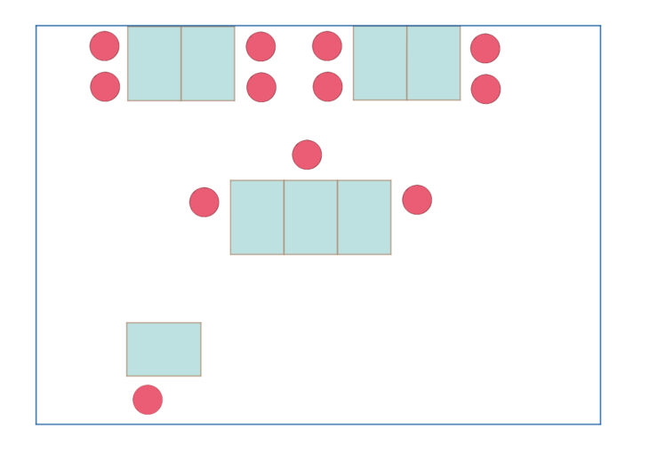

**Cloud Nine College**というバンクーバーの語学学校をご存知でしょうか？

カナダのバンクーバー留学を決めたけど、語学学校が全然選べない！

カナダの中でもバンクーバーは語学学校の数が非常に多い地域です。しかし、日本滞在中に語学学校を決めるとなると、どれも同じような学校に見えたり、特徴がわからなかったりと、学校選びや比較に迷われている方は多いと思います。

私も、カナダ留学を決めた際に一番悩んだのが語学学校選びでした。

この記事では、私（モトキ）が現地で、実際に**Cloud Nine Collegeのトライアルレッスンに行った****感想と学校の特徴（メリット・デメリット）を、個人の視点から紹介します。**

私は現在カナダに留学していまして、**10校以上の語学学校に体験入学＋****語学学校３校に通いました。**[それらの体験や比較](https://28-nikki.com/vancouver_school_review_list/)から、学校ごとの特徴やメリットデメリットをまとめています。

- バンクーバーの数ある語学学校の中から、何を基準に選べばいいかわからない
- Cloud Nine Collegeを検討しているが自分が合っているか不安
- Cloud Nine Collegeの悪い点やデメリットも知りたい
- Cloud Nine Collegeが気になっているけれど、実際体験した評判を知りたい

この記事では、メリットデメリット含めて率直な評価、意見をそのまま書いていますので、バンクーバー語学留学に向けて学校の実態や評判を知ることができます。

また、クラウドナインカレッジが、どんな方におすすめできるかも、併せてご紹介します。クラウドナインカレッジを検討されている方、バンクーバーの語学学校の情報が欲しい方の不安を解消する手助けになると思います。

その他の[語学学校の学校感想・体験授業口コミリンク集はこちら](https://28-nikki.com/vancouver_school_review_list/)。

## バンクーバーのCloud Nine College **とは？**

**Cloud Nine College 基本情報！**

- **Cloud Nine College／クラウドナインカレッジ**
- **#110 - 668 Seymour Street, Vancouver, B.C., V6B 3K3**
- [**http://www.cloudninecollege.com/**](http://www.cloudninecollege.com/)

クラウドナインカレッジは、カナダ、バンクーバーのダウンタウンに位置する語学学校です。Dollaramaと同じ建物、同じフロア（地下１階）にあるため、学校を出たら目の前にDollaramaがあります。

Granville駅から徒歩２分、City Center駅からも徒歩３分と、各駅から非常にアクセスの良い立地が特徴です。

<iframe style="border: 0;" src="https://www.google.com/maps/embed?pb=!1m14!1m8!1m3!1d10410.767394935468!2d-123.116262!3d49.282236!3m2!1i1024!2i768!4f13.1!3m3!1m2!1s0x0%3A0x9e2f91a517e4423e!2z44Kv44Op44Km44OJ44O744OK44Kk44Oz5aSn5a2m!5e0!3m2!1sja!2sca!4v1571904161767!5m2!1sja!2sca" width="400" height="300" frameborder="0" allowfullscreen="allowfullscreen"></iframe>

クラウドナインカレッジの特徴は下記の通りです。

- 日本人学生の受け入れを始めたのが数年前なので、日本人比率が比較的低い
- 生徒同士の交流が豊かな小規模学校
- コミュニティ・カレッジ併設なので、語学＋αの勉強が可能

Cloud Nine College は、昔はヨーロッパ、ラテンアメリカ系の国に対してのみアプローチをしていたそうです。アジア系、日本人の生徒の受け入れを広く始めたのがここ数年の話になるため、**日本人が少ないことが特徴の一つの小規模語学学校**です。

また、コミュニティ・カレッジが併設されているため、語学学校で英語を学ぶだけでなく、**英語で新しいことを学ぶこと**も可能です。

## Cloud Nine College の口コミは？

WEB上の口コミやレビューの評価・評判は下記の通りです。

**[Googleレビュー](https://www.google.com/search?q=cloud+nine+college&oq=cloud+nine+college&aqs=chrome..69i57j0l2j69i60l3.4924j0j7&sourceid=chrome&ie=UTF-8#lrd=0x548671820f6d8d4d:0x9e2f91a517e4423e,1,,,) ★4.6/ 27件　（2019年10月23日現在）**

**[Facebookレビュー](https://www.facebook.com/Cloudninecollege/) ★4.9 / 76件　（2019年10月23日現在）**

Facebookのレビューは、76件と多くのレビューを貰いながらも、**ほぼ満点の★4.9を獲得**しています！他の語学学校でも、4.9までいく評価はほとんど見たことがありません。

レビューの内容を分析すると、下記の点が口コミの中で評価されていました。

- **小規模で細やかな授業**
- **親切なスタッフ／プロフェッショナルな先生**
- **学校全体がフレンドリー**
- **様々な国籍のインターナショナルな環境**

小規模ながらも様々な国籍の生徒が集まる、インターナショナルな語学学校のようです。また、小規模ならではのアットホームな雰囲気が高評価でした。

## 体験入学レビュー　Cloud Nine College のおすすめポイント

ここからは、私が実際にCloud Nine College の体験授業の評価を書いていきます。

### クラスの生徒数が少なく、スピーキング（発言）の機会が多い

今回受けたトライアルレッスンのクラスの生徒数は、なんとたったの７人でした。

**語学学校の授業では、クラスあたり人数が少なければ少ないほど、自身の発言の機会が増えます。**他の学校では、時にはひとクラス18人という授業もあり、その中で先生の質問に対し回答をする、英語を話すチャンスを作るのは至難の技です。

お金を払って英語を習いに来ているのに、英語を話す機会がない、なんて悲しいことは避けたいですよね。

Cloud Nine Collegeのひとクラスあたりの生徒数は、**平均１０人前後**だそうです。他の学校では、13人〜15人で「少人数制」と呼んでいるところもあるので、クラウドナインカレッジのひとクラスの生徒数は非常に少ないと言っていいと思います。

また、教室の机の配置も、他の学校では見られない特殊な形をしていました。

このように、机を２〜３個合わせ、生徒が向き合う形で椅子に座ります。生徒間の距離が近く、生徒同士での会話が生まれる効果を狙っているそうです。

授業中でも、この机のグループ単位でのアクティビティが用意されているなど、授業中にコミュニケーションを促す取り組みをしっかり行なっている印象でした。

### 先生と生徒の距離感が近く、アットホームな雰囲気

**少人数クラス、小規模校ならではのアットホームさ**はCloud Nine Collegeも同様に持ち合わせていました。

特に先生との距離感が近く、授業の始まりでは先生が全員に「昨日は何があった？」と質問し、ひとりひとりに丁寧に返事をする時間がありました。

休み時間も、先生と生徒で雑談をするなどかなり仲が良い様子で、お互いの生活や考えを知ることを積極的に行なっていました。先生との距離感が近く、雰囲気の良い授業進行は、小規模校ならではの魅力だと思います。

### テキストに沿って丁寧に進む授業構成

Cloud Nine Collegeでは、使用している教材テキストに沿って丁寧に授業が進んでいきます。

かなりしっかりした8mm厚くらいのテキストで、ボキャブラリーの習得、文章の読解、文法事項の整理など、テキストの内容をひとつひとつ教えていくイメージでした。

ボキャブラリーは、単なる丸暗記にならないよう、生徒同士のグループでちょっとしたゲームアクティビティを取り入れていました。（二つの単語を組み合わせた名詞を作る、というゲームだったのですが、２０種類、計40個の単語だったので、生徒総出でてんやわんやになってました笑）

テキストを購入するもほとんど使わない。これなんのために買ったの？みたいな語学学校もあります。また、その結果文法を全然やらない、四技能と言いつつ偏った英語しか伸ばせない。といった授業もあります。

そのため、Cloud Nine Collegeの、**テキスト準拠で英語の基礎部分を教え、固めていく点には好感が持てました**。

### 英語授業×日本語で英語を学べるクラスも！

Cloud Nine Collegeの午後の選択授業では、Beginner 1〜Pre Intermediate 1の英語初級レベルの方に向けて、**日本語で英語を教えてくれる授業が用意されていました**（日本人が少ない学校にも関わらず！）

「日本人の生徒を入れていきたい」という学校側の強い意思を感じますね・・・笑

正直、ここは人の好みによりけりかな、と思います。

しかし、午前中の英語の授業のわからなかった点を日本語で思う存分訊ける利点もあります。

バンクーバーに来た後に、日本語で英語を教えて貰いたい！と思うと、かなり選択肢が狭まること。また、基本英語で授業を受け、わからないところを日本語でサポートしてもらえるサービスは他の語学学校にはありません。

そのため、いきなり英語で授業がスタートしていくことに不安を覚えている方、あるいは英語授業を受けたものの、ちんぷんかんぷんでついていけない、という方には安心できる授業体制になっています。

ちなみに、Cloud Nine Collegeの公式WEBサイトは珍しく[日本語専用サイトを用意してくれています](https://spark.adobe.com/page/yW4ZanOQXU6QC/)。

ただし、先生の英語を聞くことも最初の段階ではリスニングの練習になります。個人的には、できる限り英語授業を受講することをオススメします。

## Cloud Nine College のデメリット

### アジア系の生徒も結構見かけた

アジア系の生徒を最近増やし始めているせいかもしれませんが、**事前情報に比べるとアジア系の国籍比率が高いな**、という印象です。

私の体験したクラスは3/7がアジア系の生徒だったため、余計にその印象が強かったと思います。他に比べて、別に日本人が少ないわけではないイメージでした。

国籍比率は、入学前に重視する方は多いと思います。

しかし、申込者に対し学校側で調整できることはあまりありません。どれくらいの生徒が通っているか。時期やタイミング次第になってしまうため、日本人比率の少なさについては、あまり期待しすぎないことをおすすめします。

ただ、小規模校のアットホームさ、もともとヨーロッパ、ラテン系の学生が多いことを考えると、日本人以外と仲良くなるチャンスは十分にあると思います。

### 午前クラスは選択肢がほぼ１択

Cloud Nine Collegeのクラスレベル分けは下記の７種類です。

1. Beginner 1
2. Beginner 2
3. Pre Intermediate 1
4. Pre Intermediate 2
5. Intermediate
6. Upper Intermediate
7. Advanced

小規模校としては、かなり細かくレベル分けされている印象です。

しかし、午前中の授業は、 General EnglishかIELTS対策コースしか用意されていません。

学校の規模感から、１つのレベルに対し複数クラスが用意されることもほとんど無いため、「Beginner2のレベルだけれども授業／先生が合わなかった」といった場合に変更が不可能です。

テキスト準拠で丁寧に授業を進めていくからこそ、長期間の受講は、同じような進み方をする授業に飽きやすい方にはおすすめできません。

小規模校の場合は、申し込みの前に体験授業を受けるなどして、授業の雰囲気をしっかりと掴んでおくことをおすすめします。

## まとめ　Cloud Nine College はどんな人にオススメ？

以上の内容から、**Cloud Nine Collegeは、小規模ならではのアットホームな雰囲気が魅力の語学学校**であると言えます。

そのため、クラウドナインカレッジは下記のようなタイプの方にはオススメの語学学校だと思います。

- 小さめの語学学校、先生や生徒と仲良くアットホームな雰囲気で勉強をしたい
- 「英語の四技能をバランスよく」を言葉通り、きちんと授業で習っていきたい
- 英語に全然自信がなく、できれば日本語での授業フォローも欲しい

一方、

- 絶対に日本人の国籍比率が少ない学校に行きたい方（どうしても時期によるため）
- 授業が合わなかった時に、他の授業を選べるオプションが欲しい方
- 授業に飽きやすく、長期間の通学を検討している方

上記のような方は、別の語学学校も再度検討した方が良いかもしれません。

Cloud Nine College以外の[語学学校の学校感想・体験授業口コミはこちらにまとめています](https://28-nikki.com/vancouver_school_review_list/)。

https://28-nikki.com/vancouver\_school\_review\_list/

また、語学学校に申し込む際は留学エージェントを使うと値引きがあるのでオススメです。[エージェントに申し込む時の注意点とバンクーバーのオススメエージェントはこちら。](https://28-nikki.com/ryugaku_agent_how-to-choose/)

https://28-nikki.com/ryugaku\_agent\_how-to-choose/

以上、バンクーバーの語学学校Cloud Nine College の感想と評判のまとめでした。カナダ留学、バンクーバー語学留学の参考になりましたら幸いです。

 

**[＞＞相談無料・カナダ現地留学エージェントの【カナダジャーナル】＜＜＜](https://px.a8.net/svt/ejp?a8mat=35QD5V+7R8C9M+3OSA+5YJRM)**
