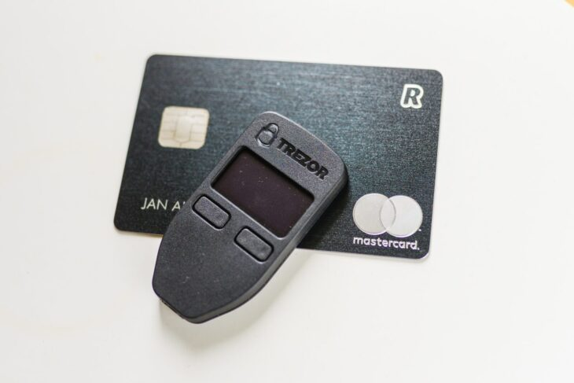
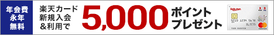

海外留学に向けて準備が進んでくると、初期費用が予想以上にかさんでしまい、少しでも留学費用を節約できないか・・・という気持ちになりますよね。特に、海外保険の加入は任意の部分もあり、保険に入らないで留学ができないかと悩んでいませんか？

私も、留学費用を節約したくて**保険に加入しないで留学できないか**と色々調べました。

が、最初に答えを言ってしまうと、**答えはノーです**。海外留学に当たって、保険に一切加入しないで留学することはできません。

ただし、この記事で紹介する**【無料で作れるクレジットカードの自動付帯海外保険を使う】方法**を選べば、**無料で最大90日分の海外旅行保険に加入することが可能**です。

私は1年以上の長期留学（学生ビザ）でカナダにやってきました。そして実際にこの【クレジットカードの無料付帯分の海外保険】で、最初の90日分は保険会社の保険に加入せず、加入料を１万円以上節約することができました。

ビザの種類、年齢、保険内容、どの保険会社と契約するかによって、保険の掛け金が変わるので、人によっては１０万円近く簡単に節約できてしまう方もいると思います

この記事では、私が調べた**留学での保険加入の必要有無、保険の種類や、クレジットカードについている付帯海外保険の各内容の比較、おすすめのカードをご紹介**します。

記事を読み終えると、海外保険にまつわる留学費用を節約する方法、また、それに適した無料のクレジットカードがどれか知ることができます。

## 留学の海外保険の基本情報

まずはじめに、海外留学の際に加入を求められる「海外保険」「海外旅行保険」の加入の是非、種類など、基本的な情報をお伝えします。

### 海外保険に加入しないと留学ができなかった理由

#### 海外保険に加入する理由①　留学生は保険の加入が学校入学の条件

海外留学を検討されている方は、語学学校への入学や現地のカレッジ、大学への入学を考えている人がほとんどだと思います。

実はこうした留学生を受け入れている学校では、**入学時に提出しなければいけない書類のセットがあり、その中の一つが「保険の加入証明書」「保険証書」**です。

私はカナダで過去３つの語学学校を体験しましたが、すべての学校で、入学日に「保険証書」の提出を求められました。入学要項にも「カナダ現地で使える健康保険に加入していること」と書かれています。また、カレッジでも海外健康保険の加入を求められました。カレッジの場合、学校入学時に、学校と提携している保険への加入を求められるところや、保険証の提示で済むところなど様々です。

語学学校、カレッジともに、**「生徒が海外保険に加入していること」が留学生受け入れ、入学のひとつの条件になっている**ため、学校への通学を考えている場合、ひとつも海外保険に加入しないで留学することは不可能なのです。

#### 海外保険に加入する理由②　留学中に何かあった時のリスクヘッジ

「保険」という制度そのものの存在意義です。そして、海外において「保険」の重要性が日本と全く異なっていることを知っておく必要があります。

海外に住んでいる人で、健康保険に入っていない人はまずいません。何故かというと、日本のように公的な健康保険制度が存在しないこと。そして、医療費が高額であることが挙げられます。

誰しも、一度も病院に行かないで一生を過ごすこと−−−−−−これが難しいことはわかると思います。また、突然の事故、怪我、自身のお金の蓄えがない時に何かが起こったら・・・。そうした不安を解消するシステムとして、民間の健康保険制度が利用されているのです。

上記の**「高額な医療費用」は、もちろん留学生にも適用されます。**

何かがあって救急車で運ばれた。手術を行い、２〜３日入院した。請求が来る。

このときに気にせず払えるだけの貯蓄がある方には不要かもしれません。しかし大多数の留学生には、簡単に出せる金額ではないでしょう。こうした**有事の際に、事前に保険制度に加入しておくことで、費用を健康保険の企業に負担してもらえるのが海外旅行傷害保険です**。

もちろん、入院や救急車の例は極端と言えます。しかし、[留学先として人気の各国の交通事故率は日本よりも一般的に高い（アメリカ、ニュージーランド、オーストラリア、カナダ等）](https://www8.cao.go.jp/koutu/taisaku/h29kou_haku/zenbun/keikaku/sanko/sanko02.html)です。「自身が健康に気をつける」だけでは済まないのが事故の怖いところ。

カナダ留学については、[外務省のHP](https://www.mofa.go.jp/mofaj/toko/medi/n_ame/canada.html)でも、旅行傷害保険への加入を推奨しています。

> 留学生（ワーキングホリデイ含む）等は公的医療保険を取得できない州もあり，その場合，医療費は有料になります。また，歯科診療・処方薬剤（入院中は無料）・リハビリ治療などは全額個人負担となります。高額な医療費請求に備えて，渡航前には**旅行傷害保険に加入しておくことをお勧めします。**
> 
> [https://www.mofa.go.jp/mofaj/toko/medi/n\_ame/canada.html](https://www.mofa.go.jp/mofaj/toko/medi/n_ame/canada.html)

毎日の留学生活で「何かあった時」も保険に加入しているから安心して暮らせる。そうした環境づくり、リスクヘッジとしての側面を持っているため、海外保険の加入と言えるでしょう。

## 海外留学で加入する保険はどんなものがあるの？

#### 【海外旅行保険の種類①】健康・医療保険

保険加入の第一目的となる要素です。

**風邪を引いた、怪我をした、事故にあった。そうした数々の病気、健康被害をカバーする保険になります。**

カナダ現地企業による健康保険のカバー範囲私がカナダで加入している保険でカバーしている範囲は下記の通りです。

- **医療費**
- **処方箋**
- **年一度の定期検診**
- **緊急輸送費用（救急車など）**
- **死亡保障**
- など

カナダでは救急車を呼んで運ばれるとお金を取られてしまうんですよね。。。

歯医者以外の、通常の医療に関わる範囲はだいたいカバーしています。**保険会社や保険によって適用範囲が異なるため、加入前にどういった対象が補償の範囲に入っているか確認することが大事です。**

#### 【海外旅行保険の種類②】損害保険・賠償保険

**「損害保険」**とは、**海外で盗難が起こったり、自分の持ち物が事故などで壊れてしまった際の損害金額カバーする保険**です。健康保険と比べると、優先度は大きく下がります。

私は盗難にあって困るほど高級な物を身につけていないこと。また、カナダは比較的安全な国なこともあり、加入していません。ただ、**国によっては盗難が日常茶飯事の場所もあります。**中南米の国から来た友人曰く、「飲食店で物を食べながらテーブルにスマホを置いておけるなんてカナダは本当に安全だよね」とのこと（店員さんが料理を持って来て、そのままスマホを盗んでいったりするらしいです。）

また、**「賠償保険」**とは、他人を死傷させてしまったとき、自分のものではなく、他人の物を壊してしまったときなど、**自身が「加害者側」になった場合、「被害者」（相手）への損害賠償分を補償する保険**です。こちらも、通常の留学であれば余程のことがない限り発生することはありません。

どちらも、病気などと比べると、比較的自身の注意でコントロールできる範囲でしょう。

#### 【海外留学用の保険会社】海外or日本企業の保険

海外留学の際に検討できる保険は、通常２種類あります。

1. **海外留学先、現地の保険会社が提供する保険**
2. **日本の保険会社が提供する保険**

一般に、１の「**海外留学先、現地の保険企業が提供する保険**」は通常、**保障される範囲が「健康・医療」のみとなっており、２の日本企業の保険よりも安価に済むのが特徴**です。

一方、２の「**日本の保険企業が提供する保険**」は、適用範囲を「健康・医療×損害」、「健康・医療×賠償」、あるいは全て含むなど、自身の好みに合わせてアレンジできる場合が多いです。ただし、**保険の掛け金が高く、海外現地企業の保険と比べ費用が高額になります。**

## クレジットカード付帯の海外旅行傷害保険とは？

### クレジットカード付帯の海外旅行保険とは？

クレジットカードによっては、**各クレジットカード会社がサービスとして、カード利用者／保持者に対し海外旅行障害保険をサービスとして無料でつけている（これを付帯という）**場合があります。

#### クレジットカード付帯保険の特徴①　自動付帯と利用付帯

クレジットカードに海外旅行傷害保険がついていた場合、カード会社が契約している、日本国内の保険会社の保険を利用することができます。

また、その際に付帯される保険には２種類のパターンがあります。

- **自動付帯**
- **利用付帯**

「**自動付帯**」とは、**カード保持者が海外旅行に出発した際に、自動的に海外旅行傷害保険に加入しているとみなされるパターンの保険**です。クレジットカードを持っているだけで、そのほかの条件無しに保険を利用できます。代表的な例として、[【エポスカード】](https://px.a8.net/svt/ejp?a8mat=35M2WK+XCBFE+38L8+BYDTU)や[【REXカード】](http://kakaku.com/rexcard/)が挙げられます。

「**利用付帯**」は、**カード保持者が海外旅行に際し、そのカードを使用することで海外旅行傷害保険に加入することのできるパターンの保険**です。カードの保持に加え、各カード会社の定める「利用条件」を満たす必要があります。[【楽天カード】](//af.moshimo.com/af/c/click?a_id=1576647&p_id=58&pc_id=58&pl_id=668&guid=ON)や[【リクルートカード】](https://recruit-card.jp/)などが一例となります。

#### クレジットカード付帯保険の特徴②　補償期間

クレジットカード付帯の海外旅行傷害保険は**【90日】**が一般的な適用範囲です。

自動付帯であれば、留学出発日から90日間までは、クレジットカードの保険で医療費などをカバーできます。

また、利用付帯の場合、留学（出発）前の支払いが条件となっているものは出発日から90日間。留学中のカード利用・支払いが条件となっているものは、旅行中の支払日から90日間が保険の補償期間となります。

#### クレジットカード付帯保険の特徴③　保険補償の対象範囲

**クレジットカードによって、保険の補償対象となる範囲が異なります。**

たとえば、「最高●●●●万円の海外旅行傷害保険が自動付帯！」などのキャッチコピーがついているクレジットカードでも、中身を見ると「傷害死亡」のみ補償がついており、現地で病気になった際の「傷害・疾病治療費用」などが補償の対象外になっている場合があります。

こうした保険補償の対象が死亡補償のみの場合、留学中に病気になったり怪我をして医師に診てもらう際に使用することができません。

**無料で付いてくる海外旅行傷害保険だからこそ、補償の対象範囲は必ず確認が必要**です。

#### クレジットカード付帯保険の特徴④　保険の項目ごとの補償金額

**海外保険の各項目（傷害死亡、傷害・質病治療費用）などに対する、補償金額もクレジットカードごとに異なります。**補償金額が少ないと、**留学先の現地でかかった費用を保険でカバーできないことが多いので注意が必要**です。

例えばカナダでは、1日の入院費用（部屋代）が24万円なので、5日間入院すると部屋代だけでも100万円を超えてしまいます。そこに初診料、救急車費用などもろもろの費用がさらに加わります。

あまりにも補償金額の少ないものは、加入していても焼け石に水状態なので、クレジットカードの補償金額は確認をするようにしましょう。

#### クレジットカード付帯保険の特徴⑤　保険補償金額の支払い・請求方法

海外旅行傷害保険で、現地での医療費などが補償されると言っても、どのように保険会社が支払ってくれるのでしょうか。

医療費の支払いについては、

1. **現地で一度個人が建て替えし、あとから請求するパターン**
2. **現地での支払いも保険会社が行ってくれるパターン（キャッシュレス診療）**

の２種類が存在します。

しかし、**キャッスレス診察は保険会社が提携している病院に限り、利用可能**な診察・支払い方法になるため、事前に提携病院の把握が必要となります。

キャッスレス診察可能は非常に便利なシステムなのですが、場所によっては、まったく提携病院が無い場合があります。また、緊急搬送の場合は病院を選んでいる余裕などありません。

実際に使用するとなると、正直使い勝手はあまり良くないです・・・。

## 海外留学はクレジットカード付帯の保険で充分？

### 留学期間次第では、有料の保険に加入しないで留学も可能

#### 短期留学：クレジットカード付帯の海外旅行保険でもOK

短期留学の場合、クレジットカード付帯の海外旅行傷害保険次第で、**渡航中の病気などをカバー（保険会社の保険に加入しないで留学を終える）することも可能**です。

#### 長期留学：クレジットカードでは不十分だが保険代の節約可能

長期（91日以上）の留学を検討されている場合、クレジットカードの海外旅行傷害保険は90日間しかカバーできません。そのため、**保険会社の保険に加入しないで留学を済ませることは不可能**です。

しかし、最初の90日間はクレジットカードの保険を利用。91日目から保険会社の保険に加入することで、**90日分の保険代を節約することができます**。

### ただし、１枚だけだと補償金額は足りないかも

クレジットカード付帯の海外旅行傷害保険を使い、留学中の保険加入費用を節約することは可能です。しかし、事前にお伝えした通り**自動付帯／利用付帯などの保険利用条件、保険でカバーできる範囲には注意が必要です。**

そして何よりも、**保険の補償金額については、保険会社にお金を払い受ける補償とは大きく価格が異なります。**海外の医療事情を鑑みると、クレジットカード１枚だけで保険をカバーするのは少し難しいかもしれません。

#### 留学用の各保険の費用・補償内容比較

一例として、各保険（90日間）での、留学中に一番使う可能性のある「傷害・疾病治療費用」の補償金額と掛け金（費用）を比較します。

1. **【クレジットカード】**年会費無料で作成できるクレジットカードの中で「傷害・疾病治療費用」の補償金額が最も高い**[【エポスカード】](https://px.a8.net/svt/ejp?a8mat=35M2WK+XCBFE+38L8+BYDTU)**で比較
2. **【日本の保険会社】**[AIG損保の留学保険](https://px.a8.net/svt/ejp?a8mat=35RZ3A+EF6122+TC4+I1NCI)で最も掛け金の安いプラン（ブロンズBプラン(IR4)）
3. **【カナダの保険会社】**Allianz Global AssistanceのInternational Student用プラン

**クレジットカード**

**日本の保険会社**

**カナダの保険会社**

**疾病治療　補償金額**

270万円 （1疾病の限度額）

 無制限

200万CAD （約1億6600万円※）

**90日間の費用（掛け金）**

0円

48,190円

130.5CAD （10,831.5円※）

※1CAD＝83円で計算

カナダの保険会社の場合、補償項目ごとに価格が設定されていないため、その他の補償全て含めて合計この金額まで補償しますよ、という書き方になります。が、なんであれ**クレジットカードの補償金額とは桁・サービスが全く違います。**

私は最初の90日間、クレジットカードの付帯保険を利用しました&期間中緊急で病院にかかることもなく過ごしました。しかし、何かあった時のリスクヘッジなので、**不安な方は保険会社に加入することをオススメします。**

#### クレジットカード付帯保険の補償金額を引き上げる方法

なお、クレジットカードに付帯の補償金額が小さかった場合でも、**死亡補償以外の補償項目については、複数カードの補償金額を合算することが可能**です。

留学中に一番使う可能性のある「傷害・疾病治療費用」を例にすると、自動付帯の海外旅行傷害保険がついている[【エポスカード】](https://px.a8.net/svt/ejp?a8mat=35M2WK+XCBFE+38L8+BYDTU)や[【REXカード】](//ck.jp.ap.valuecommerce.com/servlet/referral?sid=3475678&pid=886143373)２枚を所持していれば

**傷害・疾病治療補償費用**

**エポスカード**

200万円（疾病は270万円）

**REXカード**

200万円

**合計**

**400万円**

このように、**それぞれのカードの補償金額を合算することが可能なので、２枚を合算した400万円までの補償を受けることができます。**

クレジットカードの保険のみで留学を検討する場合、保険付帯のクレジットカードを複数枚所持することで、補償金額面の不安を補強することが可能です（有料保険の補償金額には届きませんが・・・）

## 留学用の保険付帯でオススメのクレジットカード３選

以上を踏まえまして、留学用の保険、という観点から、クレジットカードを調査。その中からオススメのクレジットカードをご紹介します。

### 留学用付帯保険の選定条件

- **カード年会費が初年度以降も無料**
- **大学生でもカードの申し込みが可能**
- **保険加入の付保証明書が発行可能と公式サイトで記載**
- **傷害・疾病治療費用の１回の限度額が200万円〜**

### 海外留学におすすめのクレジットカード①　エポスカード

 すでに何度かお伝えしている、マルイ発行の[エポスカード](https://px.a8.net/svt/ejp?a8mat=35M2WK+XCBFE+38L8+BYT9E)です。

**エポスカード**のおすすめポイント

- 年会費が**永年無料**
- **大学生**でもカードの申し込みができる（申込年齢は18歳以上）
- [保険加入の付保証明書が発行可能](https://faq.eposcard.co.jp/faq/show/1180?category_id=55)と公式サイトで記載
- 疾病治療費用は１回の限度額**最高270万円**（傷害治療費用は**200万円**）
- キャッスレス診療にも対応
- **自動付帯**

今回調べた中では、**疾病治療費用の補償額が270万円最も高い**こと。更に**年会費も永年無料**なので、とりあえず作っておいても不安がないのが強み。

私も実際にエポスカードを持っており、留学用に付保証明書を依頼ししました。（その時は三井住友海上の証明書をいただきました。）

**最短即日でクレジットカードの発行が可能**なので、現在海外旅行傷害保険付帯のカードを持っていない。留学まで期間がなく急いでる！って方にもおすすめです。

[＞＞年会費無料・最短即日発行のエポスカード＜＜](https://px.a8.net/svt/ejp?a8mat=35M2WK+XCBFE+38L8+BYT9E) 

### 海外留学におすすめのクレジットカード②　REXカード

続いてのおすすめはレックスカードです。エポスカード同様に、年会費無料ながら保険の内容が充実している点が特徴です。

レックスカードのおすすめポイント

- 年会費が**無料**
- 学生でもカードの申し込みができる（申込年齢は18歳以上）
- [保険加入の付保証明書が発行可能](https://faq.jaccs.co.jp/faq_detail.html?id=212&category=&page=1)と公式サイトで記載
- 傷害・疾病治療費用は**１回の限度額最高200万円**
- キャッスレス診療にも対応
- **自動付帯**

今回調べた中では、エポスカードには届きませんが**傷害・疾病治療費用の補償額がそれぞれ200万円**と高めのカードです。こちらも**年会費が無料**、かつ自動付帯のカードなので、留学の保険付帯目的でも、とりあえず作っておいて損の無いカードです。

[＞＞REXカードの公式サイトを見る＜＜](http://kakaku.com/rexcard/)

### 海外留学におすすめのクレジットカード③　楽天カード

最後におすすめするのは楽天カードです。エポスカード、REXカードと異なり、**利用付帯のタイプ**です。そのため、**渡航前に航空券・あるいは空港までの交通機関への支払いでカード利用しなければならない制約があります**が、補償金額は遜色ありません。

楽天カードのおすすめポイント

- 年会費が**無料**
- 学生でもカードの申し込みができる（申込年齢は18歳以上）
- [保険加入の付保証明書が発行可能](https://www.rakuten-card.co.jp/overseas/insurance/)と公式サイトで記載
- 傷害・疾病治療費用は**１回の限度額最高200万円**
- **利用付帯**

利用付帯の「利用」に該当する支払いについては細かい条件があるため、[楽天カードの詳細ページ](https://www.rakuten-card.co.jp/overseas/insurance/)を確認してください。

当日空港へ行くときの電車代等でも「利用」と見なされ保険適用の対象となりますが、**付保証明書を楽天で入手する場合には注意が必要です**。カードを利用していることが保険適用の大前提になるため、航空券の支払いや交通機関の事前予約・支払いが条件になると考えられます。

[＞＞＞年会費永年無料の楽天カード＜＜＜](//af.moshimo.com/af/c/click?a_id=1576647&p_id=58&pc_id=58&pl_id=669&guid=ON)

## まとめ　海外留学の保険はクレジットカードを使って節約できる

以上、海外留学の旅行傷害保険について、クレジットカードの付帯保険を利用する際の特徴と注意点、オススメのカードでした。

きちんとクレジットカードの海外保険付帯内容を理解し、うまく利用すれば、無料で90日分をカバー。留学費用を節約できるので、少しでも留学費用を抑えたい方はご参考ください。

ただし、お伝えした通り保険の補償金額は保険会社の補償とは大きく異なります。何かあった際は自己責任になりますので、不安な方は保険会社の保険に加入することをおすすめします。

同じく留学前に悩みがちな、[留学エージェントの選び方についてはこちら](https://28-nikki.com/ryugaku_agent_how-to-choose/)
