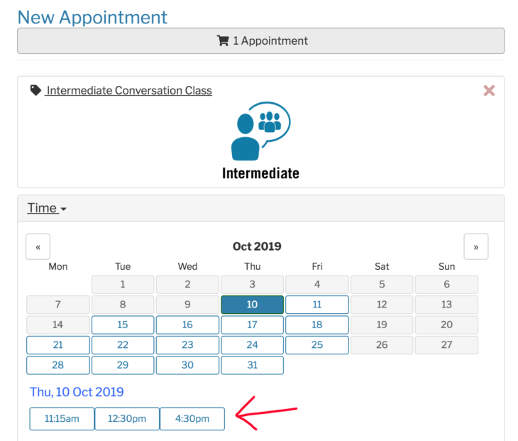
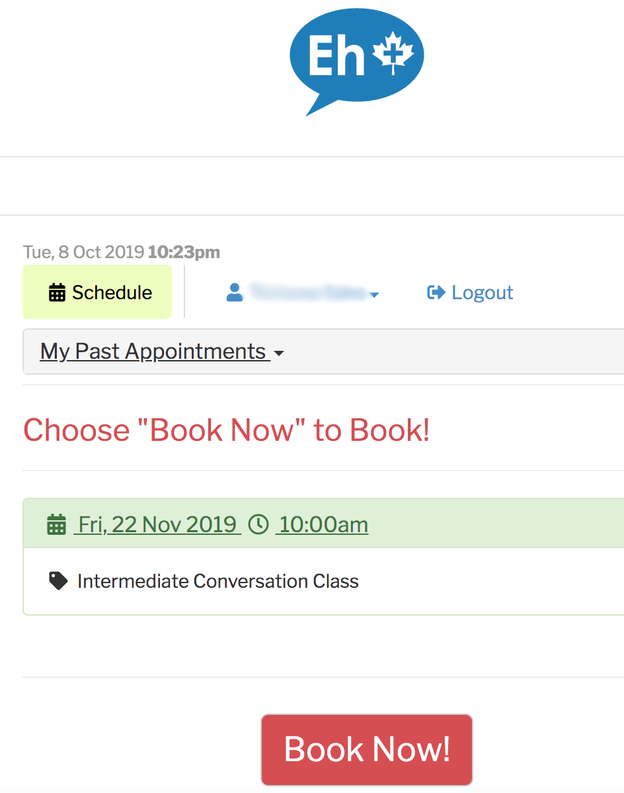

バンクーバーの語学留学を検討されているみなさま、語学学校、**[Eh Plus English Education](https://eh-plus.com/)**をご存知でしょうか？

カナダのバンクーバー留学を決めたけど、語学学校が全然選べない！

カナダの中でもバンクーバーは語学学校の数が非常に多い地域ですが、どれも同じような語学学校に見えたり、特徴がわからなかったり。留学にあたって、学校選びや比較に迷われている方は多いと思います。

この記事では、私（モトキ）が実際に、バンクーバーの語学学校Eh Plus English Educationに体験入学をした授業の感想と学校の特徴（メリット・デメリット）を、個人の視点から紹介します。

**私は現在カナダに留学していまして、語学学校３校に通う＋複数の語学学校に体験入学をしています。**一個人の体験や比較から、学校ごとの特徴やメリットデメリットをまとめています。

- **バンクーバーの数ある語学学校の中から、何を基準に選べばいいかわからない**
- **語学学校に自分が合っているか不安**
- **どこも良いことしか書いていなくて、学校のデメリットも知りたい**
- **Eh Plus English Educationが気になっているけれど、実際体験した評判を知りたい**

この記事では、メリットデメリット含めて率直な評価、意見をそのまま書いていますので、バンクーバー語学留学に向けて学校の実態や評判を知ることができます。

また、Eh Plus English Educationが、どんな方にとってオススメの学校になるかも併せてご紹介しますので、Eh Plus English Educationを検討されている方、バンクーバーの語学学校の情報が欲しい方の不安を解消する手助けになると思います。

その他の[語学学校の学校感想・体験授業口コミリンク集はこちら](https://28-nikki.com/vancouver_school_review_list/)。

## バンクーバー語学学校　Eh Plus English Education**とは？**

Eh Plus English Education基本情報！

- **Eh Plus English Education ／　エイプラス イングリッシュ エデュケーション**
- **568 Seymour St, 3rd Floor, Vancouver, BC**
- **[https://eh-plus.com/](https://eh-plus.com/)**

まずはじめに、[Eh Plus English Education](https://eh-plus.com/)はどのような学校なのでしょうか？

Eh Plus English Educationは、バンクーバーのダウンタウンに位置する小規模の語学学校です。かなり語学学校が密集している地域ですが、駅からも近く非常に便利な立地の学校です。

<iframe style="border: 0;" src="https://www.google.com/maps/embed?pb=!1m14!1m8!1m3!1d2602.655559658259!2d-123.11681967953517!3d49.282923563575146!3m2!1i1024!2i768!4f13.1!3m3!1m2!1s0x0%3A0xd331b5d13c9d5375!2sEh%20Plus%20English%20Vancouver!5e0!3m2!1sja!2sca!4v1570484897231!5m2!1sja!2sca" width="600" height="450" frameborder="0" allowfullscreen="allowfullscreen"></iframe>

また、Eh Plus English Educationは、他のバンクーバーの語学学校と異なり**徹底した少人数制、フレキシブルなスケジュールを組める授業が特徴の語学学校です。**

- **会話（Conversation）のクラスは最大生徒数４人（その他のクラスは最大８人）**
- **授業の時間が固定ではなく、自分の都合の良い授業（１コマ60分）を選んで予約できる**
- **授業後に授業で習ったノートをWeb上で配ってくれる**
- **先生との距離が近く親しみやすい**

通常の語学学校と異なり、アクティビティなどのイベントはありません。**生活の基本が、語学学校以外にある人（働いている、ボランティア、その他）が、通うのにおすすめの語学学校、という印象でした。**

また、教室数も４つしか無いため、語学学校というよりも語学塾、と言った方が規模感としては正しいかもしれません。

## Eh Plus English Educationの語学学校としての評判は？

WEB上の口コミやレビューの評価を見てみると、非常に高評価を得ていることがわかります。

**[Googleレビュー](https://www.google.com/maps/place/Eh+Plus+English+Vancouver/@49.2830991,-123.1169235,17z/data=!4m7!3m6!1s0x0:0xd331b5d13c9d5375!8m2!3d49.2830991!4d-123.1147348!9m1!1b1) ★4.9 / 132件　（2019年10月7日現在）**

**[Facebookレビュー](https://www.facebook.com/ehplusenglish/) ★4.9 / 22件　（2019年10月7日現在）**

このレビューの高さは驚異的ですね。**他の語学学校でもここまでレビューが入っていることが少ない&★５に近い口コミになっているところは見たことがありません。**

では、Eh Plus English Educationの評判はどのようになっているのでしょうか？口コミのレビュー内容をまとめると、

1. **少人数クラスなので、他の語学学校と比較しても圧倒的に話す機会が多い**
2. **先生がフレンドリーかつプロフェッショナルで、ネイティブの言い回しなども教えてくれる。**
3. **授業料が低価格なのに高クオリティー**
4. **スケジュールを自分の都合に合わせて組めるのが良い**

Eh Plus English Educationが強みとしている点がそのまま評判になっているようです。

また、上記のような理由から総合的で、**「今まで通った中で一番よかった学校！」**と評価している口コミが非常に多かったです。

## 体験入学レビュー　Eh Plus English Educationのメリット

実際にEh Plus English Educationに体験入学した評価を書いていきます。今回はConversationのIntermediateクラスを体験してきました。

### WEBで全てが完結できる簡単なシステム

まず最初に感じた特徴は、他の語学学校と比較してWEBで授業の予約、ノートの閲覧、支払いがすべて出来る簡易さです。

#### Eh Plus English Educationは、授業の予約がWEBで可能

Eh Plus English Educationでは、事前に時間単位（１５、３０、６０時間）で授業料を先に支払うプリベイドタイプのシステムを導入しています。**お金さえ払っていれば、[Eh Plus English EducationのWEBサイト](https://eh-plus.com/)上でそのまま授業の予約ができます。**

希望の日付、クラスを選択すると候補の授業時刻が表示されるので、希望の時間をクリック（赤矢印）、

そこから「Book Now」のボタンを押すだけ！

※プリペイドの授業料を払っていなくても、なぜか予約までできました・・・。こわ・・・。学校でお金払うパターンになるんでしょうか・・・・

会話のクラスについては、平日は最大６コマから自由に選択が可能です。（2019年10月8日現在）

**10:00 / 11:15 / 12:30 / 14:00 / 15:15 / 16:30** ※金曜日のみ15:00で授業は終了

また、**クラスの30分前まで予約が可能です。**「ちょっと時間が空いてしまっていて予定を埋めたい・・・」なんて時にもWEB上で確認して、ささっと授業予定入れることができます。

#### Eh Plus English Educationは、体験申し込みもWEBから可能

また、[Eh Plus English Educationの公式WEBサイト](https://eh-plus.com/)の**「Free Trial Lesson」というページから、そのままダイレクトに体験授業の予約ができます！**

他の語学学校は、問い合わせページや語学学校の公式WEBサイトに掲載のメールアドレスからメールを送って、返事が来たら日程調整して・・・とかなり面倒臭かったのでこれはありがたい笑

（他の語学学校は、けっこう問い合わせ無視されたりもするので機械的にできるのも有難かったです・・・・）

### 超少人数制の語学学校なので、話す時間が圧倒的に多い

WEBのシステムで１クラスあたりの人数を管理しているため、クラス定員が埋まってしまった場合は、自動的に予約可能日時の選択肢から無くなります。そのため、**必ず定員の４名を超えるクラスになることはありません。**

今回体験したクラスは、ConversationのIntermediateクラスでしたが、生徒数は私を含め３人でした。

授業中は、先生がその日のトピックを紹介し、**常に順番に生徒に質問をしていくため、****必ず英語を話す機会を作ることができます。**

他の語学学校では、少人数といっても１０人程度のクラスになることが多いです。そして私が経験して来た中でも、「授業中に一言も喋らずに終わってしまった・・・」と授業料を無駄にする生徒がたくさんいました。

**大人数の中で声を出すことが苦手、自分から話を遮って会話に割って入ることが難しい、という方には非常にメリットのある授業だと感じました****。**

### フレキシブルな独自のスケジュールシステム

Eh Plus English Educationは、**WEB上から自分の空いている時間に授業を簡単にスケジュールに組み込めることが大きなメリットと考えられます。**

バンクーバーにワーホリビザなどで来ていて、働きながらも英語も語学学校で学びたい。普段のスケジュールが変則的だが、英語は学び続けたいという方は多いと思います。

ですが一般的な語学学校は、ほとんどの場合週20時間（朝9時〜13時まで）〜など、日中の授業時間が固定されています。そのため、午前中に仕事をしたい方などは、通える語学学校が極端に少ない状況になっています。

**そういった方にとっては、Eh Plus English Educationは最適な語学学校の一つになると思います。**

### 個別のフィードバック&会話に集中できる授業構成

Eh Plus English Educationの授業を受けている中で面白かったのが、授業の構成でした。

たとえば今回参加した会話の授業では、先生が生徒一人一人に質問をし、会話を促していきます。

生徒がその質問に回答する中で、間違った／言えなかった／より適した単語があれば、その場ですぐに教えてもらえ、**個々人の英語に細かくフィードバックしてもらえる環境だと感じました。**

また、授業を進行しながら、**先生自身がキーボードを使ってiPad上に授業ノートを作ってくれます。**新出語彙や、生徒の文法や発音の間違いをひとつひとつノートに書き込み、追加していきます。

授業後には、先生の作ったノートをEh Plus English Educationのウェブサイト上からDLできるため、パソコンやスマホからいつでも授業内容を復習することができます。

他の語学学校と違い、自分の英語の「間違い」や、言えなかった「単語」がノートとなり、授業を構成していくため、復習時に非常に記憶に残りやすいと感じました。

また、生徒がノートを作る必要がないため、「綴りがわからない」や、「ノートを書いている間に授業が進んでしまってついていけなくなった」ということが発生しません。

**授業中はしっかり授業に集中し、その後の復習も簡単に行えるのはEh Plus English Educationの魅力の一つと考えられます。**

## 体験入学レビュー　Eh Plus English Educationのデメリット

### 語学学校の中で友人を作ったりするのには不向き

授業を自分で自由に選択できる、というメリットの反面、毎回参加する生徒の顔ぶれが変わります。

そのため、日中長時間、同じメンバーで授業を受ける他の学校と比べると**友達作りには不向きな学校と言えます。**

休み時間中の様子を眺めていましたが、ロビーでお互いに会話する生徒は０。あくまで学校には授業を受けに来ているだけ。という印象でした。（自分から話しかけていけば全然友達は作れると思いますが・・・）

アクティビティなどもないため、**友達を作って遊びたい！という方にはあまりオススメはできません。**

### 授業の質は参加している生徒次第

会話の授業は少人数制を取っている分、参加している生徒によって授業のレベルが大きく変わると感じました。

Eh Plus English Educationの会話のクラスは、「Intermediate」と「Advanced」の２つのクラス分けしかありません。実際に今回参加した授業はConversationのIntermediateクラス、私の他に生徒は２名いましたが、**生徒間の英語レベルのばらつきが若干気になりました。**

予約時点で自己申告制なのと、細かいレベル分けができるわけではないので、参加生徒のレベルが自分と全く離れていた場合、**知ってる単語の説明ばかり・・・と授業が無駄になってしまう可能性もありそうです。**

ただ、先生については、非常にフレンドリーかつ優しかったこと。また、細かく生徒の間違いを修正、話題を広げて質問を促すなどレベルが高く、授業自体の質は良かったです。

**質問も個々人に回ってくるため、最低限自分がしっかり話す。自分に対してフィードバックをもらう。ということは担保されていると言えるでしょう。**

### 語学留学で英語を１から学びたい人にはおすすめできない

Eh Plus English Educationの授業は下記の４種類があります。

1. **会話**
2. **リスニング**
3. **発音**
4. **ボキャブラリー**

見ていただくとわかる通り、**文法の授業はありません。**

また、会話の授業内でも、自身の文法の間違いは指摘してもらえますが、文法そのものを習う時間はありませんでした。そのため、**ある程度文法を理解し、最低限の会話ができることが大前提の授業構成になっています。**

**Eh Plus English Educationは、英語の文法を１から習いたい、という方にはオススメできない学校と言えます。**

また、日本人のカウンセラーの人もいないので、全てが英語での対応となります。日本語で困ったことがあった時には相談したい・・・！という方にも、少しハードルが高い学校と言えるかもしれません。

## まとめ　Eh Plus English Educationはどんな人にオススメ？

これまでの内容をまとめると、**Eh Plus English Educationは超少人数制・生徒自身でのフレキシブルなスケジュール組み立てが最大の魅力の語学学校**であると言えます。

実際、学校の先生からも「**今回体験してもらった会話の授業が一番おすすめ。何より人数が少ないから**」とのことでした。（Eh Plus English Educationは、「会話」以外にも「発音」などの授業があるため、結局どの授業が一番おすすめなの？と先生に聞いてみた際の返答です）

- **最低限の英語文法、会話をこなすことができる方**
- **日中別のスケジュールがあるが、学校で英語をきちんと習いたい方**
- **多くの生徒の前で話すことに抵抗がある／恥ずかしくて声を出せない方**
- **個々人に対しこまめにフィードバックをもらいたい方**

には非常に魅力のある学校と感じました。自分の状況にうまく合うようであれば、バンクーバーの中でも唯一無二の語学学校になると思います。

一方で、下記のような方には別のバンクーバーの語学学校を検討されることをオススメします。

- **英語を１から習いたい方**
- **語学学校で他の外国から来た友達も作りたい方**
- **自分の英語レベルの上達に合わせて、適宜最適な授業を受けたい方**

また、最低限の文法、会話力を鍛えておけば、Eh Plus English Educationの語学学校の良さを一番うまく使えるようになります。

Eh Plus English Education以外の[語学学校の学校感想・体験授業口コミはこちらにまとめています](https://28-nikki.com/vancouver_school_review_list/)。

語学学校に申し込む際は、個人で申し込むとHPそのままのお値段なのですが、留学エージェントを使うと値引きがあるのでオススメです。[エージェントに申し込む時の注意点とバンクーバーのオススメエージェントはこちら。](https://28-nikki.com/ryugaku_agent_how-to-choose/)

また、Eh Plus English Educationのような学校を検討されている、スピーキング重視の方は、留学前に瞬間英作文を事前にやっておくのがおすすめです。

留学生活が始まってから、「英語でぱっと話す」下地が出来上がるので、スムーズに語学学校で発言できます。留学前・留学中ともに個人でできるので、留学してすぐに話し始めたい！という方はぜひ。

実際に私が[瞬間英作文に取り組んだ方法、効果はこちら。](https://28-nikki.com/shunkan_eisaku_effect/)

https://28-nikki.com/shunkan\_eisaku\_effect/

以上、Eh Plus English Educationの体験入学や語学学校の特徴、感想でした。カナダ留学、バンクーバー留学の参考になりましたら幸いです。

 

**[＞＞相談無料・カナダ現地留学エージェントの【カナダジャーナル】＜＜＜](https://px.a8.net/svt/ejp?a8mat=35QD5V+7R8C9M+3OSA+5YJRM) **
