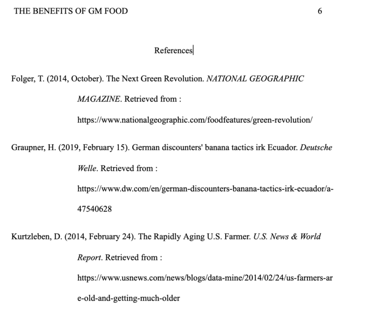

英語の論文には、フォーマットとしての型があります。

英語のエッセイや文章を書く際には、必ず規定のフォーマットを指定されますが、この書き方を間違えると当然のように減点されます。

英語の論文、エッセイのライティングが初めての方や、不慣れな方にとって一つ一つのルールを確認するのは大変だと思います。

今回は、複数ある英語論文のフォーマットのうち、APAスタイルと並び、有名な**APAスタイルと呼ばれる英語論文の本文中の引用（Citation)****、言い換え（Paraphrase)、そして****参考文献（Reference）の書き方についてご紹介します。**

 

- 英語の論文の書き方がわからない
- APAスタイルを指定されたが細かい書式フォーマットがわからない
- 参考文献や引用の仕方のルールが細かすぎてわからない
- 自分の書いた論文について、ルールが間違っていないか確認したい

 

上記のように不安を抱えている方も、この記事を読めば、APAスタイルの参考文献の引用方法、書き方を具体例付きで確認することが可能です。

なお、引用文献以外、基本のAPAスタイルの書き方については、こちらの記事をご確認ください。

https://28-nikki.com/apa-style-format/

## 英語エッセイのフォーマット　APAスタイルとは？

**APA**とは、**The American Psychological Associationの略**です。社会学を中心に、学術論文のスタイルとして多く使用されるエッセイフォーマットであり、表紙付き、各ページの上に省略タイトルを入れるなどの特徴があります。

最新のマニュアルは、[随時公式サイトで更新](https://apastyle.apa.org/)されています。

このページでは、6th ed., 2n printing 2010版の情報をもとにAPAスタイルの基本的な書き方、注意したいポイントをご紹介します。

<iframe style="width: 125px; height: 245px;" src="//rcm-fe.amazon-adsystem.com/e/cm?lt1=_blank&amp;bc1=000000&amp;IS2=1&amp;bg1=FFFFFF&amp;fc1=000000&amp;lc1=0000FF&amp;t=28nikki-22&amp;o=9&amp;p=8&amp;l=as4&amp;m=amazon&amp;f=ifr&amp;ref=as_ss_li_til&amp;asins=4469246026&amp;linkId=6afe7ed92faaac1a613052460c28fcbd" frameborder="0" marginwidth="0" marginheight="0" scrolling="no" data-mce-fragment="1"></iframe>

## 【APAスタイル】参考文献の引用方法

英語論文（エッセイ）では、自身の論文の中で他人の書いた文章などを参照するとき、

1. **文中で参考文献の「文章を直接引用」**
2. **文中で参考文献の「 要約を提示（間接的に引用）」**

の2種類があります。

その際、APAフォーマット、MLA、Chicago・・・など、英語の論文形式によって、引用元の示し方が異なります。

この記事では、上記１、２に加え、**「最後につける参考文献の書き方」**をご紹介いたします。

## 【APAスタイルの基本ルール】参考文献から直接文章を引用

まず初めに、論文の本文内で、直接文章を引用する方法です。

**「引用」とは、参考文献内の文をそのまま、直接論文中で使用する方法を言います。**

### 基本の引用ルール

まずは基本の文章ルールから。

文章を引用する際は、下記の２点が絶対のルールになります。

- **引用文を "**XXXX**"（クオーテーションマーク）で囲む**
- **著者（引用元）****をと引用元の発行年を前後どちらかに明示する**
- 本などは**ページ番号**,Webサイトは**段落**を付記する。

また、表示方法は2パターンあります。

1. **「文章を引用」した後、「著者, 発行年,ページ番号等」をまとめて書く方法**
2. **引用前の導入で「著者** **(発行年)」＋「文章を引用」＋「ページ番号」を書く方法**

### a.「文章を引用」した後、「著者、発行年、ページ番号等」を書く場合の例

こちらが基本の引用方法です。

書き方の型は「 "**引用する文章**"(**著者, 発行年,** **ページor段落**). 」です。

pdfファイルや本など、ページ番号のあるものは著者名、発行年の後ろにページ番号（例：「**p.23**」）を付けます。

反対にページ番号のないWEBの情報などは、ページ番号の代わりに「**para.3**」や「**para.8-9**」などのように記載します。ページ（p.）も段落（para.）も小文字で書きます。

Therefore, these relationships consolidate children’s active classroom participation because “**the participation factor is the observation that people in small schools and units come to know and care about one another to a much greater degree than is possible in large schools**”(**Cotton**, **1996**, **p.10**).

（引用元）Cotton, K. (1996). School size, school climate, and student performance. Education Northwest.

### b. 引用前の導入で「著者」＋「文章を引用」＋「発行年,ページ番号」を書く方法

こちらは、文章引用前に著者名を明示してから引用を行う方法です。

書き方の型は「**著者、研究名, 発行年**が言うには "**引用する文章**"(**ページ番号**). 」です。または「The studyなどの主語

さきほどと同様のページから文章を引用した例です。

According to **a study by Krueger, A. B., & Whitmore, D. M.**(**2001**),  "**black students gained about 0.26 of a standard deviation from being assigned to a small class while white students gained about 0.13 standard deviation**"(**p****.15**).

（引用元）Krueger, A. B., & Whitmore, D. M. (2001). Would smaller classes help close the black-white achievement gap? (Vol. 451). Industrial Relations Section, Princeton University.

## 【APAスタイルの基本ルール】参考文献の情報を要約し引用

本来は研究としてはよくないのですが、たとえばインタビュー記事で、「文章を書いた著者」と、「文章中で引用したい文章を述べた人物／元となった研究」が異なる場合があります。

その場合は、「引用した文章」の中で引用されている／書かれている、「別の誰かの発言／研究内容」を用いていることを明示する必要があります。

書き方は「 **研究者****、研究名**が言うには "**引用する文章**"**(as cited in** **引用した文章の著者、研究名, 発行年, **ページor段落******)**. 」です。

たとえば下記は、**2017年**に**Samanth** **Subramanian**氏が書いた記事の中に出てきた、**Ganesh Devy**氏の発言を引用する場合の例です。

**Ganesh, the chairman of PLSI**, states that “**Roughly 250 languages have vanished over the past 50 years, and another 400 are at the risk of dying in the next 50**” **(as cited in Subramanian, 2017, para.6).**

（引用元）https://www.thenational.ae/world/asia/disappearing-words-documenting-india-s-languages-before-they-die-out-1.616990

この場合、引用したい文章が掲載されている記事、書籍を書いた人については、（**qtd. in 記事・書籍を書いた人**）と最後につけます。「〜の中から引用しました。」といった意味合いです。

## 著者が複数名の参考文献を引用する場合

### 著者が２名の参考文献の引用方法

著者が２名の場合は、上記の基本ルールに対し、単純に「**and**」か「**&**」で著者名をつなげて書きます。使い分けは下記の通りです。

著者名そのものを主語にする場合は「 **研究者名1 and 研究者名2**」

主語を「The study（**研究者名1 & 研究者名2**)」

### 著者が３名〜５名の参考文献の引用方法

引用の最初の１回目は、すべての著者名を書きます。

初回の引用は「 **研究者名1, 研究者名2, 研究者名3, 研究者名4, and 研究者名5**」

２回目以降は最初の著者名のみを記載し、残りは「et al.」でまとめちゃいます。

２回目以降の同著書からの引用は「 **研究者名1 et al.**」

最後の「.」まで含めて「著者名」の一つとして考えるため、()の中に年月含め全て書く場合は「"引用文章”(**研究者名1 et al.****,** **1996**, **p.10**)」のように、「.」のあとに基本ルール通り「,」（カンマ）をつけます。

### 著者が６名以上の参考文献の引用方法

初回の引用から、最初の著者以外はすべて略します。

最初から「 **研究者名1 et al.**」

「著者が３名〜５名の参考文献の引用」の２回目以降とルールは同じです。

## 【APAスタイル基本ルール】本文中の参考文献の言い換え方法

続いては、参考文献中の文章を言い換える方法です。paraphraseと呼びます。

そのままの引用文では、うまく文章中に組み込めない場合に使用します。また、引用文が長文になってしまう場合や、引用を使いすぎた場合、ただの字数稼ぎをしている印象になるため言い換えを行います。

言い換えの場合でも、もとの文章は必ず明示すること、ページも記載します。

According to **the estimation by the United Nations Department of Economic and Social Affairs/Population Division,** the number of the world population will reach 9.8 billion in 2050 (**2017**, **p.8**).

（引用元）http://www.fao.org/fileadmin/templates/nr/sustainability\_pathways/docs/FWF\_and\_climate\_change.pdf

## 【APAスタイル】参考文献リストの書き方

論文の最後につける参考文献一覧（References）の書き方についてです。

### 【APAスタイル】参考文献 基本の書き方

基本の書き方は、下記の順に記載していきます。

各情報の表記後に、「,」「.」を付けていきます。また、表記のない情報はスキップします。

**著者名. (発行日). 論文名or記事タイトル.** **_本タイトルやサイト名,_ (ページ). 場所 : 出版社. Retrieved from: URL**

#### **※著者名について**

著者名については、通常の英語の表記順ではなく、「**ファミリーネーム, ファーストネームの頭文字.」の順**に記載します。

ファミリーネームのみフル表記、それ以外は「頭文字.」で記載していきます。

ミドルネームがある場合は、「ファミリーネーム, ファーストネームの頭文字.ミドルネームの頭文字.」のようになります。

例）ルーシー・モード・モンゴメリ（Lucy Maud Montgomery）

「Montgomery, L.M.」

#### **※本タイトルやサイト名について**

こちらは必ず書体を**_斜め（イタリック）_**にします。また、ここの後は「,」（カンマ）になります。

#### **※場所 : 出版社**

本、あるいは政府資料などの場合、APAフォーマットでは出版元の場所名を載せます。

#### **※ページ**

「p.」あるいは「pp.」を前につけます。

複数ページに渡る場合は「(pp. 667-668).」のように書きましょう。

#### **※URL**

Webページからとってきた場合は、「**Retrieved from:** 」を実際のurlの前につけます。

「Retrieved from: https://28-nikki.com/apa-style-format/」

のような書き方をします

#### その他書式等注意事項

タイトルは「**References**」とし、ページ番号等も本文同様につけていきます。

引用が２行以上に渡る場合は、下記のように**２行目以降をハンギング**する必要があります。

また、引用した参考文献リストは、**著者名をABC順**に並べていきます。

## 【APAスタイル】英語論文の参考文献　書き方のまとめ

以上が基本の英語エッセイAPAスタイルの書き方となります。

- **本文中　引用の仕方**
- **本文中　言い換えの仕方**
- **参考文献リストの書き方**

上記３点をしっかり把握し、無駄な失敗で減点されないようにしっかりとルールを押さえていきましょう。

<iframe style="width: 125px; height: 245px;" src="//rcm-fe.amazon-adsystem.com/e/cm?lt1=_blank&amp;bc1=000000&amp;IS2=1&amp;bg1=FFFFFF&amp;fc1=000000&amp;lc1=0000FF&amp;t=risso2408-22&amp;o=9&amp;p=8&amp;l=as4&amp;m=amazon&amp;f=ifr&amp;ref=as_ss_li_til&amp;asins=4799102877&amp;linkId=a3d97ccc164e7e7a0e5ae7852db0aab5" frameborder="0" marginwidth="0" marginheight="0" scrolling="no" data-mce-fragment="1"></iframe>

<iframe style="width: 125px; height: 245px;" src="//rcm-fe.amazon-adsystem.com/e/cm?lt1=_blank&amp;bc1=000000&amp;IS2=1&amp;bg1=FFFFFF&amp;fc1=000000&amp;lc1=0000FF&amp;t=28nikki-22&amp;o=9&amp;p=8&amp;l=as4&amp;m=amazon&amp;f=ifr&amp;ref=as_ss_li_til&amp;asins=4766419219&amp;linkId=6900978a5ad2492f57bfb680d59363b7" frameborder="0" marginwidth="0" marginheight="0" scrolling="no" data-mce-fragment="1"></iframe>

また、別記事で[APAスタイルの基本書式を紹介](https://28-nikki.com/post-377/)、そもそもの[英語の小論文の書き方](https://28-nikki.com/post-169/)も説明していますので、併せてご参考ください。
