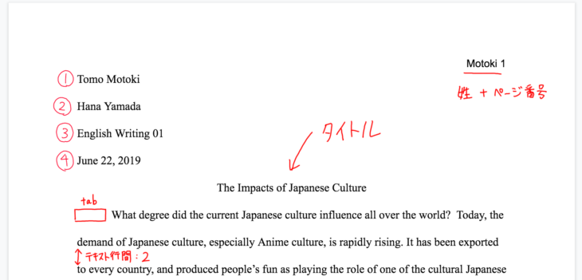
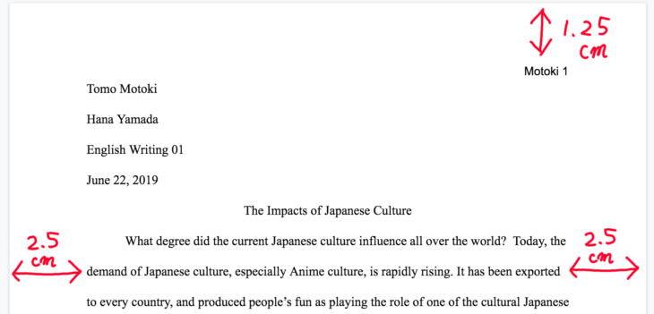
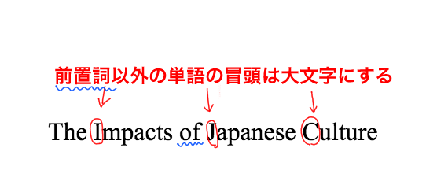

MLAスタイル（MLAフォーマット）という英語エッセイの型をご存知でしょうか？英語エッセイ、小論文には、コンテンツの構成としての型と、スタイルとしての型があり、それらを書く際は必ず規定のスタイルを指定されます。

この「スタイル」は論文を書く上では必須の知識、当然の知識として扱われており、記述方法やフォーマット設定が間違っていると当然のように減点されます。

しかし、英語の論文、エッセイのライティングが初めての方や、不慣れな方にとって一つ一つのルールを確認するのは大変だと思います。

今回は、複数ある英語小論文のスタイルのうち、[APAスタイル](https://28-nikki.com/apa-style-format/)と並び有名な**MLAスタイルと呼ばれる英語論文の基本の書式設定について、具体例とともにご紹介**します。

- 英語の論文の書き方がわからない
- MLAフォーマットを指定されたが細かい書式フォーマットがわからない
- 書いてみたものの、ルールが間違っていないかもう一度確認したい

上記のように不安を抱えている方も、この記事を読めばMLAフォーマットの書式設定について確認することができます。

なお、そもそもの[英語論文のコンテンツ、内容の盛り込み方や構成の作り方はこちら。](https://28-nikki.com/post-169/)

また、同じく間違えると論文の減点対象となる[MLAスタイルの引用方法、参考文献の書き方](https://28-nikki.com/mla_reference/)については、こちらをご確認ください。

https://28-nikki.com/post-394/

## 英語エッセイのフォーマット　MLAスタイルとは？

MLAとは、Modern Language Associationの略です。人文系の論文で非常に多く使用されるエッセイフォーマットであり、表紙が不要、引用方法がChicagoスタイルなどと比べると簡易等の特徴があります。

今回はMLA Handbook, 8th edition(2016)の内容をもとに、MLAスタイルの基本的な書き方、ポイントをご紹介します。

<iframe style="width: 125px; height: 245px;" src="//rcm-fe.amazon-adsystem.com/e/cm?lt1=_blank&amp;bc1=000000&amp;IS2=1&amp;bg1=FFFFFF&amp;fc1=000000&amp;lc1=0000FF&amp;t=28nikki-22&amp;o=9&amp;p=8&amp;l=as4&amp;m=amazon&amp;f=ifr&amp;ref=as_ss_li_til&amp;asins=4469246026&amp;linkId=6afe7ed92faaac1a613052460c28fcbd" frameborder="0" marginwidth="0" marginheight="0" scrolling="no"></iframe>

## 【MLAスタイル】フォーマット　書式基本のルール

まず最初に、全体で守るべきMLAスタイルの基本のルールについてです。

- **フォント：Times New Roman**
- **フォントサイズ：12pt**
- **テキスト行間：2**
- **表紙は作成不要**
- **ページ番号：各ページ右上に配置。　表記方法は「自身の姓（苗字）＋番号」**
- **最初のページ左上に「①自分の名前②先生の名前③****クラスの名前④日付」を記載する**
- **論文タイトルの位置：論文本文の直前、センター揃え。**
- **本文の各段落冒頭には「Tab」キーでスペースを入れる。**

具体的な論文の例は下記をご確認ください。

これより、上記で紹介した各ルールの詳細を確認していきます。

### MLAスタイルの書式設定（フォント、文字スタイル）

MLAスタイルに限らず、どの英語論文でもフォントの指定については、下記を基本としています。

- **フォントサイズ：12pt**
- **フォントスタイル：Times New Roman（を推奨。読みやすいものであること）**
- **テキスト行間：２**

フォントスタイルは必ずしもTimes New Romanである必要はなく、**読みやすいものであることがルール**となりますが、Time New Romanであれば絶対に問題ありません。

英文が詰まっていると読みにくすぎるため、**テキスト行間は「２」（英語ではDouble spaceと言います）**が基本となっています。

### MLAスタイルのページ設定（ページ余白、ヘッダー等）

続いてMLAスタイルのWordページ設定です。

まず、「姓（苗字）＋ページ番号」は右揃えで、ヘッダーに記載します。また、**ページ番号は自動的に連番**になるように設定します。

また、**ページ余白上は「1.25cm（1/2 inch）」**、**左右は「2.5cm（1 nch）」**に揃えましょう。

### MLAフォーマット　英論文（エッセイ）のタイトルの書き方

エッセイのタイトルを記入するときに気をつけたいのが、大文字小文字の使い分けです。

下記の例を見ていただくとわかるとおり、文頭の「the」の「T」が大文字になっているだけでなく、その他の単語についても、**頭文字を大文字にするというルール**があります。

一方、すべての単語の頭文字が大文字になるわけではありません。**前置詞や、a,theといった冠詞については、タイトルで使用する際も頭文字を小文字のままにしておきます。**

**Food Impacts on Climate Change**

**The Nurture and Nature Influence the Individual Developmental Gaps**

## まとめ

以上、MLAフォーマットの基本的な書式設定、および表紙などの注意点でした。

英論文（エッセイ）は色々なフォーマットがある複雑ですが、型ごとの基本を最初に設定してしまえば、あとはファイルのコピーペーストで活用していくことができます。

最初に設定だけしてしまって、あとはガツガツ書いていきましょう！

<iframe style="width: 125px; height: 245px;" src="//rcm-fe.amazon-adsystem.com/e/cm?lt1=_blank&amp;bc1=000000&amp;IS2=1&amp;bg1=FFFFFF&amp;fc1=000000&amp;lc1=0000FF&amp;t=risso2408-22&amp;o=9&amp;p=8&amp;l=as4&amp;m=amazon&amp;f=ifr&amp;ref=as_ss_li_til&amp;asins=4799102877&amp;linkId=a3d97ccc164e7e7a0e5ae7852db0aab5" frameborder="0" marginwidth="0" marginheight="0" scrolling="no"></iframe>

<iframe style="width: 125px; height: 245px;" src="//rcm-fe.amazon-adsystem.com/e/cm?lt1=_blank&amp;bc1=000000&amp;IS2=1&amp;bg1=FFFFFF&amp;fc1=000000&amp;lc1=0000FF&amp;t=28nikki-22&amp;o=9&amp;p=8&amp;l=as4&amp;m=amazon&amp;f=ifr&amp;ref=as_ss_li_til&amp;asins=4766419219&amp;linkId=6900978a5ad2492f57bfb680d59363b7" frameborder="0" marginwidth="0" marginheight="0" scrolling="no"></iframe>

また、MLAフォーマットを書く際には引用方法、参考文献の書き方が他のスタイルと異なります。[MLAスタイルの引用方法、参考文献の書き方](https://28-nikki.com/mla_reference/)については、こちらをご確認ください。

https://28-nikki.com/mla\_reference/

そもそもの[英語論文のコンテンツ、内容の盛り込み方や構成の作り方](https://28-nikki.com/post-169/)については、こちらをご確認ください。

https://28-nikki.com/post-169/
