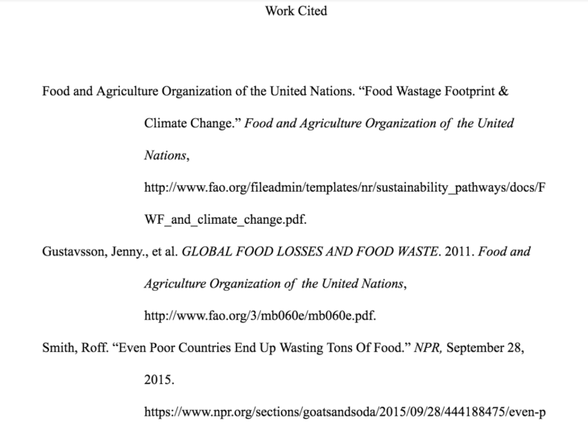

英語の論文には、フォーマットとしての型があります。

英語のエッセイや文章を書く際には、必ず規定のフォーマットを指定されますが、この書き方を間違えると当然のように減点されます。

英語の論文、エッセイのライティングが初めての方や、不慣れな方にとって一つ一つのルールを確認するのは大変だと思います。

今回は、複数ある英語論文のフォーマットのうち、APAスタイルと並び、有名な**MLAスタイルと呼ばれる英語論文の本文中の引用（Citation)****、言い換え（Paraphrase)、そして****参考文献（Reference）の書き方についてご紹介します。**

 

基本のMLAスタイルの書き方については、こちらの記事をご確認ください。

https://28-nikki.com/post-377/

## 英語エッセイのフォーマット　MLAスタイルとは？

MLAとは、Modern Language Associationの略です。人文系の論文で非常に多く使用されるエッセイフォーマットであり、表紙が不要、引用方法がChicagoスタイルなどと比べると簡易等の特徴があります。

今回はMLA Handbook, 8th edition(2016)の内容をもとに、MLAスタイルでの文中での参考文献の引用の仕方、最後につける参考文献一覧（Reference）の書き方をご紹介します。

<iframe style="width: 125px; height: 245px;" src="//rcm-fe.amazon-adsystem.com/e/cm?lt1=_blank&amp;bc1=000000&amp;IS2=1&amp;bg1=FFFFFF&amp;fc1=000000&amp;lc1=0000FF&amp;t=28nikki-22&amp;o=9&amp;p=8&amp;l=as4&amp;m=amazon&amp;f=ifr&amp;ref=as_ss_li_til&amp;asins=4469246026&amp;linkId=6afe7ed92faaac1a613052460c28fcbd" frameborder="0" marginwidth="0" marginheight="0" scrolling="no"></iframe>

## 【MLAスタイル】参考文献の引用方法

### 【MLAスタイル】文献から直接文章を引用する方法

まず初めに、論文の本文内で、直接文章を引用する方法です。

**「引用」とは、参考文献内の文をそのまま、直接論文中で使用する方法を言います。**

#### 基本の引用ルール

まずは基本の文章ルールから。

文章を引用する際は、下記の２点が絶対のルールになります。

- **引用文を "**XXXX**"（クオーテーションマーク）で囲む**
- **著者、****研究名を前後どちらかに明示する**
- 本、pdfファイルなど**ページ番号**のあるものは付記する。

また、表示方法は３パターンあります。

1. **「文章を引用」した後、「著者、研究名　ページ番号」を書く方法**
2. **引用前の導入で「著者、****研究名」＋「文章を引用」＋「ページ番号」を書く方法**
3. **a と bの組み合わせ**

#### a.「文章を引用」した後、「著者、研究名　ページ番号」を書く場合の例

こちらが基本の引用方法です。

書き方の型は「 "**引用する文章**"(**著者、****研究名　ページ**). 」です。

複数著者の場合、著者名が複数連なる場合は、（**代表著者名** **et al.**）を付けます。

Research shows that **“Per capita food wasted by consumers in Europe and North-America is 95-115 kg/year, while this figure in sub-Saharan Africa and South/Southeast Asia is only 6-11 kg/year”** (**Gustavsson et al. 2**).

（引用元）http://www.fao.org/3/mb060e/mb060e.pdf

pdfファイルや本など、ページ番号のあるものは著者名の後ろにページ番号を付けます。

反対にページ番号のないWEBの情報などは、ページ番号なしで記載します。

According to a report, “**a large percentage of global food waste occurs in developing countries**” (**Smith**).

（引用元）https://www.npr.org/sections/goatsandsoda/2015/09/28/444188475/even-poor-countries-end-up-wasting-tons-of-food

#### b. 引用前の導入で「著者、研究名」＋「文章を引用」＋「ページ番号」を書く方法

こちらは、文章引用前に著者名、研究名を明示してから引用を行う方法です。

書き方の型は「 **著者、研究名**が言うには "**引用する文章**"(**ページ番号**). 」です。

さきほどと同様のページから文章を引用した例です。

**Gustavsson et al.** state that **“Irrespective of the level of economic development and maturity of systems in a country, food losses should be kept to a minimum.”(1)**.

（引用元）http://www.fao.org/3/mb060e/mb060e.pdf

また、基本は「"引用文"**.**」と、クオーテーションマークの後に「**.**（ピリオド）」を打ちますが、引用文がちょうど「**.**（ピリオド）」で終わる場合は下記のように「"引用文**.**"」と打つこともできます。

According to **Smith**, **“As much as half of the food grown or produced in the developing world simply never makes it to market.”**

（引用元）https://www.npr.org/sections/goatsandsoda/2015/09/28/444188475/even-poor-countries-end-up-wasting-tons-of-food

上記の場合は、先ほどと同様に、ページ番号がないため、記載なしで引用を終わらせています。

#### c. a と bの組み合わせ

上記のaとbを組み合わせる方法もあります。下記は先に研究名、のちに研究団体名を記載しています。

**Research by the United States Environmental Protection Agency** states **“In 2017, greenhouse gas emissions from the agriculture economic sector accounted for 9.0 percent of total U.S. greenhouse gas emission”** (**United States Environmental Protection Agency**).

（引用元）https://www.epa.gov/ghgemissions/sources-greenhouse-gas-emissions#agriculture

### 【MLAスタイル】文献内の情報を間接的に引用する方法

本来は研究としてはよくないのですが、たとえばインタビュー記事で、「文章を書いた著者」と、「文章中で引用したい文章を述べた人物／元となった研究」が異なる場合があります。

その場合は、「引用した文章」の中で引用されている／書かれている、「別の誰かの発言／研究内容」を用いていることを明示する必要があります。

書き方は「 **研究者****、研究名**が言うには "**引用する文章**"(**引用した文章の著者、研究名**). 」です。

たとえば下記は、**Subramanian**氏が書かれた記事の中に出てきた、**Ganesh Devy**氏の発言を更に引用する場合の例です。

**Ganesh Devy, the chairman of PLSI**, states that “**Roughly 250 languages have vanished over the past 50 years, and another 400 are at the risk of dying in the next 50**” **(qtd. in Subramanian).**

（引用元）https://www.thenational.ae/world/asia/disappearing-words-documenting-india-s-languages-before-they-die-out-1.616990

この場合、引用したい文章が掲載されている記事、書籍を書いた人については、（**qtd. in 記事・書籍を書いた人**）と最後につけます。「〜の中から引用しました。」といった意味合いです。

## 【MLAスタイル】本文中の参考文献の言い換え方法

続いては、参考文献中の文章を言い換える方法です。paraphraseと呼びます。

そのままの引用文では、うまく文章中に組み込めない場合に使用します。また、引用文が長文になってしまう場合や、引用を使いすぎた場合、ただの字数稼ぎをしている印象になるため言い換えを行います。

言い換えの場合でも、もとの文章は必ず明示すること、ページも記載します。

According to **Food and Agriculture Organization of the United Nations**, global food waste and loss account for 8 percent of total greenhouse gas emissions. The percentages reach the third largest emitting, that follows the United States and China in comparison to each other country (**1**).

（引用元）http://www.fao.org/fileadmin/templates/nr/sustainability\_pathways/docs/FWF\_and\_climate\_change.pdf

For example,  agricultural products; such as crop and farming animals, emits 10 percent of greenhouse gas in Canada (**Government of Canada**).

（引用元）http://www.fao.org/fileadmin/templates/nr/sustainability\_pathways/docs/FWF\_and\_climate\_change.pdf

## 【MLAスタイル】参考文献リストの書き方

論文の最後につける参考文献一覧（Work Cited）の書き方についてです。

### 【MLAスタイル】参考文献 基本の書き方

基本の書き方は、下記の順に記載していきます。

各情報の表記後に、「,」「.」を付けていきます。また、表記のない情報はスキップします。

**著者名（※）. "論文名、記事タイトル."** **本の巻数, _本タイトルやサイト名（※）,_ 出版社, 発行日, （本の場合）場所. URL.**

#### **※著者名について**

著者名については、通常の英語の表記順ではなく、「**ファミリーネーム（ラストネーム）, ファーストネーム.」（苗字＋名前）の順**に記載します。日本と同じ表記順です。しかし、通常の英語圏の表記方法と逆になることを示すため**ファミリーネームのあとに「,」を挟みます。**

#### **※本タイトルやサイト名について**

こちらは必ず書体を**_斜め（イタリック）_**にします。

#### その他書式等注意事項

引用が２行以上に渡る場合は、下記のように**２行目以降をハンギング**する必要があります。

また、引用した参考文献リストは、**著者名をABC順**に並べていきます。

## 【MLAスタイル】英語論文の参考文献　書き方のまとめ

以上が基本の英語エッセイMLAスタイルの書き方となります。

- **本文中　引用の仕方**
- **本文中　言い換えの仕方**
- **参考文献リストの書き方**

上記３点をしっかり把握し、無駄な失敗で減点されないようにしっかりとルールを押さえていきましょう。

<iframe style="width: 125px; height: 245px;" src="//rcm-fe.amazon-adsystem.com/e/cm?lt1=_blank&amp;bc1=000000&amp;IS2=1&amp;bg1=FFFFFF&amp;fc1=000000&amp;lc1=0000FF&amp;t=risso2408-22&amp;o=9&amp;p=8&amp;l=as4&amp;m=amazon&amp;f=ifr&amp;ref=as_ss_li_til&amp;asins=4799102877&amp;linkId=a3d97ccc164e7e7a0e5ae7852db0aab5" frameborder="0" marginwidth="0" marginheight="0" scrolling="no"></iframe>

<iframe style="width: 125px; height: 245px;" src="//rcm-fe.amazon-adsystem.com/e/cm?lt1=_blank&amp;bc1=000000&amp;IS2=1&amp;bg1=FFFFFF&amp;fc1=000000&amp;lc1=0000FF&amp;t=28nikki-22&amp;o=9&amp;p=8&amp;l=as4&amp;m=amazon&amp;f=ifr&amp;ref=as_ss_li_til&amp;asins=4766419219&amp;linkId=6900978a5ad2492f57bfb680d59363b7" frameborder="0" marginwidth="0" marginheight="0" scrolling="no"></iframe>

また、別記事で[MLAスタイルの基本書式を紹介](https://28-nikki.com/post-377/)、そもそもの[英語の小論文の書き方](https://28-nikki.com/post-169/)も説明していますので、併せてご参考ください。
