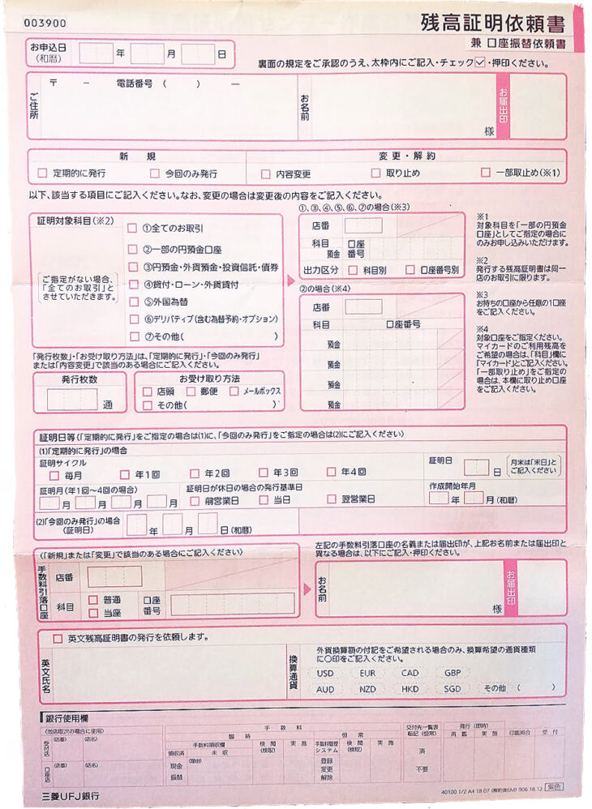

カナダ学生ビザ取得にあたり、三菱UFJ銀行で英文残高証明書の発行が必要になりました。

それまで残高証明書なんて聞いたこともなかったので、当初の私は戸惑うことばかりでした。

- 残高証明書がなんなのかそもそもわからない
- 残高証明書の取得にあたり必要なもの／ことを事前に確認したい
- 急ぎ英文残高証明書の発行が必要になったが、実際の取得日数を知りたい

同じように英文の残高証明書発行が必要になったものの、初めてで勝手のわからない方はいらっしゃるのではないでしょうか？

私は理由あって学生ビザを2回ほど更新したため、初回のビザ取得時も含め**3回ほど英文残高証明書の申請・発行をしました。**

その中で、三菱UFJ銀行は支店によって発行日数が異なっていたり、必要な物がなかった場合は再度いく必要が出てきたりと戸惑うことが多かったです。

そのため、今回は**三菱UFJ銀行での残高証明の発行申請の仕方、注意点について、実際の経験をもとにご紹介いたします。**

また、[渡航後にビザの再延長をする予定のある方（海外から残高証明書の取得が必要になる方）](https://28-nikki.com/mufj_english_bank-statement_abroad/)は、下記の記事を【出発前に】ご確認ください。かなり大変です。

https://28-nikki.com/mufj\_english\_bank-statement\_abroad/

## 英文残高証明書とは - 留学ビザ申請時の必要書類

**残高証明書**とは、ある特定の時点（証明基準日）で、各銀行口座に自身が預け入れている預金金額（預金残高）がいくら 預けられているか （残っているか）を証明する書類です。

ビザ申請時に提出を求められる理由は、滞在期間中の生活費、学費等の滞在費をきちんと払い生活できるかどうか。金銭的な問題がないことを証明する必要があるためです。

残高証明書の発行にあたっては、記載方法を選ぶことができます。

1. **記載言語を選択**　【日本語】or【英語】
2. **預金金額の通貨の選択**　【日本円￥】【アメリカドル（USD）】【ユーロ（EUR）】など

また、1つの銀行に複数口座を持っている場合、あるいは複数の銀行に預金が分散している場合、**口座ごとに残高証明書の発行依頼をする必要があります**。

## 三菱UFJ銀行の英文残高証明書の発行にかかる日数

通常、和文での残高証明書であれば即日の発行が可能です。

が、英文での残高証明書の発行には時間がかかります。また、受け取り方法によっても異なります。

### 受け取り方法が【郵送】の場合

郵送での受け取りを選んだ場合、受付日から、自宅への郵送お届けまで**1週間～10日間**必要となります。

### 受け取り方法が【店頭】の場合

後日また店頭に行き受け取る場合は、一般に郵送より早いですが、こちらは、**【残高証明を行いたい口座の開設支店】と【発行依頼を受け付けた銀行支店】によって期間が異なります**。

銀行通帳の表紙を開いたところに書かれている支店コードと支店名が、その口座を開設した支店になります。

#### 口座開設をした支店以外　の窓口で発行依頼をした場合

口座を開設した三菱UFJ銀行の支店以外の窓口で、英文残高証明書の発行依頼を行った場合、**受け取りまでの期間は郵送とあまり変わりません。**

というのも、この場合は下記のような流れになるからです。

口座開設の支店以外でのフロー

1. 口座開設をした支店以外の支店（支店A）の窓口で残高証明書の発行依頼を受付
2. 支店A→口座開設支店（支店B）へ英文残高証明書の発行依頼
3. 支店Bで英文残高証明書を発行
4. 支店B→支店Aへ英文残高証明書を郵送
5. 支店Aの窓口で受け取り

つまり、受け取り方法を【郵送】にした場合と工程がほぼ同じ（あるいは窓口まで取りに行くため、余計に手間）になるのです。

結果、口座開設した銀行以外の窓口で申請した場合、**申請受付～受領までの期間が短くなることはほぼありません。**

#### 口座開設をした支店　の窓口で発行依頼をした場合

**最も発行依頼～受け取りまでの期間が短い方法**です。

口座開設の支店でのフロー

1. 口座開設をした支店（支店B）の窓口で残高証明書の発行依頼を受付
2. 支店Bで英文残高証明書を発行
3. 支店Bの窓口で受け取り

口座開設をした支店まで直接赴いた場合、前述の他支店を挟む工程を省けるため、**最短即日～3日程度で発行が可能**です。発行を急ぐ場合は、口座開設を行った支店窓口まで行くことが最もおすすめの方法になります。

ただ、ご注意いただきたいのが、**即日発行できる支店と、数日かかる支店があること**です。

私は三菱UFJ銀行の口座を２つ持っており、それぞれの支店窓口で残高証明の発行申請を行いましたが、**1つ目の支店は発行に3日、2つ目の支店は即日（15分）で発行されました。**

直接、口座を開設した支店に赴いたからと言って即日発行してくれる訳ではないため、事前に口座開設銀行に確認をとっておくか、**日数に余裕を持って発行申請をしましょう。**

## 三菱UFJ銀行の英文残高証明書の発行手数料

残高証明書は英文・和文にかかわらず**1通あたり：税込み７７０円（2019年10月2日現在）**がかかります。

最新の価格については、[三菱UFJ銀行の残高証明](https://www.bk.mufg.jp/tsukau/tetsuduki/zandaka/index.html)についてのページをご確認ください。

## 三菱UFJ銀行の英文残高証明書の窓口での受付方法

### 持ち物準備

銀行に行く前に、必要なものを準備しましょう

- **銀行のキャッシュカード、手帳**
- **届印**
- **本人確認書類　－　運転免許証など**
- **表記したい通貨の通貨コード\[ISO4217コード\]の控え －　USD、CADなど**
- **窓口に行く前日までに、必要な金額は預金しておく**

### 銀行窓口に行く

三菱UFJ銀行では、機械で来店目的を記録、待合番号が発行されます。

**大抵は機械の隣に銀行員さんが立っているため、その方に英文の残高証明書の発行をしたいことを伝えましょう。**銀行員さんが機械への入力、番号カードの発行をし渡してくれます。

### 申請書類（残高証明依頼書）に必要事項を記入

都度発行の欄に記入していきます。ここで届出印の押印も行います。

残高を証明できる証明基準日は、当日受付日の**前日から前**になります。**受付日当日を基準日とすることはできない（その日の取引がそのあとに発生する可能性がある）ためご注意ください。**確実に数値が確定している受付日前日が最新日となります。

留学ビザ申請の場合、**残高証明基準日は【最新のもの】であることが求められます。**国ごとに、ビザ申請日の1か月以内のもの、など規定があるためご注意ください。

### 窓口で手続き

順番が来たら、呼ばれた窓口で手続きを行います。先ほどの申請書類の確認と手数料の支払いもここで行います。

ここで本人確認証明書の提出を求められますので提示しましょう。

また、私の場合はここで【口座番号を記載するかどうか】を訊かれました。正直わからなかったのですが、情報不備でビザ申請が刎ねられる可能性もあるためとりあえず記載する方向で依頼しました。

#### 発行手数料の支払い

こちらは**窓口での現金払い**か、**口座預金からの引き落とし**が選べます。（申請用紙に選択肢があります）

特に申請そのものには関係がないため、お好きな方を選びましょう。

## まとめ

英文の残高証明書、実際に口座開設を行った支店に行ったとしても、**支店によって即日発行できるところと日数がかかるところとあります。**

また、窓口受け受けの当日は証明基準日に選択できないため、窓口に行く前日までにきちんと必要なお金を入れておきましょう。

くれぐれも**期間に余裕をもって、事前に十分な準備をする**こと。また、**必要な持ち物をきちんと確認すること**が大事です。

[【英文残高証明書】発行にかかる日数と申請方法は？-ソニー銀行](https://28-nikki.com/post-277/)

https://28-nikki.com/post-277/

[【英文残高証明書】発行にかかる日数と申請方法は？-住信SBI銀行](https://28-nikki.com/post-315/)

https://28-nikki.com/post-315/
