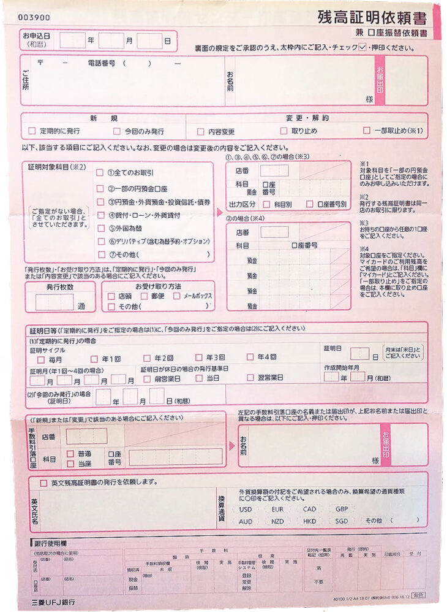

カナダ滞在中に学生ビザを延長することになり、三菱UFJ銀行での英文残高証明書の発行が必要となりました。

しかし、三菱UFJ銀行で、海外から英文残高証明書の申請・取得ができるかどうかがわかりません。ネットで調べようにも、[三菱UFJの残高証明書の発行について](https://www.bk.mufg.jp/tsukau/tetsuduki/zandaka/index.html)のページでは「**ご本人さまがご来店ください。**」と記載されているし、他の個人のページでは曖昧、かつ古い情報しかなく実態がつかめませんでした。

そこで今回は、私と同様に海外に滞在中ながら残高証明書の発行をしたい方のため、一例として**銀行に確認した発行方法をお伝えします。**

先に結論から申し上げますと、申請はできなくはないが、申請に到るまでにものすごく時間がかかる&身分証明ができる／日本で代理取得ができる家族の存在が必須です。**難易度はかなり高め。**

申請から取得まで、**少なくとも1ヶ月はかかる**、と考えた方が良いと思います。また、郵送での書類紛失などのリスクもありますので、もっと時間がかかる可能性もあります。

三菱UFJ銀行は支店によって、英文残高証明書の発行日数が異なります。同様に、今回ご紹介する方法が私の支店では大丈夫でも他の支店では不可、という可能性もありますので、**必ずご自分の利用される銀行に直接確認をしてください。**

実際に銀行とやりとりを行い、そこで確認した内容を載せています。あくまで一例としてお考えください。

## はじめに確認しておきたいこと

### 英文残高証明書と、日本での発行方法について

まずはじめに、英文残高証明が何か。日本で[英文残高証明書を発行する場合どうすれば良いか](https://28-nikki.com/mufj_english_bank-statement/)については別記事でお伝えしております。

https://28-nikki.com/mufj\_english\_bank-statement/

### 三菱UFJ銀行の公式での見解

最初にお伝えした通り、[三菱UFJの残高証明書の発行について](https://www.bk.mufg.jp/tsukau/tetsuduki/zandaka/index.html)のページを見ると、下記のように記載されています。

> 「都度（今回のみ）発行」と「定期発行」があります。お手続方法をご確認のうえ、**ご本人さまがご来店ください。**

そして、今回親族の力を借りて、実際に三菱UFJ銀行に確認してもらったところ、やはり**本人が銀行に行かない限りは、原則発行できないそうです。**

しかし現実的に私は海外、残高証明のために帰国なんてできません。もちろん、海外に限らず、障害や病気を抱えて窓口にいけない方もいるでしょうし、本人以外が代理人として取得依頼をすることもあるはず。

そこでもう少しごねて訊いてもらったところ、私の使っていた支店であれば、今回お伝えするフローであれば受け付けるとの回答を貰いました。

### 【これが必須】海外からの英文残高証明書発行に必要なもの

海外から残高証明書の取得申請を行う場合に必要なものは下記４点でした。

1. 本人直筆の残高証明依頼書（三菱UFJの公式申し込みフォーマット）
2. 銀行の届出印
3. 銀行口座情報（支店コード、口座番号など）
4. １を取得／申請に行ってくれる親族（代理人）

はい、そこ。早速無理ゲーとか言わない。

上記の必須アイテムを見ただけで察する方もいらっしゃると思いますが、「残高証明依頼書」を日本、海外間でやりとりする必要があります。

また、銀行への届出印や、通帳／カードを日本に置いて行っている場合、代理人にそれらを探して貰い、押印／情報を教えてもらわなくてはいけません。

**かなり難度が高いです。**

## 海外から代理人を立てて残高証明依頼書を取得する手順

### 銀行に「残高証明依頼書」を取りに行く

まずはじめに、三菱UFJ銀行公式の「残高証明依頼書」を取りに行きましょう。

自分が銀行に行って取得申請する場合に書くものと同じ依頼書です。

銀行に行って、趣旨を伝えれば行員さんが配ってくれます。その際、下記２点をかならず押さえてもらいましょう。

1. **書き損じの可能性があるため、複数枚もらうこと**
2. **発行に際し、必ず記載しなければならない箇所／規定を確認する**
3. **代理人証明の条件を確認する**

### 「残高証明依頼書」を海外（自分のいる場所）に送ってもらう

国際郵便を使って、入手した「残高証明依頼書」を自分の手元に送って貰います。

国際郵便の宛て名の書き方は、[日本郵便のこちらのページをご確認ください](https://www.post.japanpost.jp/int/ems/greeting/howto/address.html)。

また、急ぎの場合、値段は上がりますが[郵送にかかる日数が若干早くなる速達サービス（EMS)](https://www.post.japanpost.jp/int/ems/index.html)もあります。

**【例】千葉→カナダバンクーバーの場合**（送るもの：書類、重量：20g） 

2019/10/23調査

**通常国際郵便**

**速達サービス（EMS）**

**料金**

110円

2000円

**日数**

6日

4日

**追跡**

不可

可能

具体的な値段については、書類の重さ、送る国によって変わってきますので、[日本郵便のHPでご確認ください。](https://www.post.japanpost.jp/cgi-charge/)

### 残高証明依頼書に必要事項を記入する

上記のようなフォーマットに、必要事項を記入して行きます。抜け漏れがあると全て台無しになるので、気をつけて記入しましょう。

また、**銀行の届出印を自分で持ってきている場合は、ここで押印をします**。

### 「残高証明依頼書」を日本に返送する

必要事項を記入した「残高証明依頼書」を、代理人の元に返送します。

先ほどと同様に、国際郵便の宛て名の書き方は[日本郵便のこちらのページをご確認ください](https://www.post.japanpost.jp/int/ems/greeting/howto/address.html)。

国によって郵便事情が異なると思うので、よく調べて送ってください。郵便が全然信用できない！という場合には民間のサービスを利用するのも手だと思います。

### 残高証明依頼書を銀行に持ち込んでもらい、発行を依頼する

残高証明依頼書を三菱UFJ銀行に持って行って貰い、発行依頼をしましょう。

今回私の場合は、代理人による依頼・発行については店舗受け取り不可、郵送のみ可というルールがありました。

また、ここで口座名義本人との関係を証明する必要が出てくる可能性もあります。手順１でお伝えした通り、代理人に必要な要件を事前に訊いておくことも忘れないようにしましょう。

また、[銀行での取得申請までのおおまかな流れ](https://28-nikki.com/mufj_english_bank-statement/)はこちらをご確認ください。

https://28-nikki.com/mufj\_english\_bank-statement/

## まとめ　できれば事前準備をしっかりと！

以上、海外滞在中に、海外から三菱UFJ銀行で英文残高証明書を取得する方法でした！

結論としては、下記の３点を満たさない限り、三菱UFJ銀行での残高証明の取得は難しいと言わざるを得ません。

1. **日本での協力者**
2. **銀行口座情報と届出印の把握**
3. **1ヶ月以上余裕を持った取得依頼**

これから海外に出発される方については、書類を自分で先に取得しておき、海外に一緒に持って行っておく、銀行情報や銀行への届出印の場所を控えておくなど、日本にいる間に準備しましょう。

また、既に海外滞在中の方は、代理人に頑張って貰いましょう。
