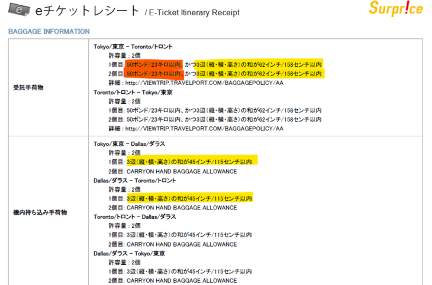
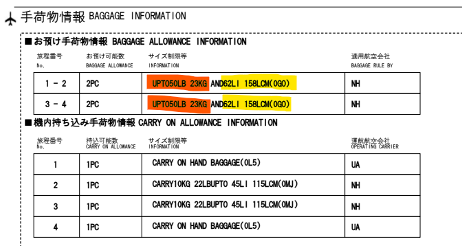

留学や長期旅行の際に持っていくスーツケース、期間や、購入した航空チケットによって、持っていく数やサイズなど選ぶ種類が変わってきます。

留学期間、旅行日数が長ければ長いほど、どんなに詰め込んでも容量が足りなくて悩んでしまいますよね。

**サイズ、材質、重量、普段使わないし、何が一番いいのか全然わからない・・・**

この記事では、**サイズ（寸法）、容量、重さ、機能性といった視点から、 スーツケースの選び方やポイントをご紹介**します。

## スーツケースを選ぶためのポイント

スーツケースの値段はぴんきり、もちろんその分スペックも千差万別です。ここでは留学用にスーツケースを選ぶ際、確認しておいた方が良いポイントを紹介します。

### 大きさ（寸法・容量）

スーツケースは3辺合計あるいは容量を、大きさの目安として掲載しています。

#### 容量

容量を確認する際は、宿泊数を基準として選ぶことが一般的です。

**1～3泊：～40リットル程度  
3～4泊：20～40リットル程度  
3～4泊：40～60リットル程度  
4～7泊：60～90リットル程度  
1週間以上：90リットル以上** 

留学の場合は、短期長期にかかわらず1週間以上いますので、**メインのスーツケースは90リットル以上のサイズを選ぶようにしましょう。**

また、**40リットル程度までのスーツケースは手荷物として機内持ち込みができるサイズに設計されていることが多い**です。留学や旅行で持っていく際、**小さいスーツケースは持ち込み用サブケースとして活用することもできます**ので、機内持ち込みの荷物もぎりぎりまで詰めたい！という方は候補のひとつになると思います。

サイズが大きくなっても、下記の航空会社規定を超過しなければ値段は変わりません。旅行の際は帰りのお土産なども大幅に増えるため、**大は小を兼ねる**を基準に考えましょう。

#### 3辺合計寸法（3辺の和）

スーツケースの大きさやサイズを確認する際、もう一つの基準となるのが3辺合計寸法です。

各航空会社の預け入れ荷物には寸法の規定があり、それを超えると超過料金がかかるようになっています。すでに取得するチケットの算段がついているようでしたら、**対象の航空会社の手荷物情報（BAGGAGE INFORMATION）を事前に確認しておきましょう。**

こちらの3辺合計（3辺の和）の計算方法がこちら。

**【計算方法】**  
**3辺の和　＝　幅（W）＋高さ（H）＋奥行（D）≦　158cm**

一部の例外はありますが、たいていの国際線は、158センチ（62インチ）以内のスーツケースであれば、飛行機で利用可能です。

たとえば私が最初に利用したアメリカン航空（成田ートロント間のチケット）のBAGGAGE INFORMATIONは158センチ以内、

トロントー成田の一時帰国便で利用したANAでも158センチが基準となっています。

#### それ以外のチェックポイントー自分の身長・体格

一番大きいサイズをメインで持っていくことは前提として、各スーツケースによって寸法は少しずつ異なります。そんな中、**特に女性の場合、気を付けたいのは、自分の身長や体格とのバランスです。**

100L以上のスーツケースになると、ケース本体の高さが75cm以上になることも多いため、女性の場合は取り回しができません。キャスターがついているとしても、階段やちょっとした段差など自力で持ち上げる機会は非常に多いです。そして、**自分の半身より高い、20kg以上あるものを持ち上げることは難しいです。**

一方、**探せば100リットル以上でも比較的背の低いスーツケースもあるので、そうしたものを探しましょう。**

例えば同じ100L前後のサイズのエバウィンのスーツケースでも、10cmも違いが出ることもあります。

<iframe style="width: 120px; height: 240px;" src="https://rcm-fe.amazon-adsystem.com/e/cm?ref=tf_til&amp;t=28nikki-22&amp;m=amazon&amp;o=9&amp;p=8&amp;l=as1&amp;IS2=1&amp;detail=1&amp;asins=B00OXB42WO&amp;linkId=04ac46cdf054625d82476fe8f7103218&amp;bc1=000000&amp;lt1=_blank&amp;fc1=333333&amp;lc1=0066c0&amp;bg1=ffffff&amp;f=ifr" frameborder="0" marginwidth="0" marginheight="0" scrolling="no"></iframe>

 

<iframe style="width: 120px; height: 240px;" src="https://rcm-fe.amazon-adsystem.com/e/cm?ref=tf_til&amp;t=28nikki-22&amp;m=amazon&amp;o=9&amp;p=8&amp;l=as1&amp;IS2=1&amp;detail=1&amp;asins=B071GNNK1Y&amp;linkId=a15990a2b56174a1f16f9e7f363973b6&amp;bc1=000000&amp;lt1=_blank&amp;fc1=333333&amp;lc1=0066c0&amp;bg1=ffffff&amp;f=ifr" frameborder="0" marginwidth="0" marginheight="0" scrolling="no"></iframe>

**エバウィン Be Light(94L) - 高さ74cm  
エバウィン Be Max(100L) - 高さ64cm**

スーツケースは価格や家まで運んでくれる利便性を考えると、インターネットで購入するのが一番楽だと思いますが、**自分に最適なサイズは何か、リアル店舗で一度確認しておくことをおススメします。**

### 重量／材質

スーツケース自体の重さは、できる限り軽いものを選びましょう。

**スーツケースが軽ければ軽いほど、より多くの荷物を詰め込むことができます。** 留学は、現地での物の調達が前提になるとはいえ、 お金の節約のためには日本からどれだけ詰め込めるかが肝になります。

ここでも最初に確認したいのは、各航空会社の重量規定です**。一般には、受託手荷物は23kgまで預けられる航空会社が多いです。**

ここでまたANAの規定を見ると、「UP TO 50LB 23KG」と書いてありますね。

各スーツケースメーカー、スーツケースの重量をいかに軽くできるかが商品の人気に関わる要素になります。そのため、**同じメーカーでも軽ければ軽いほど価格も上がっていく場合が多いです。**

また、材質がソフトかハードかによっても重量が大きく変わります。**ソフトケースは布を使っている分、一気に重量が軽くなる**ので、多く物を持っていきたい場合は選択肢として考えてみましょう。

### ブランド・メーカー

ブランド、メーカーについては、よほど無名、口コミが悪いものを選ばない限りは問題ありません。というのも、スーツケースとして作られている限り、通常はそれに見合った耐久試験を施しているからです。

**品質に着目したいのであれば、キャスターとハンドル部分を確認しましょう。**なぜならスーツケース本体は通常の使用で凹むことがほぼ無いからです。むしろ、**凹むときは、それだけの衝撃を与えられているので必ず凹みます。**

一方で、キャスターとハンドルは品質の差が大きく出ます。**20kgの重さの力がかかるのは、すべてキャスター部分。そして引っ張る箇所のハンドル部分です。**

キャスターそのものの品質が悪かったり、キャスターが本体にきちんと接着していない状態の製品はすぐにキャスター破損・折れが発生します。ハンドルも、20kg入れた状態で引っ張るとフニャフニャしてしまうものがあります。

こうしたものは、20kgリアル店舗でも確認しにくい内容になります。が、きちんとしたメーカーやブランドの場合は確実に品質試験を行っているため、こうした破損が比較的起こりにくいと言えるでしょう。

### その他機能（セキュリティ・キャスターの数）

その他セキュリティや二輪、四輪などについてです。

#### セキュリティについて

アメリカを経由する場合は、鍵は閉めません。なので正直、TSAやらなんやらありますが、**鍵の種類は気にする必要がありません。**

フライト、預入時に発生する盗難は、おおむね下記の2点です。

1. フライト後の荷物回収時に盗られる　
2. 空港スタッフなどが鍵を開けて取る

空港スタッフによる場合、TSAロックは普通に開けられてしまいます。**基本は回避できません。**

**預け入れ荷物は最悪盗まれてもいいものだけを入れる。**という意識を持ちましょう。

ホームステイやシェアハウスでの盗難については、ナイフでジッパー部分を開けるほどの気概を持つ人間が家の中にいるかどうかです。金庫代わりに使う場合でも、何か一つ鍵がついていれば良いのではないかと思います。

#### キャスター

品質については先ほど述べたとおりですが、二輪、四輪、八輪と種類がある場合があります。

**おすすめは四輪以上です。**

というのも、**スーツケースはハンドルで引っ張って後ろからゴロゴロと動かすだけでは無いからです。**こうした引っ張り方の場合、二輪しか使わないのですが、**20kgの大きい荷物を斜めに持ち、2輪のキャスターだけで支え動かすのはけっこうきつい**です。

むしろ、留学時に使う**大型のスーツケースの場合は重いため、地面に対し垂直に持って、自分の横につけて引っ張る場合が非常に多いです。**

こうした動かし方の時に4輪以上あると、四方でバランスが取れるため非常に動かしやすいです。

これが四輪以上をおすすめする理由です。

### アクセサリー類のオススメは？

最後にアクセアりー類です。基本的には要らないと思っていますが、唯一スーツケース用のベルトだけは、下記の理由からオススメ勧めします

- **飛行機到着後のターンテーブルで、自分のものと識別しやすい**
- **誰かが誤って取った／あるいは盗もうとした場合でも、アクセサリーを目安に識別できる**
- **ハードケースをパンパンに入れた場合の開き防止**

【例】

<iframe style="width: 120px; height: 240px;" src="https://rcm-fe.amazon-adsystem.com/e/cm?ref=tf_til&amp;t=28nikki-22&amp;m=amazon&amp;o=9&amp;p=8&amp;l=as1&amp;IS2=1&amp;detail=1&amp;asins=B07G5V3XFH&amp;linkId=090771ad46fe8a29242bcc1bda14faa5&amp;bc1=000000&amp;lt1=_blank&amp;fc1=333333&amp;lc1=0066c0&amp;bg1=ffffff&amp;f=ifr" frameborder="0" marginwidth="0" marginheight="0" scrolling="no"></iframe>

 

<iframe style="width: 120px; height: 240px;" src="https://rcm-fe.amazon-adsystem.com/e/cm?ref=tf_til&amp;t=28nikki-22&amp;m=amazon&amp;o=9&amp;p=8&amp;l=as1&amp;IS2=1&amp;detail=1&amp;asins=B071VR23GB&amp;linkId=9039af46661738ab38b09aa24e78f79c&amp;bc1=000000&amp;lt1=_blank&amp;fc1=333333&amp;lc1=0066c0&amp;bg1=ffffff&amp;f=ifr" frameborder="0" marginwidth="0" marginheight="0" scrolling="no"></iframe>

上はものすごく欲しかったマリオのベルト。デザインがすごく可愛い・・・。もうひとつは私が実際に買ったベルトです。安かったので。

ただ、柄がレインボーのものは価格が安い分、つけている人をよく見ます（黒地のスーツケース×レインボーのベルトなど）。大したことではありませんが、差別化したいのであれば、レインボーは避けた方が良いかもしれません。選ばなければせいぜい100円、200円程度の価格アップです。

また、**クロスタイプはつけるのが面倒**なのと、機能的にはワンベルトタイプでも充分かなと思います。可愛いんですけどね。**20kgのスーツケースの周りを通していくのは結構キツいです。**

<iframe style="width: 120px; height: 240px;" src="https://rcm-fe.amazon-adsystem.com/e/cm?ref=tf_til&amp;t=28nikki-22&amp;m=amazon&amp;o=9&amp;p=8&amp;l=as1&amp;IS2=1&amp;detail=1&amp;asins=B077JH46ND&amp;linkId=04f197b2d8afd616e6d4326e0213a03c&amp;bc1=000000&amp;lt1=_blank&amp;fc1=333333&amp;lc1=0066c0&amp;bg1=ffffff&amp;f=ifr" frameborder="0" marginwidth="0" marginheight="0" scrolling="no"></iframe>

 

<iframe style="width: 120px; height: 240px;" src="https://rcm-fe.amazon-adsystem.com/e/cm?ref=tf_til&amp;t=28nikki-22&amp;m=amazon&amp;o=9&amp;p=8&amp;l=as1&amp;IS2=1&amp;detail=1&amp;asins=B00DVIP3UA&amp;linkId=b80deb77c5304b61ac6111080c373331&amp;bc1=000000&amp;lt1=_blank&amp;fc1=333333&amp;lc1=0066c0&amp;bg1=ffffff&amp;f=ifr" frameborder="0" marginwidth="0" marginheight="0" scrolling="no"></iframe>

## 最後に

スーツケースは、よほど旅行慣れした人以外は、あまり馴染みのあるものではありません。

今回の記事を参考に、自分にベストなスーツケースを見つけていただければと思います。
