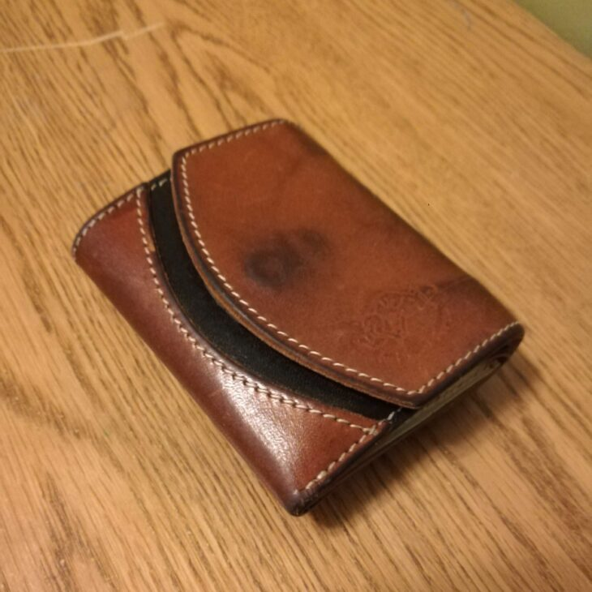
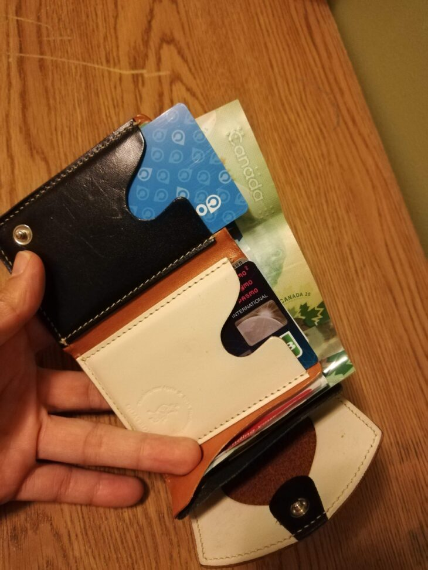
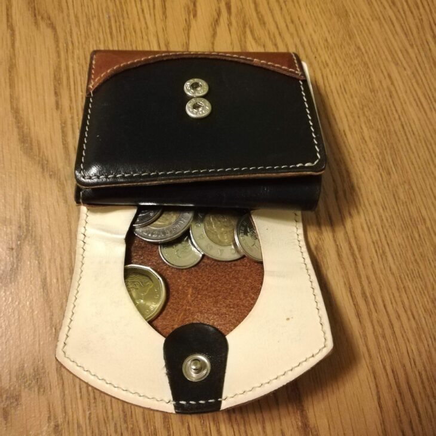
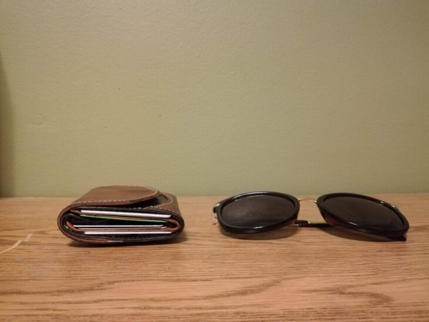

## 小さい財布（ポケットサイズ）

次にオススメしたいのが、とにかく**小さい財布。**

私は昔からクアトロガッツのペケーニョ、「小さいふ」を愛用しています。

旅行シーンを中心に使っていたものをそのまま持って行ったのですが、カナダで出来た友人からも大好評でした。

\[rakuten id="osaifuyasan:10000343" kw="クアトロガッツ ペケーニョ 財布"\]

こちらはもう数年使っている私の小さいふ。

### 小さいふ。のオススメポイント①　カナダで現金は使わない

カナダでの生活は、**ほとんどがクレジットカードで会計を行います。**正直現金を使う機会なんて、家賃支払う時か人と一緒に食べに行って、会計清算するときくらいかな・・・？というレベル。

また、必要なカードは

- **クレジットカード１枚**
- **PRESTOカード（交通網定期券）**
- **持ってる人は運転免許証やオンタリオフォトカード**

ぐらいじゃないでしょうか？バンクーバーでも、PRESTOがCOMPASカードになるだけです。

**現金もカード類も最低限になるため、正直大きい財布がほぼ必要なくなります。**

 

大きい財布はカバンに入れてても邪魔になるため、純粋により「小さい財布」を持ってると非常に便利です！！

### 小さいふ。オススメポイント②　十分な収納力

**小さいしポケットに入る！けれど収納力は十分あります。**

入れようと思えばカードは４枚は財布の中のポケットに入ります。お札部分に入れれば計６枚はいけるかな〜という感じ。

小銭もばっちり入ります。

### 小さいふ。のおすすめポイント③　盗まれにくい

私がトロントで仲良くなった女の子がいたのですが、**２回ほどバスの中で財布を盗まれました。**

大きい財布を使っており、また、リュックのポケット部に入れている、という不用心ぶりを発揮していたからこそなのですが・・・

一方、**小さい財布、とくにポケットに入るくらいの財布であれば、そもそも見つかりにくい**ということ。また、**自身のズボンの前ポケットなどであれば、リュックの後ろのポケットに入れておくよりもはるかに安心です。**（もちろんポケットから抜かれることもあります。自身が管理できる場所に入れておきましょう）

**お札、レシート、カード６枚、小銭を入れても、サングラスと同じぐらいの厚みです。余裕でポケットに入ります。**

安全な日本でも盗難があるように、**カナダは安全な国ですが、もちろんカナダでも盗難は発生します。**

より自身が管理しやすい財布を持ちあることをオススメします。

## まとめ

いかがだったでしょうか？男性女性に関わらず、留学生活で本当にあって良かった！！と毎日感謝しているアイテム３選をお伝えしました。

長期留学の持ち物、アイテム一覧を網羅したい！という方には、こちらの記事でリストも公開しているのでご参考ください。

https://28-nikki.com/post-104/
