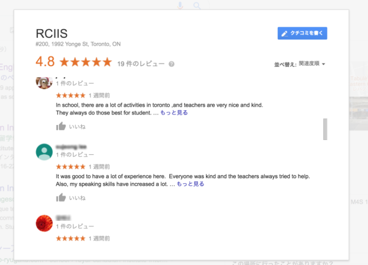

トロントへ語学留学を検討されているみなさま、語学学校、**[RCIIS（Royal Canadian Institute of International Studies）](https://rciis.ca/)**をご存知でしょうか？

カナダのトロントで語学留学をしたいけど、どの語学学校がいいか全然わからない！！！

カナダの中でもトロントは語学学校の数が非常に多い地域ですが、どれも同じような語学学校に見えたり、特徴がわからなかったり、学校選びや比較に迷われている方は多いと思います。

この記事では、私（モトキ）が実際に、トロントのRCIIS（Royal Canadian Institute of International Studies）に3ヶ月通った経験を踏まえ、授業の感想や学校の特徴（メリット・デメリット）を、個人の視点から紹介します。

私は現在カナダに留学していまして、**語学学校３校に通う＋複数の語学学校に体験入学**をしています。**一個人の体験や比較**から、学校ごとの特徴やメリットデメリットをまとめています。

- **トロントの数ある語学学校の中から、何を基準に選べばいいかわからない**
- **決めた語学学校に自分が合っているか不安**
- **どこも良いことしか書いていなくて、学校のデメリットも知りたい**
- **RCIISが気になっているけれど、実際体験した評判を知りたい**
- **RCIISのパワースピーキングのクラスが気になっている**

この記事では、私がなぜRCIISを選んだのか。その理由と、メリットデメリット含めて率直な評価、意見をそのまま書いていますので、トロント語学留学に向けて学校の実態や評判を知ることができます。

また、RCIISを検討されている方、トロントの語学学校の情報が欲しい方の不安を解消する手助けになると思います。

その他の[語学学校の学校感想・体験授業口コミリンク集はこちら](https://28-nikki.com/vancouver_school_review_list/)。

## トロント語学学校　RCIIS**とは？**

RCIIS 基本情報！

- **Royal Canadian Institute of International Studies**
- **1992 Yonge St #200, Toronto, ON M4S 1Z7**
- [**https://rciis.ca/**](https://rciis.ca/)

まずはじめに、RCIISがどのような学校なのでしょうか？

[RCIIS（Royal Canadian Institute of International Studies）](https://rciis.ca/)は、トロントのDavisville駅とEglinton駅の間にある語学学校です。Davisvilleからの方が若干近いです。

<iframe style="border: 0;" src="https://www.google.com/maps/embed?pb=!1m18!1m12!1m3!1d2884.4985884790462!2d-79.39960958506907!3d43.70018655741015!2m3!1f0!2f0!3f0!3m2!1i1024!2i768!4f13.1!3m3!1m2!1s0x882b333f2ba0e07d%3A0x19b6a159e3f25e4f!2sRCIIS!5e0!3m2!1sja!2sca!4v1570382674441!5m2!1sja!2sca" width="600" height="450" frameborder="0" allowfullscreen="allowfullscreen"></iframe>

ビルの２階をまるまる借り切っており、決して大きい学校ではありませんが、駅近でEglinton駅自体が大きく映画館やカフェなど充実した駅であること。ダウンタウンからも近い立地なので、非常に利便性の高い学校です。

また、**RCIISはSpeaking重視の学校として評価を得ている学校**です。

- 20年以上語学学校を経営
- **明るくカフェのような雰囲気の校舎**
- **小規模校でアットホームな校風**
- 英語の初級者から上級者まで**質の高い授業を、会話重視で学べる**
- **プロフェッショナルかつ非常に個性豊かな講師陣**
- **少人数クラス**で、スピーキングのクラスは**先生と１対１で会話する時間がある**
- 2019年は**[Best Speaking of Toronto,](https://www.castudy.net/school/best/2019/rciis.html)** [Best IELTS of Toronto](https://www.castudy.net/school/best/2019/rciis3.html),[Best Business of Toronto](https://www.castudy.net/school/best/2019/rciis2.html)を受賞

[BEST SCHOOL OF CANADAは日本人の評価・投票によって毎年決まる賞](https://www.castudy.net/school/best/index.html)なのですが、RCIISは毎年各セクションで上位にランクインする語学学校です。2019年もスピーキングだけでなく、IELTSやビジネスの面でも優秀なプログラムを提供していることがわかります。

## トロント留学でRCIISを選んだ理由は？

私が留学にあたりRCIISを選んだ理由は３つあります。

1. **とにかくスピーキングが上達できる学校を選びたかったこと**
2. **どの留学エージェントも勧めてくる大規模校じゃないところにしたかったこと**
3. **きちんと第三者からの評判が良いこと**

### スピーキングに特化した授業

留学前、私のTOEICは450点を切っていましたが、3ヶ月の勉強で400点前半から685点まであげることができました。

そんな中、文法、リーディング、[リスニング](https://28-nikki.com/post-374/)はある程度自分でも改善できることがわかったのですが、**スピーキングはまったく上達せず。**

こればっかりは**人と環境が無いとどうにもならない、と考えて、とにかくスピーキングに特化した授業のある学校に通いたい**と考えていました。

そんな中で見つけたのが**RCIISの『Power Speaking』プログラム**でした。

事前にRCIISのWEBサイトから問い合わせて手に入れたパンフレットから、PowerSpeakingの特徴を少しピックアップすると、

- RCIISのモットーは**“Leaning by doing”\-英語を実践的\=会話する事により身に付けます。**
- **1分間Power Speaking**とは、講師と生徒の1対1会話練習です。ほぼ毎日のように行われるこのレッスンでは自分の意思を明確に話す練習をします。
- 電話応対に必要な表現を学んだ次の日は携帯電話を使い、別室で待機している講師に電話をかけます。

とのこと。

実際、３つ目の電話は授業中に、先生相手、どころか**市内のレストランや図書館に直接電話をかけました。** **ガッチガチに緊張して死ぬかと思った。**

### 小規模かつ留学エージェントにあまり勧められないところ

語学学校選びの前に、留学エージェントを８社回ってひたすら留学について調べました。

その際、**留学エージェントがオススメしてくる語学学校がほぼ全て一緒の超大規模校でした。**

https://28-nikki.com/2018-09-08-004147/

https://28-nikki.com/2018-09-10-223532/

その中で、

**日本中の留学エージェントが一度は勧める語学学校があるのでは？**

****

**ていうか、日本人がめちゃくちゃ多いのでは？？？**

という結論に行き着きました。

あまり大人数の場が昔から得意ではない、ということもあり、**小規模校かつあまりエージェントに勧められなかったところ。**というのが２つ目の条件になりました。

### 第三者からの評価・評判が高いこと

次に大事にしたのは、不特定多数、第三者からの評価が良いことです。

もちろん、実際に留学した方に直接話を聞く・・・というのは難しかったのですが、**先ほどのBEST SCHOOL OF CANADAで毎年受賞していること。**

また、**評判や口コミの****レビューが非常に高かったことが、最後の決め手になりました。**

Googleレビューは19件の投稿で★4.8、[Facebookでは２１件の投稿で★4.9](https://www.facebook.com/pg/rciisjp/reviews/)と非常に高い評価を獲得しています。

ここでいくつかRCIISのGoogleレビューを紹介します。

この学校で勉強できて幸運でした。多くのコースを信頼して受けることができました。また、真摯かつプロフェッショナルな先生しかいませんでした。素晴らしい能力のある先生のもと、異なる種類の英語スキルを大きく改善させることができました。

素晴らしいスタッフたちが、暖かい心で生徒を助けてくれます。先生たちは素晴らしく、また、教えることが大好きです。

非常に親切な教師、スタッフ、さまざまな国の人々に会うことができます。また、発音について勉強したい場合は、スタープログラムを通じて発音を改善できます。発音用の非常に具体的なプログラムです。

どれも先生に対する信頼が強く、授業の質が高いことが伺えます。また実際に通っている中でも、**先生、授業の質の高さを実感することが非常に多かったです。**

## RCIISに実際に通ってみての感想・評価

### 3ヶ月RCIISに通って受けた授業一覧

私はRCIISで午前・午後の授業のある週30時間のコースを選択しました。

私は最初のテストの評価がよくなかったため、かなり下のクラスからのスタートでしたが、最終的にAdvanced DiscussionというPower Speakingの一番上のクラスまで上がりました。卒業直前の滑り込みみたいなものでしたが・・・。

**午前中のクラス**

**午後のクラス**

Power Speaking2

Grammer2

Power Speaking3

Writing

Power Speaking4

IELTS(Speaking + Writing)

Advanced Discussion

最初にPower Speakingを取っていたとしても、途中、希望があればPower Speakingから、四技能全体を学ぶESL（Pre academic）コースに変更することも可能です。そのあたりは、カウンセラーさんに相談することで、柔軟に対応してもらえます。

### RCIIS　Power Speakingクラスの感想

#### 基本の授業の流れ　とにかく喋る。喋る。喋りまくる。

Power Speaking全体の流れは下記のようになります。

1. **その日のテーマに沿ったスクリプトや単語が配られる。**
2. **単語やトピックの要旨、意味を確認**
3. **その単語が使えるようなトピックテーマが複数配られ、先生、生徒を交えてひたすら会話、ディスカッションを繰り返す。**

実践をモットーにする学校だからこそ、**習った単語をその場ですぐ使う、定着させることに重きを置いた授業になっていました。**

授業の開始では必ず一人一人、前日にあったことを会話する時間が設けられていました。

また、授業中も雑談や、先生の面白い会話、カナダ文化などを紹介してもらい、**とにかく話す時間が圧倒的に多かった**、という印象。

#### 少しずつテーマの難しさ、単語のレベルが上がっていく。

Power Speakingの授業を２から駆け上がったからこそ言えるのですが、**トピックはレベルがあがるごとにどんどん難易度が上がっていきます。**

最初は日常会話。次のレベルではビジネスや星座、環境問題など。次は遺伝子改良や尊厳死。果ては新聞やニュースから自身で話題を選んで説明する。

等々、**自然と求められる語彙力も上がっていきます**。正直、短期間で習得している語彙力以上に、求められるレベルが大きくアップしていくため大変でした・・・。

#### 同じPower Speakingでも、先生の個性が大きく授業に影響する！

基本の流れやコアとなる部分は同じなのですが、授業は**先生ごとに雰囲気が全く異なります。**

几帳面な先生もいれば、可愛らしいおじさん先生、とにかく冗談ばかり言う先生などなど。

先生ごとに、授業にオリジナルの課題や要素を取り入れていること。プリントの作り方も異なるため、授業ひとつひとつに先生の個性を思う存分に感じられます笑

しかし共通しているのは、**どの授業も「楽しい」「面白い」という気持ちが先行して学べること。**

クラスのレベルが一個ずつ上がるたびに、「このクラスにもっと残りたい・・・」と名残惜しさでいっぱいになりながら移っていきました。

また、私はとにかくレベルの高い人たちの中で喋る練習をしたかったので、上にあがるべく授業内で喋る&先生に相談をとにかくしていました。

**上のクラスに上がるためには私の何が弱点でしょうか？普段授業内での喋りを見ていて、もっと頑張った方がいいところを教えてください！**

という感じ。**授業内での喋りを多く見てもらうことと、それに対するレビューを貰っていました。**もちろん、カナダのネイティブ社会の中で喋るためには発音も語彙も文法も全てが全然ダメなので弱点しかないのですが、**上のクラスに上がるために足りない点であれば先生も的確に指示してくれます。**

自分にとっても、克服するべき弱点を身近、かつ頑張れば上がれる階段として設定できるため、**「ガンガン喋る&先生に質問する」**の組み合わせは、語学学校に通う全ての人におすすめしたい方法です。

### RCIISのWriting,Grammerの授業

#### 英語のライティングを基礎から丁寧に教えてくれる

実はものすごく役に立ったのがこちらのWritingの授業。

- **英語のWritingで必要とされる要素は何か。**
- **どういう文章構成にすれば良いのか。**
- **意見のまとめ方**
- **覚えておくべき接続詞　等々・・・**

本当にいままで習ったことのない、しかし確実に英語社会で必須となる能力を０から教えてもらいました。

授業の人数次第ですが、私の時はクラスの人数が少なく、毎日１回作文を書いて、それを毎回丁寧に添削してもらえる時間がありました。

先生の質の高さ、授業の質の高さ、丁寧な指導、それらが合わさって、**一番Writingの成長を実感できた期間でした。**

### RCIISの中で気になった点

授業の質が非常に高い反面、学校で気になった点もあります。

#### **小規模校になってしまうためクラス取得の選択肢が狭いこと。**

基本的に、午前中に取れる授業はESL（Pre Academic）かPower Speakingかの２択です。ビジネスの授業は人数が集まれば開催する、という不定期開催でした。

また、Power Speaking内での同レベルの授業は１個しかやっていないため、「スピーキングを鍛えたいけど先生が合わなかった」となった場合に、取れる授業がESLの四技能を高めるクラスしかなくなってしまいます。

また、どちらの先生とも合わなかった、となった際はほぼ選択肢がなくなってしまいます。

#### **一つのクラスに長く滞在すると、同じトピックを繰り返してしまうこと。**

全てのクラスかはわかりませんが、Power Speakingの場合、1ヶ月ごとに授業内容を繰り返すクラスもあったため、**何ヶ月も通うと授業にだれてしまう可能性があります。**

私は幸い、短期間でガツガツクラスが上がっていったので、ダレることはなかったのですが、私の友人は3ヶ月同じクラスを取り続けて心が死んでいた子もいたので・・・。

最初からある程度高いレベルのクラスに入った場合、１回レベルが上がってしまうとずっと同じクラスに滞在・・・という可能性も出てきます。

 

ただ、他の学校に通っている留学生友達に聞いたところ、これらの問題は**他の語学学校でもよく発生しているらしいので、RCIISだけではありません。**

その後通ったSSLCのパワースピーキングやPathwayのクラスでも、基本的に数ヶ月でトピックが一周するため、長期で滞在している生徒には「これ前もやった〜」という子が多くいました。

長期留学かつ長期で語学学校へ通う留学プランを立てている場合は、**１つあたりの学校に対し、規模感と自分の目的をしっかりと相談・把握して期間を決めることをオススメします。** 

## 総評　RCIISに通って良かったか？

はい。3ヶ月という短い期間でしたが、**RCIISに通えて良かった。**と感じています。

理由は、目的としていた**英語Speakingについて、的確かつ質の高い授業を提供してもらえたこと。また、自身の上達を肌実感で感じられたからです。**

3ヶ月間みっちり話す練習をしてきたことで、日本語を英語に翻訳して話すのでなく、**英語で考えて英語を話すという習慣も作ることができました。**

周りの生徒の意欲も高く、レベルの高い生徒と一緒のクラスになると、**英語をもっと喋れるようになりたい、と相乗効果で頑張る気持ちが増えていった**ことも嬉しかった点の一つです。

Writingについては、卒業後に通った別の学校のPathwayコースで一番力になってくれました。

卒業後も、授業外でも先生や生徒たちで花見をしたりと、**本当にアットホームで皆んなで仲良くなれる学校だったと感じています。**

 

**勉強するための環境はしっかり整っている、と自信を持って断言できます。**

 

その環境を最大限活かせるか。小規模であることのデメリットを、自身の向上心で無くしていけるかが肝かなと思います。

RCIIS以外の[語学学校の学校感想・体験授業口コミはこちらにまとめています](https://28-nikki.com/vancouver_school_review_list/)。

また、スピーキングを重視されている方は、留学前に瞬間英作文がおすすめです。私自身、一番スピーキングに効果があったと感じているので、クエストでの勉強に加え、集中的に英語スピーキングを重視したい方には留学に行く前、留学中に一度でもやっておくと、スムーズに留学生活をスタート、語学学校で発言できると思います。

実際に私が[瞬間英作文に取り組んだ方法、効果はこちら。](https://28-nikki.com/shunkan_eisaku_effect/)

https://28-nikki.com/shunkan\_eisaku\_effect/
