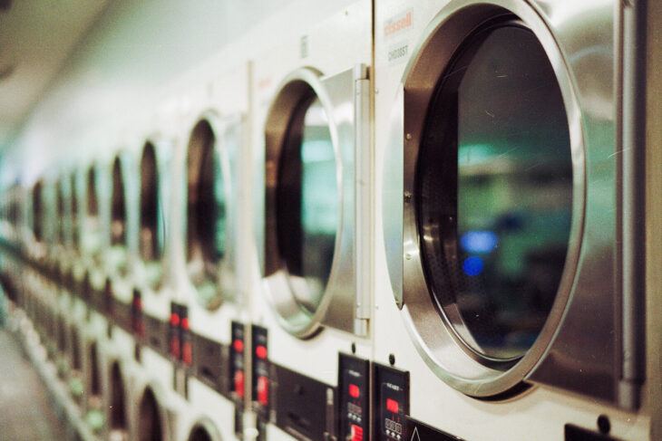
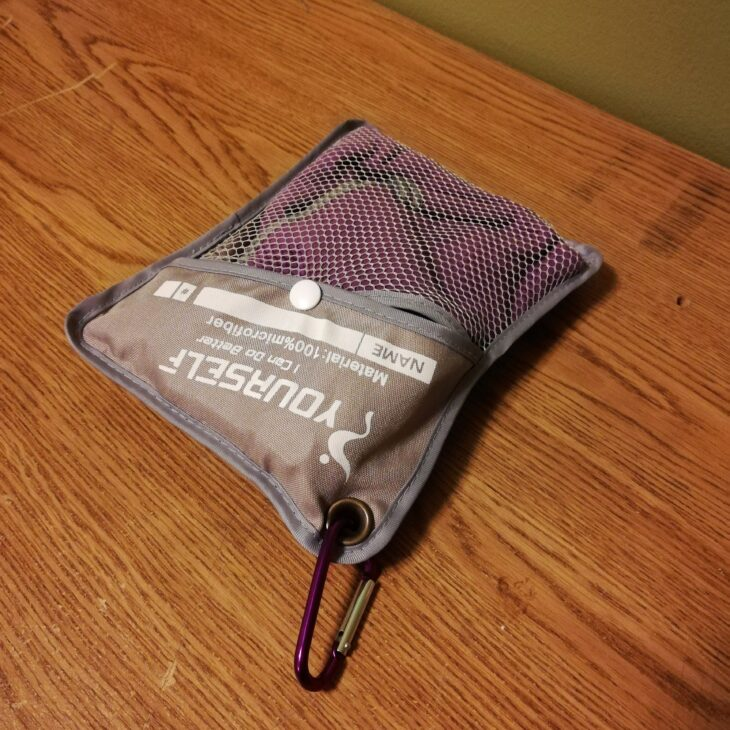

留学に向けての持ち物って非常に悩みますよね。その中でも**タオル**は、軽いけどかさばるし何枚持っていこう・・・。と、海外の洗濯事情も知らない中で決めるのは難しいと思います。

私は1年以上のカナダ長期留学をするにあたり、渡航前に何を持っていくべきか、悩みに悩んで結局選べず、大型スーツケース２つでカナダへと渡りました。が、[無駄だったものもすごく多かった](https://28-nikki.com/canada_stuff_list/)し、逆に持って来れば良かった・・・と大きく後悔したものも。

中でも**タオル**は、留学生活中にもっと考えておけばよかったと**一番後悔しているアイテムのひとつ**です！

自身の後悔の中で、次に留学する人に向けて伝えたいのは、**留学に持っていくなら絶対にスポーツ用速乾タオル。**

今回の記事では、これから留学準備を始める方に向けて、**カナダの洗濯事情**、そして、**なぜ私がスポーツ用速乾タオルをおすすめする****のか**、その理由をご紹介します！

[＞＞Amazonで【速乾タオル】を探す＜＜](https://www.amazon.co.jp/gp/search?ie=UTF8&tag=28nikki-22&linkCode=ur2&linkId=b4bff71528603dd9fe5710f7d59f4fab&camp=247&creative=1211&index=sporting&keywords=速乾タオル)

## タオルを選ぶ前に知っておきたいカナダの洗濯物事情

### 週１回、溜め込んだ洗濯物を一気に洗う

**カナダでの洗濯は週に１回が基本**です。これはバンクーバーだろうとトロントだろうと変わりません。

と、言うのもカナダでは洗濯機／乾燥機が家に備え付けておらず、有料のコインランドリーを使うことが多いからです。アパートメントやコンドミニアム（マンション）では地下に大型コインランドリーが併設されている場合がほとんど。また、一軒家の場合でも電気代／水道代がバカにならないため、週に１回まとめて洗濯をするのが一般的です。

また、「洗濯物を干す」という概念がありません。洗濯機で衣類を洗ったら、隣に置いてある乾燥機にポイポイ入れて乾燥まで仕上げます。

そもそも１週間分の衣類を一気に干すスペースがありません。さらに、留学先として人気のバンクーバーは秋から2日に１回は雨が降りますし、トロントは雪。毎日雪です。屋外で干すよりも、乾燥機で最後まで乾かしてしまうのも納得がいきますね。

### 溜め込む洗濯物は自室保管

週に１回の洗濯に向けて、着たもの／汚れたものはどうするのか？**当然自室保管です**。

ホームステイの場合は、部屋に洗濯カゴが用意されている（場合が多い）ので、そこに放り投げておきます。そして、洗濯の日になったらホストファミリーに渡して洗濯してもらうか、自分で洗濯機まで持っていき洗濯します。

シェアハウスで暮らす場合も、ラウンドリーは週１回とルールが決められていることが多いです。（自身で有料の外部ラウンドリーを使う場合は、もちろん回数自由の自己判断です）

そのため、１週間分の衣類・使用したタオル、すべて自室に溜め込んでいくことになりますが、**問題は濡れたタオル／衣類の扱い。**部屋の中で乾くまでハンガーにかけて干すものの、**どう頑張っても数日経つと雑菌が増え雑巾の匂いがほんのりと・・・**

タオルの場合、「1日経っても生乾き」という場合も多く、使えば使うほど干すスペースが必要になる状態が続きます。雑菌の件もあるため、普通の乾いている着終わった衣類と一緒に保管することに抵抗感も。

### 乾きにくいものは、乾燥機後も湿気ている場合も

１週間分の洗濯物を一気に洗濯、一度に乾燥するのですが、正直**洗濯機・乾燥機の衣類への扱いは雑です**。平然と衣類が裂けていきますし、**乾燥機は多く入れると乾かないものが出て着ます。**特に、厚手の衣類だったり、乾燥中に衣類同士が絡まってしまった部分が乾きにくいですね。

結果、**厚手のタオル**は「**厚い**」「**細長（くて絡まりやす）い**」の２大乾かない要素を持ち合わせるカナダ洗濯界の厄介者です。

タオルは洗濯までの間に雑菌も増えてるので、洗濯機の時点できちんと洗えてないと悲惨です。洗ったのに使いたくなくなります。

### 留学用のタオルに欲しい３つの機能

#### 軽くてかさばらないタオル

これは留学の荷物のパッキングにおいて非常に重要なポイントです。

**スーツケースの中身をいかに軽く、そして量を入れられるか。**

上記の状況次第で、**留学後の生活費の節約、利便性が大きく変わります**。

ふかふかのタオルが大好きな人は、私含め多くいらっしゃるでしょう。が、**１週間分のタオル（７枚）をスーツケースに入れると、結構かさばることに気づくと思います。**

そのため、軽くてかさばらないタオルに変えるだけで、留学用スーツケースのスペースが驚くほど空きます。

#### デリケートすぎず丈夫なタオル

カナダの洗濯機と乾燥機は雑なので、**デリケートな洗濯物はすぐに裂けます（経験談）**。

タオルの場合、デリケートな素材や縫製のものはほぼありませんが、１００均などの安物を買うと使っている間に縮んだり、肌触りがごわごわになっていくことが多いです。

とは言っても、タオルは所詮消耗品なので「高級今治タオル派」と「安物でダメになったら雑巾にする派」など、人によって様々な派閥が存在している状況です。ひとりひとりの好みに合わせて用意するのが一番ですが、留学中カナダ現地での余計な出費を抑えたいのであれば、衣類・タオル類の耐久性を考慮することもひとつのポイントです。

#### とにかく乾きやすい／速乾タオル

すでにお伝えした、カナダの洗濯物事情から、留学用のタオルに求められる最も大事な要素は「**乾きやすいこと／速乾であること**」です。

**速乾タオルのメリット！**

- 使用後すぐ乾くので雑菌を増やさない
- 乾いてしまえば、すぐに洗濯カゴに入れられる
- 洗濯後の乾燥機の生乾き対策

濡れたものが「いかに早く乾いてくれるか」によって、自室の快適性や衛生面が変わってくるため、留学に向けて準備するタオルはできる限り、早く乾くタオルを用意しましょう。

## 留学用におすすめの速乾タオル（スポーツ用）

カナダ洗濯問題に関わる、留学用タオルに求められる要素をすべて兼ね揃えたスーパータオルが存在します。

それは、**スポーツ用の速乾タオルです**。あまり馴染みのない方もいらっしゃるかと思いますが、一般的に水泳などで使われる速乾吸水薄型タオルです。

上記の写真は、実際に私がいま留学中に使っているタオルです。留学前に、アマゾンで下のフェイスタオルサイズ×２枚のセットを買いました。

<iframe style="width: 120px; height: 240px;" src="https://rcm-fe.amazon-adsystem.com/e/cm?ref=tf_til&amp;t=28nikki-22&amp;m=amazon&amp;o=9&amp;p=8&amp;l=as1&amp;IS2=1&amp;detail=1&amp;asins=B01N12LSC6&amp;linkId=066fec2fd706c9122c832e4ad94ab565&amp;bc1=000000&amp;lt1=_blank&amp;fc1=333333&amp;lc1=0066c0&amp;bg1=ffffff&amp;f=ifr" frameborder="0" marginwidth="0" marginheight="0" scrolling="no" data-mce-fragment="1"></iframe>

### 速乾タオルのおすすめポイント①　めちゃくちゃ薄くて軽い

今回留学にあたって、普通のフェイスタオル５枚と、スポーツタオル２枚を持って行きました。

が、お伝えした通り、**タオルって、スーツケースの中でめちゃくちゃ嵩張るんですよ・・・。**正直そこらへんのペラペラな夏服よりも厚い（笑）

しかし、それらを速乾タオルに変えると・・・、**見てくださいこの薄さ。**

 

上が１枚を四つ折りにしたときの比較、下が四つ折りタオル×２枚の比較です。

**まさかの1/2以下の厚さ。****しかも、速乾タオルそのものも軽い。**

速乾タオルというものに半信半疑で、留学前にちょこっと買ってみるか〜ぐらいの気持ちで２枚だけお試し買いだったんですが、**正直すべて速乾タオルにすれば良かった・・・**と後悔するくらいにメチャクチャコンパクトになって良いです。スーツケースの中を圧迫しません。

パッキングしたのが留学前日だったので、速乾タオルの魅力に気づけていませんでした。

ケースも付いてるので、スポーツや水辺に遊びに行く時など、外出時の持ち運びでもごちゃごちゃせずありがたいです。

### 速乾タオルのおすすめポイント②　安心の吸水性！

よくマイクロファイバーの吸水速乾タオルってあるじゃないですか。あれって実際は全然水吸ってくれないし乾くのも？？？ということが多いんですよね。そんな疑心暗鬼があってのお試し買いだったんですが、**マジで水吸います。**

**こんなペラッペラのタオルなのに、フェイスタオル１枚で体〜髪まで問題なく拭ける。**

むしろ普通のタオルより吸うのでは？！と思うくらいがっつり吸水してくれます。こんな薄いのにどうなってるんだ。

私は普段からお風呂上がり後はフェイスタオルで全身、髪まで拭いてしまうタイプなのですが、吸水性の面での使い勝手はほとんど変わりません。

ただ、見ての通りフカフカではないので、通常のタオルのようにふさ〜っと拭く、というよりはタオル面を肌に当てて吸水させていくイメージです。

### 速乾タオルのおすすめポイント③　速乾性がカナダ生活に最高！

**何より速乾性がバッチリ！**留学に向けて速乾タオルをオススメする一番のポイントです。

**全身を拭いたあと、適当にハンガーに干して寝ると翌朝にはがっつり乾いてます。**

速乾タオルは濡れている時間が少ないため、雑菌が繁殖する時間が少なく変な匂いがしてきません**。**週１回の洗濯の日まで置いておいた普通のタオルと速乾タオルを比べると、やはり**速乾タオルの方は雑巾の臭いが全然しないです。**

他の洗濯物と一緒に保管しておくと匂いも移ってしまうので、普通のタオル専用の保管場所を作ってはいるのですが、部屋の中に置いておくし、すっごい気になる・・・。

スポーツ時に持っていったときも、汗やプールの水を拭いて、少し置いておけばかなり乾いてくれるので、カバンの中に入れた時も重く無い&なんなら濡れたもの入れる用の袋がいらない。

私のように、毎日フェイスタオルを替えていく派の人にも、１週間１枚のバスタオルを使い続ける派の人にも**めちゃくちゃ推せるタオルです。**

### 留学用のタオルに必要なサイズと枚数は？

全部のタオルを速乾用タオルにすれば良かった、というのは何度もお伝えしている後悔の一つですが、実はもう一つ、大きいバスタオルサイズを１枚買っておけば良かった！と思っています。

というのも、トロントやバンクーバーに住んでいると、一度はプールやビーチに友達と行く機会ができると思うのですが、**その際に下に敷くタオルが欲しかった・・・・。**

こんなブログなんて書いているインドア人間でも、３回以上夏場にビーチに行く機会があったので、普段外に出ない！という方も**一枚くらいバスタオル持っていくことをオススメします。**これなら嵩張らないし誰かに頼もうかなぁ・・・。

私が次に留学に行く時は**速乾タオルに揃えて、フェイスタオル9〜１０枚と、バスタオル１枚のセットにする！**と決めてます。

私の場合、毎日お風呂上がりは新しいタオルで体を拭きたいタイプなのと、週２回ほど体を動かしているので、内訳としては下記のような感じです。

- お風呂あがり用　速乾タオル（フェイスタオル）７枚
- スポーツ／遊び用　速乾タオル（フェイスタオル）２〜３枚
- 速乾タオル（バスタオル）　１枚

## まとめ　おすすめの留学用タオルは速乾タオル一択！

というわけで、個人的な後悔と、留学にスポーツ用速乾タオルをおすすめする理由でした。

私が今回紹介した[速乾タオル](https://www.amazon.co.jp/gp/product/B01MUCDAZG/ref=as_li_tl?ie=UTF8&camp=247&creative=1211&creativeASIN=B01MUCDAZG&linkCode=as2&tag=28nikki-22&linkId=680e1a2505541bc003d3a929eb17f38a)は当時Amazonで一番安かった（２枚セットで、他の１枚のと同じくらいの価格だった・・・）という理由で購入したんですが、機能性・留学タオルとしての魅力に取り憑かれています笑

こちらの記事では、留学用のタオル以外でも持って行ったものや、要らなかったものへの後悔などリストにして書いています。

https://28-nikki.com/canada\_stuff\_list/

まだ留学前で、留学用のタオル選びに悩んでいる！という方の参考になりましたら幸いです。

[＞＞Amazonで【速乾タオル】を探す＜＜](https://www.amazon.co.jp/gp/search?ie=UTF8&tag=28nikki-22&linkCode=ur2&linkId=b4bff71528603dd9fe5710f7d59f4fab&camp=247&creative=1211&index=sporting&keywords=速乾タオル)

