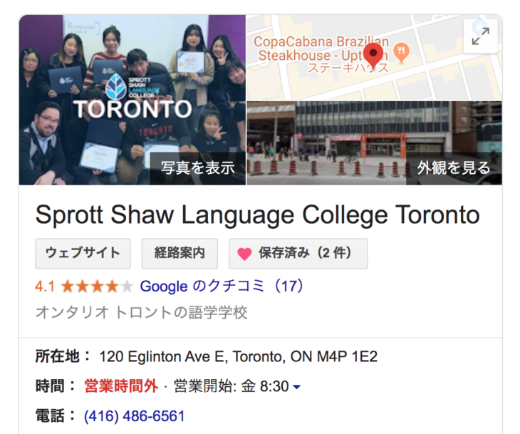

トロントの語学留学を検討されているみなさま、語学学校、[語学学校SSLC(Sprott Shaw Language College)](https://studysslc.com/)をご存知でしょうか？

カナダのトロントで語学留学をしたいけど、どの語学学校がいいか全然わからない！！！

カナダの中でもトロントは語学学校の数が非常に多い地域ですが、どれも同じような語学学校に見えたり、特徴がわからなかったり、学校選びや比較に迷われている方は多いと思います。

この記事では、私が実際に、トロントの語学学校SSLC(Sprott Shaw Language College)に3ヶ月通った経験を踏まえ、授業の感想や学校の特徴（メリット・デメリット）を、個人の視点から紹介します。

**私は現在カナダに留学していまして、語学学校３校に通う＋複数の語学学校に体験入学をしています。**一個人の体験や比較から、学校ごとの特徴やメリットデメリットをまとめています**。**

- **トロントの数ある語学学校の中から、何を基準に選べばいいかわからない**
- **決めた語学学校に自分が合っているか不安**
- **どこも良いことしか書いていなくて、学校のデメリットも知りたい**
- **SSLCが気になっているけれど、実際体験した評判を知りたい**
- **SSLCのPathwayコース（EPE）クラスが気になっている**

この記事では、メリットデメリット含めて率直な評価、意見をそのまま書いていますので、トロント語学留学に向けて学校の実態や評判を知ることができます。

また、SSLCを検討されている方、トロントの語学学校の情報が欲しい方の不安を解消する手助けになると思います。

その他の[語学学校の学校感想・体験授業口コミリンク集はこちら](https://28-nikki.com/vancouver_school_review_list/)。

## トロント語学学校 SSLC（Sprott Shaw Language College）とは？

SSLCトロント校 基本情報！

- **Sprott Shaw Language College ／ スプロットショウランゲージカレッジ**
- **150 Eglinton Ave East, 7th Floor, Toronto, ON**
- **[https://studysslc.com/](https://studysslc.com/)**

まずはじめに、SSLCとはどのような学校なのでしょうか？

**[SSLC（Sprott Shaw Language College）](https://studysslc.com/)**は、カナダのカレッジ（専門学校）Sprott Shaw College が運営する語学学校です。スプロットショーと読みます。

トロントのほか、バンクーバーのダウンタウンやビクトリアにもキャンパスを持つ比較的大きな学校になります。 3都市にキャンパスを持っているため、**生徒の希望で都市間を挟んで転校も可能**となっています。（実際私も転校しましたし、SSLCで知り合った友人もトロントからバンクーバーへ転校や、ビクトリアからバンクーバーに転校などの例がありました）

#### SSLCトロント校の特徴は？

私が通ったSSLCトロントキャンパスはEglinton駅近く、ビル内にキャンパスがあります。

駅近なので、駅のホームから出て5分かからず建物に着くことが可能です。 

<iframe style="border: 0;" src="https://www.google.com/maps/embed?pb=!1m14!1m8!1m3!1d5768.393689032372!2d-79.3974179899658!3d43.70645814677402!3m2!1i1024!2i768!4f13.1!3m3!1m2!1s0x0%3A0xf8ce5c49ab01d724!2sSprott%20Shaw%20Language%20College%20Toronto!5e0!3m2!1sja!2sca!4v1570380187190!5m2!1sja!2sca" width="600" height="450" frameborder="0" allowfullscreen="allowfullscreen"></iframe>

私が通ったSSLCトロントキャンパスの特徴としては、「勉強すること」に比較的重きを置いた学校でした。

- 母体の専門学校（Collage）への進学や、専門コースがある
- 授業外のアクティビティ、キャンパス内での無料クラスなどイベントが盛ん
- **トロント校では、TOEIC 公式テストを毎月無料で受験できる**

授業外のイベントとしてアイスやお菓子が配られる。放課後の無料クラスでは、みんなが一つの部屋に集まってお菓子を食べながら一緒に歌を歌う。など、生徒間の交流やキャンパスの雰囲気をよくするための仕組みが出来上がっている印象でした。

また、休み時間などは階をまたいで友達に会いに行く生徒がいるほど、ESLなどのクラスやキャンパス内は和気藹々としていました。

その他個人的に大きかったメリットとして、キャンパスがTOEICの試験会場になっており、**毎月月末にTOEICを無料で受験することができました。**

別にTOEICのスコアは必要なかったのですが、自分がどのくらい留学前に比べてレベルが上がっているのかの目安にできたので、リスニング、リーディングが上達しているのを感じるのが嬉しかったです。

**ちなみにカナダでTOEICを受験すると、一回$95するので経済的にはだいぶメリットが大きかったです**（2019年10月時点）

## SSLCトロントキャンパスの口コミや評判は？

SSLC（Sprott Shaw Language College）の評判はどうなっているのでしょうか？

**Googleの口コミを見ると、１７件の投稿で★4.1を獲得**しています（2019年10月3日現在）

投稿している方の国籍は、中国と南米の方が多く、

EPE（Pathway）コースでのWriting技術や発音矯正に対する感謝や、教師から丁寧に英語の指導を受けたことに対するお礼が多いようです。

一方、受付や制度の点で★１をつけている方が３名ほどいます。私自身、少し受付やシステムの面で難を感じる部分があったので、その点は後ほど詳細を書きます。

## Sprott Shaw Language Collegeを選んだ理由は？

私がトロントへの留学にあたりSSLC（Sprott Shaw Language College）を選んだ理由は、あまり積極的なものではありません。

正直、行きたい大学のPathwayコースがある語学学校がSSLCともう一校しかなく、諸々の条件を比較してSSLCを選びました。以下、比較した際にメリットとして感じた点を書きます。

### 体験入学時の授業の質が良かった

一度、入学を決める前にEPEクラスの体験入学を行いました。

部分的な参加ではあったものの、そこで行ったのは、

- **教科書に載っているような学術的な文章のリーディング**
- **１度流した専門的な英語の文章を、素早くノートに書くリスニング**

また、授業のスタイルも、RCIISと比べると日本の塾のような机の配置、授業内容に驚いたことを覚えています。

当時通っていたのがRCIISのパワースピーキングのクラスだったので、しっかりとした内容、レベルの高さがかなり衝撃でした。

生徒の意欲も強く、**がっつり勉強できる学校だと感じました。（実際がっつり勉強させられました）**

### 学校外で受けた、SSLCの無料スピーキングクラスが面白かった

EPE（Pathway）コースの話じゃないのですが、語学学校って、ときどき留学エージェントのオフィスで生徒勧誘のために無料クラスを開いているんですよね。

誘われて一度参加した無料クラスが、たまたまSSLCのパワースピーキングのクラスのものだったんですが、**この授業が本当に新鮮で面白かったんです。**

その回は、ボキャブラリーの取得とその表現に重きを置いたクラスだったんですが、**正直このクラスを取ったほうがボキャブラリーが身につくのでは？と思えるくらい良かった。**

結局トロント校でパワースピーキングの授業は取らなかったのですが、ここでの印象がかなり良く、SSLC行ってみたいな〜と決めました。

## Sprott Shaw Language Collegeトロント校の感想・評価

### 制度（規約）がしっかりしている

RCIISと比べても、SSLCはかなり制度・入学時の規約がしっかりしている印象がありました。

非常時にはこうやって避難する、母国語を話さなければならない時のルールはこう・・・と、すべて文章化してあり、サインを求められます。

もちろん他の語学学校でも最初に規約があり、サインを行うのですが、書類の分厚さが全然違いました笑

### SSLCのEPE（Pathway）コースの授業の質は？

ここからは、SSLCの肝心の授業の質についてお伝えします。

3ヶ月通った、Pathwayの授業はどうだったのでしょうか？大学や専門学校入学に向けた、アカデミックな英語能力を鍛えることが目的の授業になるため、授業の質は非常に大事になってきます。

#### EPEクラスの授業の主な内容

基本的には、スピーキングを除く下記の四技能を鍛えていく内容になります。

- **ボキャブラリー（学問での頻出単語を押さえる）**
- **リーディング（知らない単語があっても内容を素早く理解するための訓練）**
- **リスニング（専門的な内容から重要なポイントを聞き逃さないようにする訓練）**
- **ライティング（エッセイの各フォーマットの書き方、エッセイ添削）**

また、EPE（Pathyway）クラスは、**すでに英語の文法についてはきちんと仕上がっていることが前提**の授業になるため、文法を教えてもらったり、ライティングの基本的な書き方を教えてもらうことはありません。

**とにかく量をこなして慣れさせる****スタイルの勉強**というイメージでした。

個人的には、正直他の学校で事前にWritingをやってなかったらキツかっただろうな、という印象。

最終成績も、履修期間の平均値が取られるので、最初に大きく躓いてしまうと3ヶ月での卒業ができない、ということにもなりかねません。（というか期間が伸びれば伸びるほど卒業が難しくなる成績の付け方では・・・？）

生徒間で和気藹々と話したり〜といった授業でも無いので、**いかに自分でガツガツできるか。**が問われる授業だったと感じています。

#### 先生は非常にレベルが高く良い方だった

教えてもらった先生は、体験授業の時とは異なる先生だったのですが、ものすごく教師としてのレベルの高い方でした。

- **非常にフレンドリー**
- **生徒の頑張りを認めてくれる**
- **間違いに対して指摘が的確**
- **エッセイも細かく添削してくれて、一人一人フィードバックしてくれる**

常に笑顔で、はきはきと喋ってくれる魅力的方なでした。私は先生に対してお金を払った、と断言できるくらいです。

## Sprott Shaw Language Collegeで気になった点

### 受付や登録面では若干不親切

通常は入学日にテストを受験し、その後クラスの割り当てがされるのですが、私の場合はすでにトロントに住んでいたため、事前にテスト受験が終わっていました。

そのため、私の入学の仕方が少し通常と異なっていたせいか、入学日時およびその後の対応が少し不親切だな〜と感じたため、実体験を記しておきます。

#### 入学初日受付での不備

初日の受付で問題が発生しました。

に受付に来てね、と言われていたのですが、**受付の方に、「今日から入学のモトキです」と伝えると、「え、誰？？」という反応をされました。**

どうやら入学者名簿に私の名前が載っていなかったようです。すごく焦りました。。。

入学案内なども見せつつ、こちらが間違っていないことを伝えた上で、受付の方が奥のバックオフィスとのやりとりを数回し、ようやく授業の案内をしてもらえました。

すでにお金も払い済みで、きちんと事前案内も受けていたにも関わらずの対応だったので、内心かなりヒヤヒヤしたのを覚えています。

ただ、こういうことはカナダでは結構起こります。学校側の不備ではあるのですが、カナダカルチャーの一つとして捉えたほうが良いかもしれません。

#### 入学オリエンテーションを２週間くらい行なってもらえなかった。

入学後、学校のオリエンテーションを行ってもらえなかったことも印象に残っています。

同じ日に入学をした友人もオリエンテーションを行ってもらっておらず、学校や授業内のルール（何日欠席してはいけない等含めて）がわからない状態で１、２週間過ごしていました。

本来は最初に、学校、授業ルール、卒業要件、English Only Policyに基づく破った場合の学校側の対応や、避難経路などの説明ががっつり書かれた書類を読み込み、サインをする。学生ビザや保険加入済みかどうかなどの確認を行うはずなのですが、「入学当日にみんなでテストを受け、その後の団体オリエンテーション」という通常の入学フローに沿っていなかったため、しばらく忘れられていたようです。

受講していたEPEのクラスが、遅刻は２回で１欠席にカウント、●日以上欠席すると卒業できない、等かなり厳しいルールを課しているコースだっただけに、最初の不案内については不親切だな〜と感じました。

特に友人は、それを知らないまま何日か遅刻や欠席をしてしまっていたため非常に怒っていました・・・。

### クラス内の国籍比率とEnglish Only Policyの遵守

カナダのビザや滞在許可のシステムの関係上、EPEクラスは他のクラスとは国籍比率が大きく異なります。EPEクラス以外では日本、韓国、南米の比率が高く、また、放課後の無料クラスは９割が南米の生徒でした。

一方、EPEのPathwayコースは、**印象としては、6〜７****割くらいが中国の生徒でした。**

また、どうしても先生の目が届かないタイミングがあり、その際に母国語を喋ってしまう人が多かった。生徒自身の意識の高さが比例してしまうので学校側の責任とは一概に言えないのですが、English Only Policyが守りきれない部分が出てしまっていたのは残念でした。

個人でガツガツやっていくスタイルの授業だったので国籍比率を気にしても仕方ないのですが、月によっては９割くらいが中国の生徒の場合もあり、大きく偏りが発生しました。

EPEクラスは二クラスに分かれていたため、その辺りももう少し配慮できなかったのかな、という印象です。

## 総評　Sprott Shaw Language Collegeトロント校に通って良かったか？

**3ヶ月間通った感想としては、SSLCは先生・授業共に質の高い学校だと思います。**

ただ、私のとったEPE（Pathway）コースがいわゆる普通のELSコースではなかったため、楽しかったかと言われると別に楽しくはなかった・・・笑

しかし、ESLやパワースピーキングのコースを取っていた生徒や友人はみんな学校が好きだと言っていたこと。無料クラスの内容、学校全体の雰囲気を見ると、普通のESLコースはすごい良かったんだろうなぁ・・・と毎日感じていました。

**勉強、という点にフォーカスすれば、EPEのクラスは非常に勉強になりました。**RCIISではてんで上達しなかったリスニングが、**SSLCのEPEコースに通ったことでものすごく改善したと感じました。**

また、WritingのEssay添削も本当に丁寧、的確に先生にしてもらえたので、自信を持ってカレッジに行くことができます。

TOEICも無料で受験でき、自分の英語の上達を実感できたのは嬉しかった。

SSLC以外で通った、トロントの語学学校[RCIISにに通った時](https://28-nikki.com/post-406/)とはそもそも目的が違っていたので、勉強がっつりできたのは良かったな〜と感じています。

なお、SSLC以外の[語学学校の学校感想・体験授業口コミはこちらにまとめています](https://28-nikki.com/vancouver_school_review_list/)。

また、スピーキングを重視されている方は、留学前に瞬間英作文を事前にやっておくと、スムーズに語学学校で発言できるのでオススメです。留学前・留学中ともに個人でできるので、留学してすぐに話し始めたい！という方はぜひ。

実際に私が[瞬間英作文に取り組んだ方法、効果はこちら。](https://28-nikki.com/shunkan_eisaku_effect/)

https://28-nikki.com/shunkan\_eisaku\_effect/
