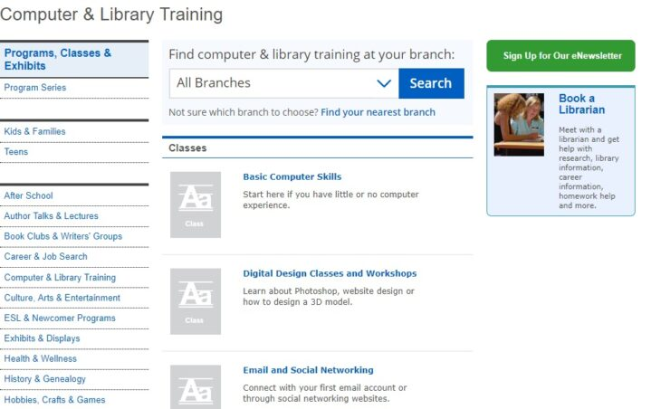
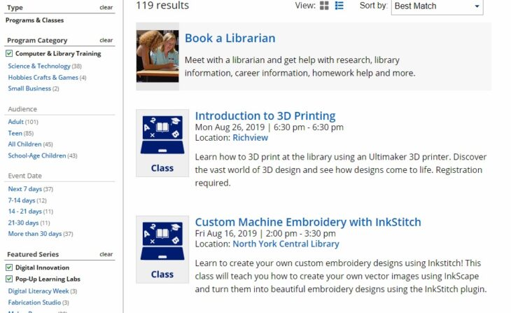
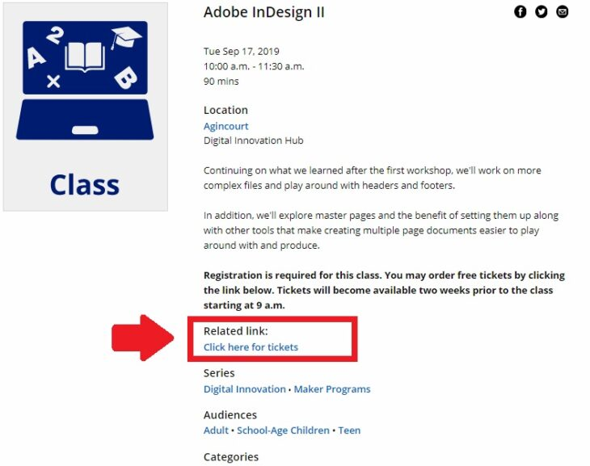
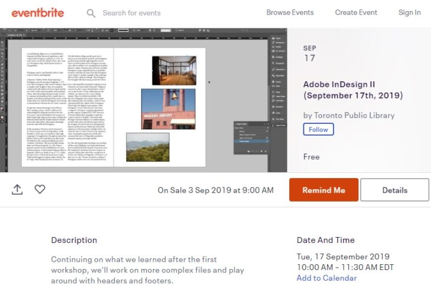
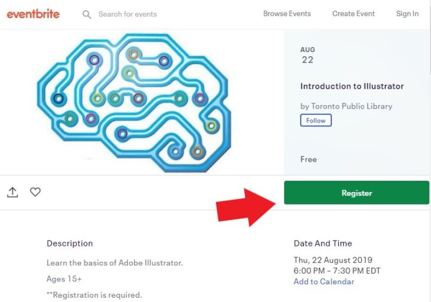
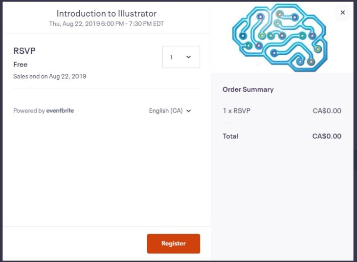
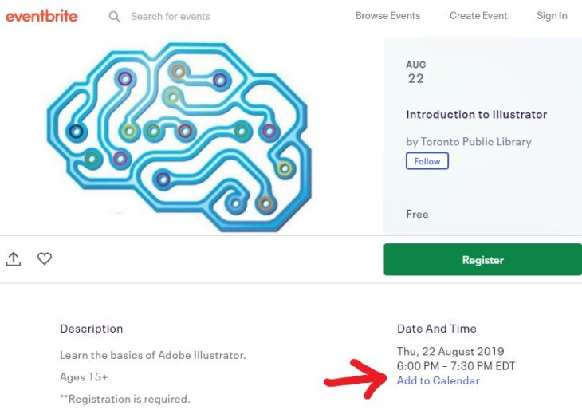

留学中の英語の勉強法、語学学校だけではなく、留学で現地の人と交流することが大事・・・とわかっていても、なかなか機会を作ることは難しいですよね。

実は、meet up以外でも**トロント図書館のラーニングプログラムを使えば、ネイティブの英語を無料で聞けて（喋れて）、更に＋αを勉強することができるんです！**

せっかくの海外留学ですから、せっかくなら**ただ語学学校で英語を学ぶのではなく、英語で新しいことを学ぶ経験をしてみませんか？**

この記事では、**トロント図書館が公開している無料講座の予約の仕方を一からご紹介します。**

そのため、この記事通りに進めれば、誰でも気軽に無料講座を受講することができるようになります。

実際に私が利用したおすすめ講座や、その内容についてもご紹介するので是非参考にしてみてください

## トロント図書館の無料ラーニングプログラムとは？

今回おすすめするのは、トロントの公共図書館の無料プログラムです。

### トロント図書館の講座なら、生の英語＋αを勉強できる

留学中の英語の勉強の方法は、ネイティブの英語に触れることです。しかし、ネイティブと関わる機会を作ることは簡単ではありません。

しかし、トロント図書館が行っているラーニングプログラムを使えば、ネイティブ英語に気軽に触れることが可能です。

更に、**留学中に英語を学ぶだけではなく、****英語で新しいことを学ぶことも可能**です。

プログラムの内容は多岐にわたっており、**英語の会話講座から、パソコンエクセル講座、Adobe関連ソフト講座、3Dプリンタやデザインのクラス、講演会など色々なプログラムが用意されています。**

### トロント図書館のプログラム・クラスを探す方法

具体的な探し方は、 公共図書館の公式サイトから直に探す方法と、Eventbriteというアプリから探す方法の2種類ありますが、最終的な申し込みはどちらも Eventbrite を使用します。

#### 探し方①　トロント図書館の公式サイトで行きたい講座を見つける

トロント図書館の公式が一番情報量も多く、網羅的になっていることは言うまでもありません。

実際に図書館でどんなクラスが行われているかは下記リンク先をご確認ください。

[トロント・パブリック・ライブラリー　講座一覧](https://www.torontopubliclibrary.ca/programs-and-classes/)

講座のカテゴリ、トロント図書館の場所、大人向け、等々条件を絞りながら検索をかけていきます。

※トロントの図書館は、それぞれの地域の分館にも、土地名とは少し異なる名まえがついていることも多いので、google map等で近所の図書館の名前を事前に調べておくことをおすすめします。

今回は左側のカテゴリー（Program Category)から、「Computer & Library Training」を選んでみました。

そして講座一覧を見ながら、気になるものを見つけ出し、プログラム名をクリックします。

日程、場所等を確認し、いいなと思ったら、「Related link : Click here for tickets」をクリック！講座の予約に入ります。AdobeのIn designの講座を無料で受けられるってすごくないですか？？ほかにもPhotoshopやIllustlator、Excel講座など、日本なら何万と取られる講座が無料！！！内容も実践的で、すごく面白かったです！

ちなみにサークル等の集まりだと、こうした予約リンクが無いため、日程を確認し現地に直接乗り込みましょう。

#### ②トロント図書館の無料講座の予約の仕方

ここからは EventbriteというWEBサービスのページに移ります。

[https://www.eventbrite.ca/](https://www.eventbrite.ca/)

Eventbrite とは、meet upの企業版です。各企業が出している、チケットの販売、無料の講座、集まりなどの予約サービスです。スマホ用アプリもあります。ここでトロント図書館の講座の予約も行うことができます。

ページを開いたら、右上のSign Inボタンからログイン、あるいはアカウントを作成しましょう。メールアドレスだけで作成可能です。

ログインができたら、**緑色の「Resister」ボタンが出現しますのでこちらをクリック**。

※先ほどと、講座タイトルが変わっていますが気にしないでください。

最終確認画面が出ますので、**「RSVP」のプルタブで参加人数（自分だけの場合は1のままで大丈夫です）を入力**、「Resister」ボタンを押せば作業はおしまい！

※トロント図書館の講座はすべて無料ですが、その他有料イベントの場合は、Order Summaryの欄に必要金額が表示、Resisterボタンを押すと支払いが完了します（事前にクレジットカードをEventribe上で登録しておきます）

登録しているメールアドレスに予約内容の確認メールが送られてくれば予約完了です！！

#### ③予約した講座の情報をカレンダーに登録（トロント図書館の場所もチェック）

予約後の画面、あるいはEventribe上のイベント詳細画面で、Googleカレンダーなどに予定の登録を自動で行うことができます。

「Add to Calendar」という表示が出ます。トロント図書館は数も多くある為、場所や時間を間違えないよう、**予約したら忘れず登録しておきましょう。**

## トロント図書館のプログラムで実際に私が参加したもの

こちらでは、トロント図書館の無料プログラムのうち、実際に私が参加した講座を紹介します。だいぶPCスキルに偏っていますが、好きなものに参加してたらこうなりました・・・。

### 【トロント図書館無料講座①】Microsoft Excel中級（Intermediate Excel 2016 Learning Circle）

全●回（回数忘れました）のMicorosoft Excel中級講座です。

トロント図書館の中央図書館のコンピューター室で実施されてました。マクロを組んだり、関数使ったり、Excel内蔵のほかの機能を、実際のビジネスで使いそうなサンプルを元に習っていきます。

仕事でがりがりExcelを使っていた私ですが、初めて知る内容も多くとても面白かったです。

ほかの講座でも言えることですが、講師の人の英語もゆっくりで聞き取りやすく、また、大きいプロジェクター画面で案内してくれるのでついていきやすかったです。

初級講座なども随時やっているようなので、エクセルを学びたい人は是非。

### 【トロント図書館無料講座②】Adobe InDesign II 

AdobeのInDesignです！すごい！無料なの！？とウキウキ参加。プログラムIの方は参加していませんでしたが、大丈夫でした。

実際に雑誌を作る体で、配置の仕方やサンプルの作り方を、ぶあつい説明冊子をもらいつつ優しく教えてもらえました。

同じように留学できている中国人女性もいて、英語ができるできないにかかわらず習うことができます。

### 【トロント図書館無料講座③】Adobe Photoshop（Photo Editing Workshop）

フォトショップを使って、画像の加工を行いました。

えっ、この車クリックで消せるの？！など、テクノロジーの進化を実感・・・。２，３、のエディティングしかしなかったので少し物足りなかったですが、画像加工技術を学びたい人にはとてもおすすめです。

### 【トロント図書館無料講座④】ティラミスづくり実演

イタリアンの料理本を出している料理研究家の方が、10分でできるティラミスの作り方を実演してくれるとのことで参加。こちらは予約なしで、当日直接会場入りするタイプの講座でした。（なのでメールでの記録が残っておらず、名前が思い出せない・・・）

おばあちゃんがたくさん参加していました。

イタリア食文化についてのクイズなどもあり、英語できない勢としては、結構ひやりとする場面も。ですがみなさん優しいので全然大丈夫です。

当日でき上ったものは、参加していた小学生くらいの女の子姉妹に渡されました。すごく欲しそうにしてたから良かった良かった。

## 【トロント図書館】無料講座で留学中に英語＋αを勉強！

ネイティブの英語に触れる機会を作るのって、結構難しいですよね。Meet upでもランゲージエクスチェンジなどもいいですが、せっかくの留学ですから、どっぷりとネイティブコミュニティに入っていくのも楽しいと思います！

特にトロント図書館の講座は入りやすく、個人的にはとてもおすすめです。無料の講座、使わない手はありません。**英語ができなくても大丈夫！わたしが大丈夫だったから！**

英語を学びながら＋αの知識も手に入れちゃいましょう！

また、トロント留学でトロント図書館講座以外にもおすすめしたい、[STAPLESの無料講座についてはこちら](https://28-nikki.com/toronto-staples-program/)。

https://28-nikki.com/toronto-staples-program/
