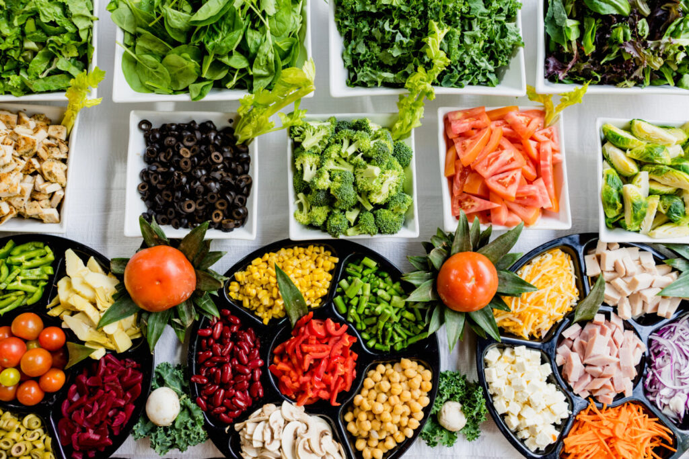
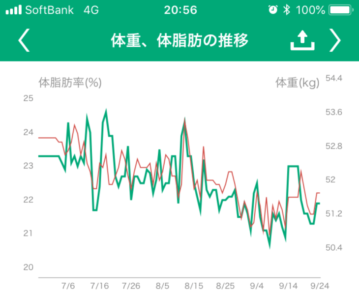

気付けば糖質制限を初めて３か月経過しておりました。

初めての糖質制限でしたが、実際に効果があったのか、一度その効果と、食事制限方法を振り返ってみようと思います。

## 基礎データ

 性別：女  
 身長：160.0cm  
 年齢：28才  
 運動：朝晩の自転車通勤（片道5km）、週１回ジム（40分） 

## 糖質制限を行った期間・方法

### 糖質制限の期間

糖質制限をはじめたのは2018年6月7日～、この記事を書いているのが、**ちょうど3～４か月程度経過**した時点です。

### 実際に行ったゆるい糖質制限のルール

厳しい糖質制限を始めることも可能だったのですが、生活および自身の人生の楽しみを食と飲酒に振っているため、完璧に制限するのは厳しい、という判断をしました。

**継続できること、を第一目標**に、今回設定したゆるゆるなルールはこちら。

1. **100g以内に収まればよし（50～80gなら万々歳）**
2. **基本自炊**
3. **外食以外での炭水化物は抜く。ブランパンのみ許可**
4. **朝ごはんはプロテイン＋ヤクルト、夜寝る前にプロテイン**
5. **お菓子も糖質制限量以内なら可**
6. **飲むときは飮む。但しビール→ウーロンハイ等への切り替えを気持ばかり（あくまで気持ちばかり）早めに。**
7. **記録はかっちり取らない。あくまで目安程度に。**
8. **基礎代謝量同党のエネルギーは必ず摂取する**

## 実際の効果　体重と体脂肪に現れた数値

**赤色の折れ線：体重　緑色の折れ線：体脂肪**  
（記録するのに使っていたカロミルというアプリの画面です）

 

**体重**

**体脂肪**

**開始時(2018/6/7）**

52.9kg

23.4%

**現在（2018/9/24)**

51.7kg

21.9%

**差**

**\-1.2kg**

**\-1.5%**

**へ、減ってる・・・・・・・**

体重の落ち方は微妙ですが、体脂肪-1.5%ということは、脂肪を減らしつつ、筋肉が付いて来ている証拠の筈。

また、体重・体脂肪が安定して落ちてきているのも好感触。３か月、糖質制限の内容が非常に緩い割には、効果が出ている気がする。

自分の感覚ではありますが、**だいぶお腹へこみました。**体重は1.2kgしか減っていませんが、ジーパンがかなり緩くなっています。

ちなみにめちゃくちゃ酒好きなので、飲み会は週２～３回は行ってました。当然のように糖質が100gどころか150g超える日もざらにある中、これはなかなかの好成績なのでは・・・！！？

#### 運動について

糖質制限と一緒に始めたジムですが、週１回通っています。

ですがジムで３０分マッサージ、残りの３０分筋トレというメニューなので、正直そこまでカロリー消費には貢献していない印象です。（そして、ジム以外では筋トレ何もしてません・・・・。）

## ゆるい糖質制限の反省

### 最初の1週間はきつい

最初の一週間はご飯が食べたい、糖質を取りたいという欲求が非常に強く、若干頭痛もしました。仕事も少し集中できなくなる時期があったのですが、 **慣れてからは体調不良や気になることもなく**なり、糖質制限を行うことを自然にできるようになりました。

### やっぱり飲むと太る、がストレスなく続けられる

飲み会でもビールを無くせばもっと痩せてたんだろうな～と思いますが、そんなことしたらメンタルが死んでしまう。心身ともに健康に痩せていかないと意味がないですし。

しかしその分、ほとんどストレスなく続けることができました。

お菓子も毎日食べることを許可していました。どうしてもお腹が減ったりした場合は、ブランパンを食べるか、普通にバームクーヘンやパウンドケーキを食べておりました。

チーズケーキは比較的糖質も控えめなのと大好物なので、スティック系の土台の無いタイプは非常にお世話になりました。

### 便秘になる→腸内環境のメンテナンスは意識的に行う

もともと便秘体質だったものの、糖質制限をはじめた瞬間はピタッと排便が止まってしまいました。

糖質制限を行うと、どうしても食べるものや食材が偏ってしまうことがあります。（サラダチキンとか、ブランパンとか、、、）

同じものしか食べないのは腸内環境を一気に悪化させる要因です。そこに更に糖質の制限が加わって、便秘が加速してしまいました。

かなり焦りつつ対策を探し、結果行った対策は下記３つ。

- **毎朝「ヤクルト」を飲むこと**
- **お弁当の品目を多く（米なし、おかず6種類以上を目標に）**
- **食物繊維を摂る（ブランパンをフル活用）**

排便の嵩増しをするため、食物繊維を1日10g以上摂るよう頑張りました。ブランパンは低糖質＆食物繊維が豊富で非常におすすめです。

ローソンのブランパンに頼ると高いので、ふすま粉（ブラン）とラカントを買って、自分で作っていました。普通に作れます。

パンを作るのはな・・・という方にも、**ラカントは料理全般に使えるので特におすすめです。**ネットなら1kgとかで売ってるので有難い。

[TOMIZ　cuoca（富澤商店・クオカ）小麦ふすま/500g ブラン](https://hb.afl.rakuten.co.jp/hgc/g00sltx6.y4v35712.g00sltx6.y4v36c0e/kaereba_main_201908290053038001?pc=https%3A%2F%2Fitem.rakuten.co.jp%2Ftomizawa%2F00001801%2F&m=http%3A%2F%2Fm.rakuten.co.jp%2Ftomizawa%2Fi%2F10000273%2F)

[楽天市場で購入](https://hb.afl.rakuten.co.jp/hgc/190ab061.fc3c1dff.190ab062.991eac47/kaereba_main_201908290053038001?pc=https%3A%2F%2Fsearch.rakuten.co.jp%2Fsearch%2Fmall%2F%25E3%2581%25B5%25E3%2581%2599%25E3%2581%25BE%25E7%25B2%2589%2F-%2Ff.1-p.1-s.1-sf.0-st.A-v.2%3Fx%3D0%26scid%3Daf_ich_link_urltxt%26m%3Dhttp%3A%2F%2Fm.rakuten.co.jp%2F)

[Amazonで購入](https://www.amazon.co.jp/gp/search?keywords=%E3%81%B5%E3%81%99%E3%81%BE%E7%B2%89&__mk_ja_JP=%E3%82%AB%E3%82%BF%E3%82%AB%E3%83%8A&tag=28nikki-22)

[Yahooショッピングで購入](//ck.jp.ap.valuecommerce.com/servlet/referral?sid=3475678&pid=885990561&vc_url=http%3A%2F%2Fsearch.shopping.yahoo.co.jp%2Fsearch%3Fp%3D%25E3%2581%25B5%25E3%2581%2599%25E3%2581%25BE%25E7%25B2%2589&vcptn=kaereba)

by [カエレバ](https://kaereba.com)

[ラカント 1kg サラヤ ホワイト送料無料 低カロリー 食品 菓子 ゼロカロリー ダイエット食品 調味料 砂糖 800gよりお得【D】](https://hb.afl.rakuten.co.jp/hgc/g00qhoa6.y4v35d5e.g00qhoa6.y4v368d8/kaereba_main_201908290055064351?pc=https%3A%2F%2Fitem.rakuten.co.jp%2Fkurashikenkou%2F9782872%2F&m=http%3A%2F%2Fm.rakuten.co.jp%2Fkurashikenkou%2Fi%2F10042349%2F)

[楽天市場で購入](https://hb.afl.rakuten.co.jp/hgc/190ab061.fc3c1dff.190ab062.991eac47/kaereba_main_201908290055064351?pc=https%3A%2F%2Fsearch.rakuten.co.jp%2Fsearch%2Fmall%2F%25E3%2583%25A9%25E3%2582%25AB%25E3%2583%25B3%25E3%2583%2588%2F-%2Ff.1-p.1-s.1-sf.0-st.A-v.2%3Fx%3D0%26scid%3Daf_ich_link_urltxt%26m%3Dhttp%3A%2F%2Fm.rakuten.co.jp%2F)

[Amazonで購入](https://www.amazon.co.jp/gp/search?keywords=%E3%83%A9%E3%82%AB%E3%83%B3%E3%83%88&__mk_ja_JP=%E3%82%AB%E3%82%BF%E3%82%AB%E3%83%8A&tag=28nikki-22)

[Yahooショッピングで購入](//ck.jp.ap.valuecommerce.com/servlet/referral?sid=3475678&pid=885990561&vc_url=http%3A%2F%2Fsearch.shopping.yahoo.co.jp%2Fsearch%3Fp%3D%25E3%2583%25A9%25E3%2582%25AB%25E3%2583%25B3%25E3%2583%2588&vcptn=kaereba)

by [カエレバ](https://kaereba.com)

### 筋肉量は落とさない

プロテインを朝晩飲むことで、たんぱく質の摂取と筋肉量を落とさないように気を付けていました。**いわゆるダイエットプロテインではなく、ガチのスポーツマン用のプロテインです。**

ホエイは口臭がきつくなるという噂を聞いたため、はじめはソイプロテインを飲んでいましたが、その後5種類くらいふらふらして、最終的には**腹持ちの良いとろみのあるカゼインプロテインを飲んでいました。**

個人的にはバルクスポーツのカゼインプロテイン、チョコレート味が美味しくて、最終的にこれ一択になっていました。ナチュラルは、ホエイだろうとソイだろうとカゼインだろうと、無味無臭で虚無を飲んでいる気持ちになるのでお勧めしません。

[バルクスポーツ プロテイン ビッグカゼイン 1kg](https://hb.afl.rakuten.co.jp/hgc/g00tgv96.y4v3530a.g00tgv96.y4v36f01/kaereba_main_201908290047349246?pc=https%3A%2F%2Fitem.rakuten.co.jp%2Fkabau-r%2Fb00o0nhi3u%2F&m=http%3A%2F%2Fm.rakuten.co.jp%2Fkabau-r%2Fi%2F10086025%2F)

[楽天市場で購入](https://hb.afl.rakuten.co.jp/hgc/190ab061.fc3c1dff.190ab062.991eac47/kaereba_main_201908290047349246?pc=https%3A%2F%2Fsearch.rakuten.co.jp%2Fsearch%2Fmall%2F%25E3%2583%2590%25E3%2583%25AB%25E3%2582%25AF%25E3%2582%25B9%25E3%2583%259D%25E3%2583%25BC%25E3%2583%2584%25E3%2580%2580%25E3%2582%25AB%25E3%2582%25BC%25E3%2582%25A4%25E3%2583%25B3%2F-%2Ff.1-p.1-s.1-sf.0-st.A-v.2%3Fx%3D0%26scid%3Daf_ich_link_urltxt%26m%3Dhttp%3A%2F%2Fm.rakuten.co.jp%2F)

[Amazonで購入](https://www.amazon.co.jp/gp/search?keywords=%E3%83%90%E3%83%AB%E3%82%AF%E3%82%B9%E3%83%9D%E3%83%BC%E3%83%84%E3%80%80%E3%82%AB%E3%82%BC%E3%82%A4%E3%83%B3&__mk_ja_JP=%E3%82%AB%E3%82%BF%E3%82%AB%E3%83%8A&tag=28nikki-22)

[Yahooショッピングで購入](//ck.jp.ap.valuecommerce.com/servlet/referral?sid=3475678&pid=885990561&vc_url=http%3A%2F%2Fsearch.shopping.yahoo.co.jp%2Fsearch%3Fp%3D%25E3%2583%2590%25E3%2583%25AB%25E3%2582%25AF%25E3%2582%25B9%25E3%2583%259D%25E3%2583%25BC%25E3%2583%2584%25E3%2580%2580%25E3%2582%25AB%25E3%2582%25BC%25E3%2582%25A4%25E3%2583%25B3&vcptn=kaereba)

by [カエレバ](https://kaereba.com)

ジムに通う度に筋肉痛が酷かったため、の超回復を狙ったこともありますが、おかげさまで体脂肪を減らしつつ筋肉を残すことができました。

## まとめ

**アラサーになってきてだんだん簡単に痩せられなくなってきていたのですが、**糖質制限ダイエットを行うことで飲み会やお菓子を制限することなく、ダイエットをすることができました。

**お腹がきれいに凹んだことが単純に嬉しいですし、人から言われるくらい顔もシュッと痩せてきました。**

便秘や、対策のためのお金がかかる（プロテイン、ヤクルト等）などの問題がありますが、それ以上にメリットも多いので、ぶよぶよの太った体を何とかしたい方にはぜひ一度お勧めしたいダイエットです。

6か月経過時点でのご報告はコチラ↓

https://28-nikki.com/2018-10-07-114608/
