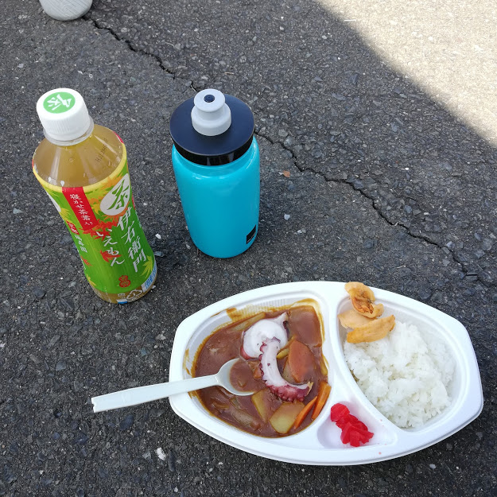

こんばんは。足を負傷したモトキです。**ツール・ド・東北２０１８**に参加してきました！

存在はかねがね知っていたのですが、**自転車長距離サイクリングとかＭでしょ・・・**

ということで参加することもなかったのですが、知り合いに酒の場で誘っていただき、酔っていたため即答し参加しました。（酔いすぎていたため、その日は帰りに財布を落しました）

[https://tourdetohoku.yahoo.co.jp/](https://tourdetohoku.yahoo.co.jp/)

## 参加したコースは北上フォンド・100km

勿論人生で100kmなんて走ったことありません。いつもは通勤の往復10kmしか自転車に乗っていませんし、長距離と言えば、数年前クロスバイクを初めて買った時に、調子に乗って「普段の通勤×６走れば着くんでしょ？いけるいける！」と年末に実家までの30kmを走って全力で死んだ記憶しかありません。

**「本当に100kmなんて走れるのか・・・？」**

疑念しか湧かない挑戦でしたが、ここ３か月高い金を出してジムに通った成果をここで見せるべきでは？！という意気込みもあり、いざ挑戦。

めちゃくちゃきつかった。

尻も痛いし足は痛くなるし坂上るの辛いし、強風吹き荒れる平地もつらい。下り坂は楽だけどスピード出すの怖い。

コース考えた人、絶対に「あ、ここ2kmくらいの長い坂ある。折角だからいれちゃおーっと★」みたいなノリで入れたでしょ。鬼かよ。やめてくれ。普段全然運動してない知り合いが参加してるから、もっとお気楽サイクリングかと思ってた。

**ちょっと走っては、風景とかの写真撮って、美味しいもの食べて、さくっとゴール、現地で打ち上げ酒を飲みお金を落して復興支援をするイベントだと思ってたよ。**

## 両足が負荷に耐えられず走行中に死亡

エイドステーションの食べ物はめちゃくちゃ美味しかったけど、死ぬ気で走って、死ぬ思いをしてゴールするやべえイベントでした。途中から左足を曲げると痛くなり、一切踏ん張れなくなったのもきつかった。右足の力だけでカバーしながら平地を走った結果、**右のふくらはぎが爆発。**

コース全体の中、自主休憩を２回はさみ、平均時速18kmの鈍行サイクリングとなりました。

けど一度も歩かなかった！頑張ったね自分！おめでと自分！

なお、グローブもヘルメットもサイクルウェアも何も持っていないので、全部借り物での挑戦となりました。なんなら、自分のクロスバイクではなく、色々カスタマイズされた人のクロスバイク借りて走ってきました。貸してくださった同僚の皆々様、ありがとうございました。洗濯してお返しします・・・。

叱咤激励指導をしながら、遅いスピードで一緒に走ってくれた知り合いにも感謝。なにより、旗や手を振りながら応援して下さった現地の方々に感謝です。

すっっごく励みになりました。

お昼にいただいた海鮮カレー。途中のエイドステーションでいただいたつみれ汁やらいろいろも本当においしかったです。

## 総評　辛かったけどまた参加したい

また参加したい！とは、今の体のボロボロさ加減からは、とても言えませんが、全体通して楽しいイベントとなりました。参加する側も楽しめて、なおかつそれが復興支援に繋がる。すばらしいイベントでした。

うん。また参加したい気がしてきた。気がする。たぶん。

ぐだぐだ言いながらも次も機会があったら参加してしまう気がする。歩くのも困難なレベルで脚が痛いので、明日は病院に行ってきます。

とりあえずいまは、どうか私の左膝よ、無事であってくれ。
