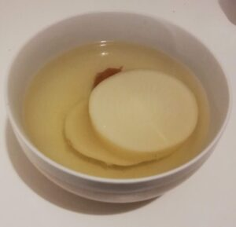

**梅流し**、**梅湯流し**というデトックス方法をご存知ですか？ネット上でまことしやかにささやかれ、**効果があるのか効果がないのかもよくわからない**、迷信のようなデトックス方法です。

私は現在カナダ留学中なのですが、留学前の1年間、[ゆるく糖質制限を行なっていました](https://28-nikki.com/2018-09-24-214729/)。

当時は[−２kg、体脂肪率もしっかり下がって行きました](https://28-nikki.com/2018-10-07-114608/)。結果としては、ゆるい糖質制限だったにも関らず、非常に効率よくダイエットを成功することができましたと考えています。

https://28-nikki.com/2018-09-24-214729/

https://28-nikki.com/2018-10-07-114608/

**が、**カナダ留学後は細かく調理をすることができず、炭水化物の摂取量が極端に増え、お菓子も赴くままに食べ、**目に見えて肥えて行きました・・・。**

食生活の乱れだけでなく、運動量も極端に落ちたこともあり、**見事にリバウンドです。**更にもともとの便秘体質も加わり、肌質も悪化と負の連鎖が続いておりました。

カナダでは体重計もなかったので、いまの自分の体重がわからないものの、体感としては３キロは確実に増えている印象・・・・

その為、まずは食べ過ぎて大きくなった胃を小さくするため、昔よくやっていた断食を行うことに。ネットでいろいろ調べてみると、プチ断食後に行う**梅流しという情報を発見**。

えっ、これは**断食で全然食べていないにも関わらず、成功すれば便秘も解消できるのでは？？**

しかも梅と大根なら、トロントでも手に入る！！！ということで、藁にもすがる思いで挑戦してみることにしました！！！！カナダダイエット爆誕。

※今回は環境とスケジュールがうまく合わず、正しいプチ断食なしで挑戦しています。

## そもそも梅流しとは？　作り方もご紹介

【腸も大掃除】驚くほど出る宿便を出す方法「梅流し」とは？　exciteニュース[https://www.excite.co.jp/news/article/TokusengaiWeb\_17239743/](https://www.excite.co.jp/news/article/TokusengaiWeb_17239743/)

私が梅流しについて知ったのはこちらのサイトでした。

断食後に「梅流し」なるレシピを作り食べて、「宿便」を出すことが目的となります。

#### 梅流しで出る宿便とは？

参照記事曰く、

> 西洋医学では、宿便は存在しないといわれています。みうらクリニックの三浦直樹先生によれば、断食後に梅湯を飲む「梅流し」をすると、明らかに通常の便とは違う大量の便が驚くほど出るのだとか。宿便を出すと、腸の機能を回復させ体調がよくなる人も多いそうです。
> 
> [https://www.excite.co.jp/news/article/TokusengaiWeb\_17239743/](https://www.excite.co.jp/news/article/TokusengaiWeb_17239743/)

腸の中にこびりついている、通常とは異なる便を指すようですが、西洋医学で正式に認められたものではないようです。

正直ちょっと胡散臭いですが、別に宿便だろうとそうじゃなかろうと**便秘体質としては便が出ればそれでいいのでとりあえず挑戦してみます。**

### 梅流しのレシピ・作り方

いろいろ調べた上で作ったのですが、あまりにも味がなかったので少しだけ自分流でアレンジしました。実際に作ったものはこちらの画像になります。。

1. **大根・・・・・1/2本**
    1. 厚さ１cmぐらいの輪切りにし、鍋に入れる。
2. **出汁用昆布、味の素、水・・・・・適量**
    1. 鍋に②を全部入れる。水は大根が全て、余裕を持って浸かるぐらい。（出汁の素は水量に合わせて調整。私は２つとも入れました。）
    2. 火にかけて１時間程度煮る。水が足りなくなったら都度足す。
3. **梅干し・・・・・２個程度** →鍋に入れ潰す。
4. **＜付け合わせ＞**
    - アボカド　・・・適当
    - ほうれん草・・・適当
    - 味噌　　　・・・適当

### プチ断食のやり方・梅流しの食べ方

#### まずはプチ断食（ファスティング）の方法

今回は、本来準備食をきちんとしなくてはいけないのですが、諸事情により前日夜にがっつり飲んで油物も食べてからの断食となりました。さらに回復食も、翌日普通に油物を取ってしまったのですが、**健康に悪いのでみなさんはやめましょう。**

 

**朝ごはん**

**昼ごはん**

**夜ごはん**

**断食前日（準備期）**

 

 

飲み会

**断食１日目**

りんご、バナナ、ヨーグルトのスムージー

バナナ１本

りんご、アボカドのスムージー

**断食２日目**

りんご、アボカド、パクチーのスムージー

バナナ１本、味噌汁（具なし）

バナナ、ヨーグルト、ほうれん草のスムージー

**断食３日目  
（終了日）**

りんご、ほうれん草のスムージー

バナナ、梅入りお湯

**梅流し＋付け合わせ**

**回復期**

梅流しの残り

おかゆっぽいもの＋野菜

トンカツ

#### 梅流しの食べ方

また、梅流しはいろいろなサイトを比較・検討し、お腹も空いていたので野菜も付け足して、下記のように食べました。

1. **どんぶり１杯目**・・・煮汁のみを入れて、一口ずつゆっくり飲む
2. **どんぶり２杯目**・・・煮汁と大根を２〜３切れ入れて、大根を一口５０回以上噛みながらゆっくりと食べる。随時煮汁も飲んでいく。
3. **付け合わせの野菜を、みそを少しつけながら時々食べる。**
4. **２〜３をひたすら繰り返す。**

## 梅流しを行なった効果は？

### 梅流し後、出た！！！

少し汚い話になって申し訳ありません。が、本当に出ました。便。当日のスケジュールを実際に書くと、

20:00 梅流し食事開始  
　　　**第一波到来**。　１杯目を食べ終わった時点でトイレへ  
20:15 梅流し２杯&アボカド１個アンドほうれん草0.4束完食  
20:40 **第二波到来。**　３杯目〜４杯目あたりでお腹がいっぱいになりペース遅めに。  
　　　　　　　　　　まだお腹がごろごろしている  
20:45 **第三波到来。**　ほぼ出なかったがお腹はずっとごろごろしている。  
20:53 **第四波到来。**　ついにほぼ水分の便が出始める。

一旦第四波が来た時点でその日の排出はストップ。

正直、半信半疑でやっていたので、**食べてすぐトイレに行きたくなった****ことは衝撃でした。**すごい！！！

２日ほどほぼ量を食べておらず、２日目の朝には一度トイレにも行っていたので、**正直自分の体から何の廃棄物が出ていたのかさっぱり不明**で恐ろしかったです。

ちなみに**宿便が出たのかどうかは全然わかりませんでした。**

便自体はいつもと異なる形、というか固形ではありませんでしたが、単純にきちんと物食べてないから固形にならなかっただけ、という気もします。

### まとめ　実際に梅流しの効果を見て

**感動しました。**

本当に**効果がある**とは！

が、思ったよりすっきりはしなかったです・・・（なぜなら第四波後もお腹がごろごろしている感覚があったのに出なかったため）

先ほどお伝えした通り、**「宿便」が出たかどうかはさっぱりわかりません**。とりあえず便が出ました。それでいい。こんな迷信みたいな胡散臭い話が実現するとは・・・。

最終的に３杯くらい食べたらもうお腹がいっぱいになってしまったので、延々と食べ続けるのは結構難しいと感じました。

何度も行いたいとは思いませんが、時間があって、胃を小さくしたくなったとき、便秘になった時はファスティングと一緒にぜひまた挑戦したいと思いました。
