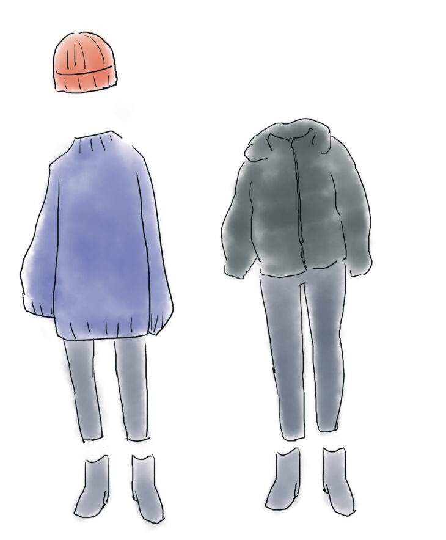
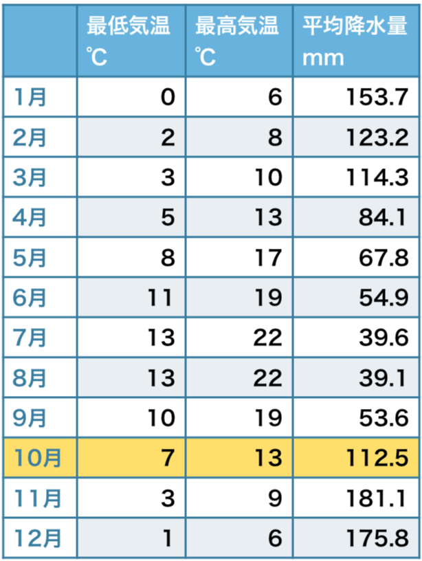
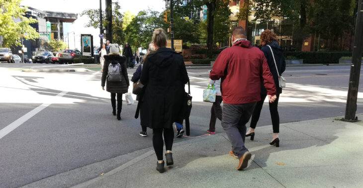

10月にバンクーバーに旅行に行くことになった／留学に行くことになったけど、どれくらい寒いの？雨ってどれくらい降る？？？

こんにちは。カナダ・バンクーバー在住のモトキです。

バンクーバーの10月は季節の変わり目であり、旅行や留学、現地に行く際にどのような格好をすればいいか。また、カナダは日本と比べるとオシャレに気を使っていない、という意見もよく聞きます。

カナダの中でもバンクーバーは、トロントやそのほかの地域に比べると温暖な気候で日本に似ていると言われていますが、現地のカナディアンがどんなファッションをしているのか気になる人も多いのではないでしょうか？

- **バンクーバーに旅行に行くが、どのような服を持っていけばいいか悩んでいる**
- **留学に向けてどれくらい防寒の準備をすればいいかわからない**
- **おしゃれな服を持って行くべきか、それとも全く気にしないでいいのか知りたい**
- **現地のカナディアンの服装を知りたい**

この記事では、**私（モトキ）が実際に、現地カナディアンの格好や、私が着ている服をご紹介します**ので、持って行く服装、着て行く服装の参考にしていただければと思います。

**私は現在カナダ・バンクーバーに留学しているアラサー女性です。写真なども含めて現地のファッションをご紹介します！**

## 10月のバンクーバーの気候は？

### バンクーバーの10月の天気　例年の傾向

例年の傾向について、 [Tourism Vancouverの天気](https://www.tourismvancouver.com/vancouver/weather/)のページを見てみると、10月は最低気温が７℃、最高気温が１３℃。また、平均の降水量は112.5mmとなっています。

夏〜9月にかけての気候と比べると、最低気温が１０℃を下回り、最高気温も9月に比べ６℃も下がっています。降水量も大幅に増加していることから、**本格的にバンクーバーの秋が始まる季節と言えるでしょう。**

### バンクーバーの10月の雨の日はどれくらい？

降水量だといまいち雨がどれくらい降っているのかわからないので、雨の日の日数で計算して見ます。

今回の記事を書いているのが2019年10月12日になりますが、現在までの記録では、10月に入ってから雨が降った日は６日間です。

つまり、現時点では、**2日に1日は雨が降っている計算**になります。

突然雨がサーっと降ってくることも多いため、やはり**天気の悪い日が非常に多い季節、地域と言えます。**

## バンクーバーの10月の服装（ファッション）

### 秋のバンクーバー服装の基本

10月は秋が始まり気温が大幅に下がり始める季節です。バンクーバーの10月は、日が出ている間は比較的暖かいですが、曇りの日、雨の日が多く日が当たらないと非常に冷え込むため、しっかり防寒をして外出している人が多いです。

#### バンクーバー10月の服装　アウター、上着

先ほどお伝えした通り、バンクーバーもかなり冷え込む季節になって着たため、防寒対策をしっかりしています。

こちらは先日街中で撮影した写真です。

**現地のカナディアンも、軽いジャケットを羽織る人から、ダウンコートを取り出す人まで多く見られるようになります。**

- **ユニクロのライトダウンのようなダウン**
- **カナダグースのようなしっかりしたダウンジャケット**
- **セミロング〜ロングのダウンコート**

また、ダウン以外では、**ウインドブレーカー×スカーフやマフラーといった方法で防寒をしている人が多いです。**

突然の雨に備えて、アウターは耐水性があったり、フード付きのタイプが主流です。しかし、バンクーバーは降水量が多いため折り畳み傘をほとんどの人が常備しているので、日本から持って行く際に気にする必要はあまりありません。

女性の場合、時折タンクトップやTシャツ×暖かそうなロングカーディガンのみで外に出ている方もいます。強い。

#### バンクーバー10月の服装　ボトム、パンツ

女性の場合は、基本的に**それしか****見かけない。**と言っていいほど**スキニーパンツかヨガパンツを履いている人が多いです。**男性の場合も、スキニーか少し細めのデニムパンツなどを履いている方が多いです。

**日本の女性がよく履いているようなワイドテーパードパンツはほとんど見ません。スカートの人も少ないです**（トロントにいる時は結構履いている人も見たのですが・・・）

雨の多い土地柄のせいか、あまり広がりのあるパンツ、スカートを履く習慣が無いのかもしれませんね。

#### バンクーバー10月の服装　トップス

10月のバンクーバーは、9月と違って**ニットを着始める方もちらほら出てきます**。が、正直人によりけりです。

上着やジャケットで防寒するため、薄めの長袖を着ている人もいれば、中には半袖の人もいます。

基本的には日本と同様に、**トップスは秋服が多め、冬服も混在しているような状況です。**

ただし、日本の女性のファッションと違って、ふわふわ、もこもこした丸いフォルム（体のラインを極端に隠す）の服装は好まれていません。

日本人が非常に多い地域になりますが、カナディアンの友人からは、街を歩いていても、**服装でたいてい日本人かどうか判別がつく**、と言われます。

#### バンクーバー10月の服装　靴、シューズ

**男女関わらず履いているのはスニーカー。きちんとしたスポーツ感のあるものから、コンバース風のものまで様々です。**

また、女性の場合はシンプルな黒のショートブーツを履いている方も多いですね。ヨガパンツ×ショートブーツ、スニーカーなどで、くるぶしあたりを少し見せる方が多いです。

雨が多いので、**どの靴でも防水スプレーをかけておくなどの対策をしておくのがオススメです。**

また、本革製品などはダメになる可能性が高いので避けましょう。

#### バンクーバー10月の服装　その他の小物系

基本的にこの時期愛用されているのは、**女性の場合はスカーフ、男女関わらずニット帽**を身につけている方をよく見かけます。防寒とおしゃれを兼ねているイメージですね。

### バンクーバーのファッションはおしゃれなのか？

**普通にみなさんおしゃれです。**

同じ国内でも、トロントは本当におしゃれに気を使わないんだな、という印象でもっと混沌としていました。一方、バンクーバーは街を歩いていても、きちんとおしゃれに気を使っているのがわかります。

## まとめ　　バンクーバーの10月　持ってくるべき服装は？

基本的に、**防寒できるウインドブレーカーか、ダウンジャケット１枚は必須です。**特に夜は非常に冷え込みます。

また、**靴は防水対策をきちんとしておく**と、バンクーバーに来てからの快適さが格段に違うと思います。

カナダだしみんな服装気にしてないだろう、とあまりに適当すぎる服を持ってくると後悔する可能性がありますので、**日本にいる時と同様、最低限自分が出かけるときに気持ちよく着れる服を持って着た方が良いかなと思いました。**

また、カナダの長期留学を検討されている方には、[実際に私が留学で持っていた持ち物全リストを公開している](https://28-nikki.com/canada_stuff_list/)ので、よければ参考にしてみてください。

https://28-nikki.com/canada\_stuff\_list/
