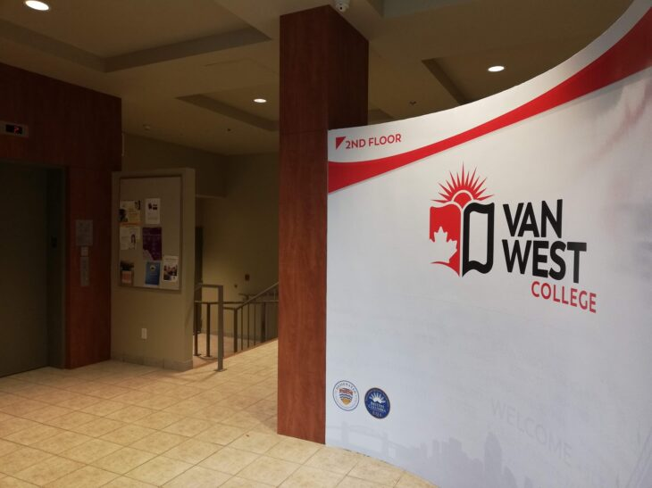
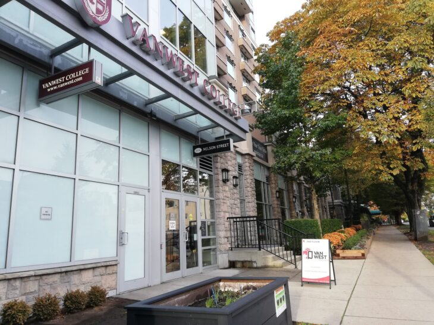
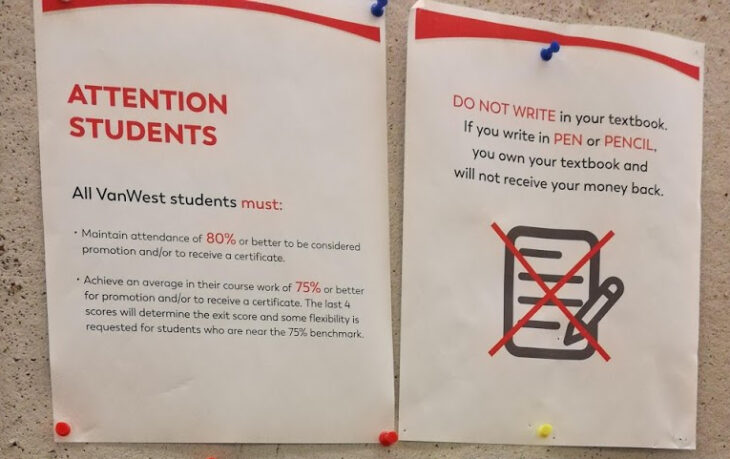
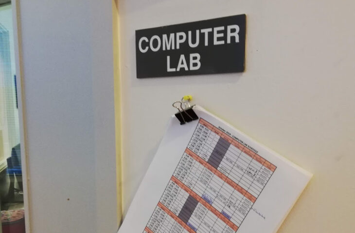
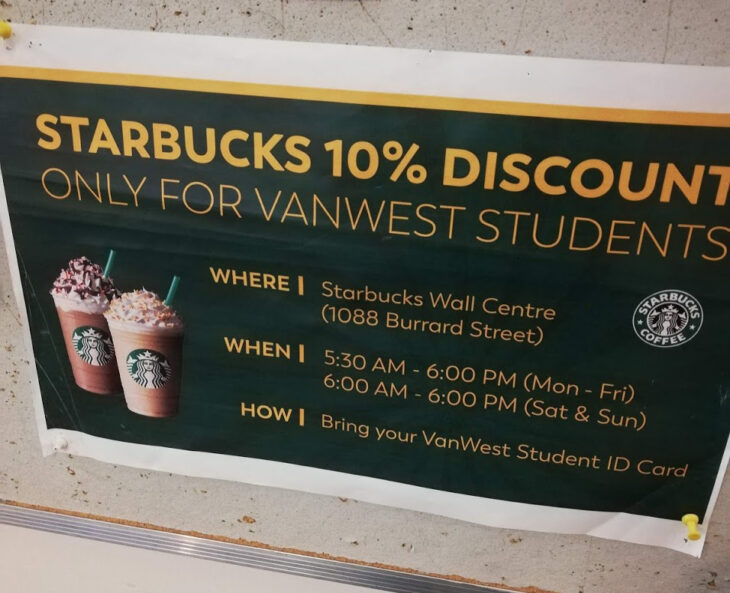

\[caption id="attachment\_877" align="aligncenter" width="730"\] VanWest College（ヴァンウェストカレッジ）エントランス\[/caption\]

**VanWest College（ヴァンウェスト・カレッジ）**というバンクーバーの語学学校をご存知でしょうか？

カナダの中でもバンクーバーは語学学校の数が非常に多い地域です。しかし、日本滞在中に語学学校を決めるとなると、どれも同じような学校に見えたり、特徴がわからなかったりと、学校選びや比較に迷われている方は多いと思います。

カナダのバンクーバー留学を決めたけど、語学学校が全然選べない！

私も、カナダ留学を決めた際に一番悩んだのが語学学校選びでした。

この記事では、私（モトキ）が現地で、実際に**VanWest College（ヴァンウェスト・カレッジ）****のトライアルレッスンに行った****感想と学校の特徴（メリット・デメリット）を、個人の視点から紹介します。**

私は現在カナダに留学していまして、**10校以上の語学学校に体験入学＋****語学学校３校に通いました。**[それらの体験や比較](https://28-nikki.com/vancouver_school_review_list/)から、学校ごとの特徴やメリットデメリットをまとめています。

- バンクーバーの数ある語学学校の中から、何を基準に選べばいいかわからない
- VanWest Collegeを検討しているが自分が合っているか不安
- VanWest Collegeの悪い点やデメリットも知りたい
- VanWest Collegeが気になっているけれど、実際体験した評判を知りたい

この記事では、メリットデメリット含めて率直な評価、意見をそのまま書いていますので、バンクーバー語学留学に向けて学校の実態や評判を知ることができます。

どんな方にとって、VanWest College（ヴァンウェスト・カレッジ）がおすすめできるかもお伝えします。VanWest College（ヴァンウェスト・カレッジ）を検討されている方、バンクーバーの語学学校の情報が欲しい方の不安を解消する手助けになると思います。

その他の[語学学校の学校感想・体験授業口コミリンク集はこちら](https://28-nikki.com/vancouver_school_review_list/)。

## バンクーバーのVanWest College **とは？**

**VanWest College 基本情報！**

- **VanWest College／ヴァンウェスト・カレッジ**
- **200-1016 Nelson St, Vancouver, B.C. V6E 1H8 Canada**
- [**vanwest.com**](http://vanwest.com)

VanWest College（ヴァンウェスト・カレッジ）は、カナダ、バンクーバーのダウンタウンに位置する中規模語学学校です。Burrard Stationから歩いて徒歩１１分、街の中心地から少し外れますが、静かで落ち着いたところにキャンパスがあります。

<iframe style="border: 0;" src="https://www.google.com/maps/embed?pb=!1m18!1m12!1m3!1d5205.253045394766!2d-123.12828232301922!3d49.28347371732539!2m3!1f0!2f0!3f0!3m2!1i1024!2i768!4f13.1!3m3!1m2!1s0x0%3A0x2bc558b011be08b1!2zVmFuV2VzdOWkp-Wtpg!5e0!3m2!1sja!2sjp!4v1573427965862!5m2!1sja!2sjp" width="400" height="300" frameborder="0" allowfullscreen="allowfullscreen"></iframe>

VanWest College（ヴァンウェスト・カレッジ）の特徴は下記の通りです。

- 授業・先生の質が高く、宿題もがっつり出るため勉強をしっかりできる。
- テキストレンタル／カフェの割引など他の学校にはない特典が多い。
- コンピューター室や、生徒サポートの設備が綺麗&整っている。

VanWest Collegeは、中規模校ならではの、国際豊か・生徒数と、先生から生徒への学習、経験、結果まで含めたトータルサポートが特徴の語学学校です。

バンクーバーとケロウナにそれぞれキャンパスを持ち、学校間での転校も可能です。

## VanWest College の口コミは？

WEB上の口コミやレビューの評価・評判は下記の通りです。

**[Googleレビュー](https://www.google.com/maps/place/VanWest%E5%A4%A7%E5%AD%A6/@49.28161,-123.1291288,17z/data=!4m7!3m6!1s0x0:0x2bc558b011be08b1!8m2!3d49.28161!4d-123.1269401!9m1!1b1) ★4.8/ 48件　（2019年11月10日現在）**

**[Facebookレビュー](https://www.facebook.com/vanwestcollege/) ★4.8 / 115件　（2019年11月10日現在）**

Facebook、Googleの口コミともに、多くのレビューを貰いながらも、**★4.8と高い評価を獲得**しています！特に語学学校で100件以上の口コミを投稿されていることは少なく、中規模校という規模感からすると多くの人に評価されています。

レビューの内容を分析すると、下記の点が口コミの中で評価されていました。

- **質の高い授業・（特に）先生が素晴らしい**
- **他の学校よりもアカデミック、勉学に力を入れている**
- **困った時にも、スタッフや学校に多く助けてもらえた**

複数人の先生の名前が名指しで書き込まれているなど、人気の先生たちがいるようです。また、「英語を学ぶこと」そのものに対して、先生・授業・環境が非常に高く評価されていました。

## 体験入学レビュー　VanWest College のおすすめポイント

ここからは、私が実際に参加した、VanWest College（ヴァンウェスト・カレッジ）の体験授業の評価を書いていきます。

今回はGeneral Englishのレベル７の授業に参加してきました。

### 授業・先生の教育レベルがトップクラスだった

**今回受けたトライアルレッスンの先生の教育レベルが、いままで受けた様々な語学学校の授業の中でもトップクラスのレベルの高さでした。**

また、スピーキング→文法→読解&ボキャブラリー→ライティングと、それぞれの単元をしっかりと勉強していき、授業の展開もとても綺麗でした。

非常に明るい男性の先生だったのですが、自分の経験談と困りごとを生徒に相談する形で授業がスタート。**相談事のスタイルを取っているため、生徒とのコミュニケーションが自動的に発生します。つまり、その瞬間に生徒は英語を話さざるを得ません。**

また、今回のVanWest Collegeの体験授業で習った文法は「仮定法」だったのですが、最初の流れからの文法への繋げ方が秀逸。

**授業で習った文法**

- If I were you, I would negotiate with them.
- If I had been you, I would have moved out right away.

また、ただ文法を学ぶだけでなく、相談事に対して提案するときの、言い回しも複数教えてもらいました。

**こういう提案の仕方もある**

- Why don't you + verb ...?
- Have you thought about -ing ... ?
- Whatever you do, make sure to verb ...
- Whatever you do, don't verb ...

いままでの語学学校では、文法を習い、使う練習をしておしまい。というところが多かったのですが、**生徒の表現の幅を広げられるよう、文法だけでなく、実際のスピーキングで使えるその他の言い回しも一緒に教えてくれるところは初めてでした。**

その後は生徒の中からいくつか議題を集め、それに対するアドバイスをそれぞれが考え提案し合う。授業の中で先生・生徒間のコミュニケーションが発生するしくみが作られていました。（授業の中の机も、先生をU字型に囲むコミュニケーション活性型の配置になってました）

また、先生がかなりカジュアルな会話をしてくれます。

Everything is Rainbow and Butterfly!

と言われ、Rainbow and Butterflyってなに！？と。（一般的には Rainbows and Butterfliesのようです。文法も少しおかしいので、聞き間違えたかな・・・・。）

**先生自身が、生徒に対し簡単（すぎる）英語だけでは喋らないよう意識をしているようでした。**きちんと学んでいけば幅広い語彙と表現力を手に入れられるのでは無いでしょうか。

その後は宿題として出されていたテキストの長文読解、ボキャブラリーの確認を行い１時間目は終了。

### 宿題含め、しっかりと勉強させる校風

２時間目はライティングのテーマの書き方を丁寧に習いましたが、授業中に10個ぐらいエッセイのテーマを練習として書かされました。

以下はひとつの例です。

> **Living in a large city has certain advantages** over living in a small town : Inhabitants can take many kinds of transportations, and get a lot of job opportunities.

太字の部分だけ決まっていて、以下は自分で考える・・・といった練習でした。エッセイを簡潔にまとめるためには[テーマの書き方は最も重要な要素](https://28-nikki.com/post-169/)です。細かい書き方や考え方は前日に履修したようでしたが、こんなの10個も書かされたら、そりゃあいい特訓になるな、と・・・笑。

続いて、**宿題もかなりがっつりめに出されている**なと感じました。

宿題として出されていたテキストの文章読解は、パッと見ただけでもなかなか歯ごたえのある長文で、おそらくきちんと読み込むには時間がかかります。

さらに、毎週金曜日はテストがあるそうです。

今回の体験授業は木曜日に受けたのですが、「**明日は、今日やった文法を間違えず、かつ流暢に言えるかをテストするから練習してきてね〜**」とのこと。仮定法を間違えずに流暢に・・・と結構厳し目のテストだなと感じました。

授業の参加率も80%以上ないと、上のクラスに上がれない・・・など明文化されており、**VanWest Collegeの授業は、生徒が「ただ授業を受けて終わり」にさせないスタンスで、英語をきちんと習得させるカリキュラムになっています。**

### 学校の設備が整っており、生徒へのサービスも豊富

VanWest College（ヴァンウェスト・カレッジ）では、生徒に対する設備・サービスが整っています。

- **パソコンルームがある**
- **ヴァンウェスト・カレッジの生徒はスターバックスで、10%の割引を受けられる**
- **銀行口座や図書館カード、SIN Numberなどの各種手続きサポート**

パソコンルームについては、大抵の他の語学学校でも自由に使用することが可能です。が、ロビーのど真ん中に２〜３個用意されているだけ、や、廊下のカウンターに設置されており立ったまま使用しなくてはならない・・・など長期の調べ物やパワーポイント作成などには向いていません。

しかし、VanWest Collegeの場合は専用にコンピュータールームが設けられているため、集中して作業に取り組むことが可能です。

****

また、他の学校だと、いわゆる学生割引、を受けられうことがほとんどないのですが、ヴァンウェスト・カレッジにはスタバ割引があります。**スタバの10%割引・・・めちゃくちゃ羨ましい・・・。**

また、**放課後のConversation Clubも無料で実施されており、英語のスピーキングを上達させたい生徒は自由に参加することが可能です。**

語学学校で英語を学ぶ、アクティビティに参加する、以外に「VanWest Collegeの生徒になる」ことそのものにメリットが存在しています。

## VanWest College のデメリット

### 参加したクラスは日本人比率が非常に高かった

こちらはクラスによると思いますが、私の参加したクラスは生徒数が７人（私は除く）、うち６人が日本人と、驚異の日本人比率でした。

Level7となるとPre-Advancedで上の方のクラスになるため、本来は日本人が少なくなるはずなのですが（もしかしてLevel7ではなかったのかもしれません・・・）。

校内を回った際も、アジア人の比率が高めだと感じました。

English Only Policyもきちんと守られているため、決して大きく気にすることでは無いと思いますが、日本人比率が少ない学校に行きたい方にはおすすめしにくいと感じました。

### 日々の先生からの個別チェックを受けるには積極性が必要

毎週金曜日にテストを受け、先生からレビューを貰うことができます。

しかし、VanWest Collegeトライアルレッスン当日の様子を見る限りは、日々の授業の中で細かく先生に個人の文法を見て貰える機会は少ないと感じました。

小規模クラスながらも、基本的に会話の練習、文法の活用、ライティングの練習（上記のテーマ10個書き）など、すべて生徒同士のチェックが基本でした。自分から先生に「見てください」「訊いてください」のスタンスを取らない限り、先生に自身の英語を修正してもらえるタイミングは少ないです。

どの学校・授業でも言えることですが、自分から訊きに行く。自分で確認して貰う。といった積極性は大事です。

### 上のクラスにあがるチャンスは１ヶ月〜２ヶ月に１回&一斉に

VanWest CollegeのGeneral Englishクラスレベル分けは８種類です。

1. LEVEL 1 - BEGINNER
2. LEVEL 2 - HIGH BEGINNER
3. LEVEL 3 - PRE-INTERMEDIATE
4. LEVEL 4 - INTERMEDIATE 1
5. LEVEL 5 - INTERMEDIATE 2
6. LEVEL 6 - HIGH INTERMEDIATE
7. LEVEL 7 - PRE-ADVANCED
8. LEVEL 8 - ADVANCED

午前中はこれらのGeneral Englishあるいは専門コースを取り、午後は１週間ごとに選べる選択授業を取ります。

**General Englishは２ヶ月に１回クラスが上がって行くというのが一般的とのこと。**

細かいクラス分けがされているものの、だいたい同じタイミングでみんなレベルアップするらしく、一度同じクラスになると生徒の顔ぶれがほとんど変わらないそうです（通っている生徒の人・談）

早くても１ヶ月に１回程度、という話もちらっと聞いたため、３ヶ月などの**短期留学の人はほぼクラスが変わらずに終わってしまう。という可能性もあります。**

## まとめ　VanWest College はどんな人にオススメ？

以上の内容から、**VanWest College（ヴァンウエスト・カレッジ）は、英語教育の質・設備やサービスが魅力の中規模語学学校**であると言えます。

そのため、VanWest Collegeは下記のようなタイプの方にはオススメの語学学校だと思います。

- 遊ぶだけでなく、質の高い教育を受けながらしっかり勉強したい
- スピーキング以外の四技能も総合的に高めていきたい
- ある程度設備の整った学校で、学生としてのサービスも受けたい

個人的な比較になりますが、語学学校としての質は、他の学校と比べても一・二を争って高かった思いました。英語を身につける環境を作りたい方にはおすすめです。

一方、

- 勉強よりもアクティビティや友人作り、放課後は街散策にフォーカスしたい
- 日本人の多い学校は避けたい
- 短期留学だがガツガツレベルアップして変化を楽しみたい

上記のような方は、別の語学学校も再度検討した方が良いかもしれません。

また、ダウンタウンに位置するものの、中心地からは離れているため、ランチは外で買って食べる派の人は辛いかもしれません。

VanWest College以外の[語学学校の学校感想・体験授業口コミはこちらにまとめています](https://28-nikki.com/vancouver_school_review_list/)。

https://28-nikki.com/vancouver\_school\_review\_list/

 

また、語学学校に申し込む際は留学エージェントを使うと値引きがあるのでオススメです。[エージェントに申し込む時の注意点とバンクーバーのオススメエージェントはこちら。](https://28-nikki.com/ryugaku_agent_how-to-choose/)

https://28-nikki.com/ryugaku\_agent\_how-to-choose/

以上、バンクーバーの語学学校VanWest College（ヴァンウェスト・カレッジ）の感想と評判のまとめでした。カナダ留学、バンクーバー語学留学の参考になりましたら幸いです。

 

**[＞＞相談無料・カナダ現地留学エージェントの【カナダジャーナル】＜＜＜](https://px.a8.net/svt/ejp?a8mat=35QD5V+7R8C9M+3OSA+5YJRM) **
